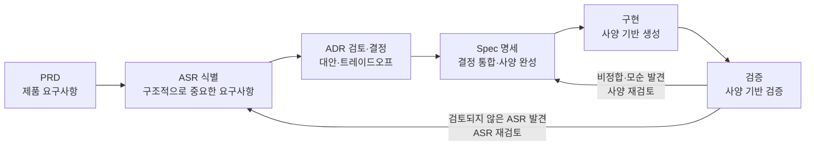
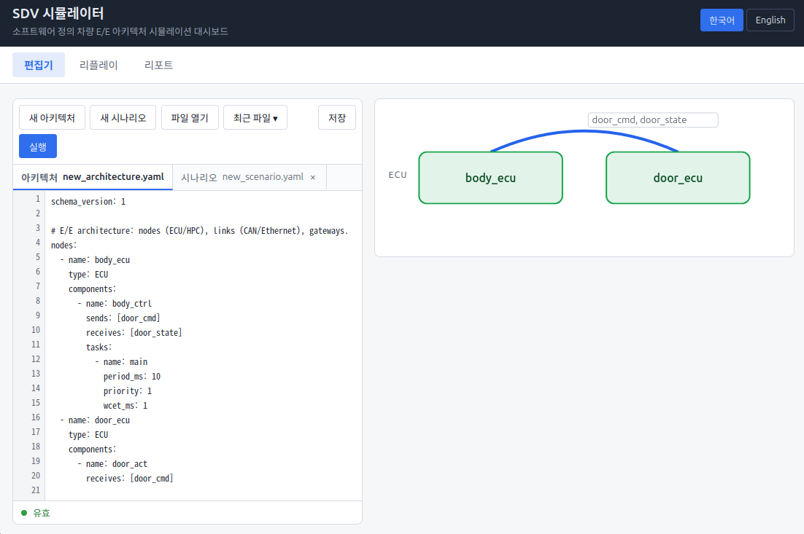
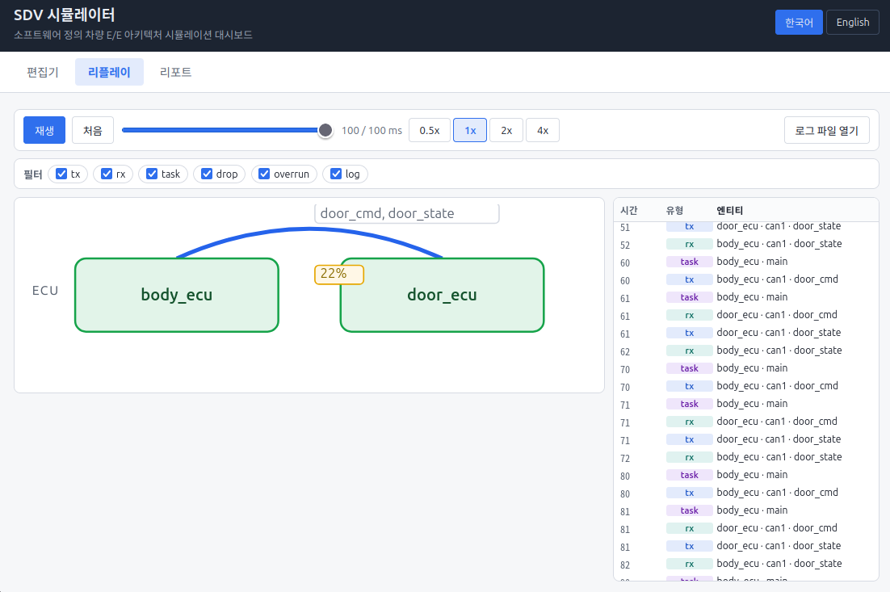
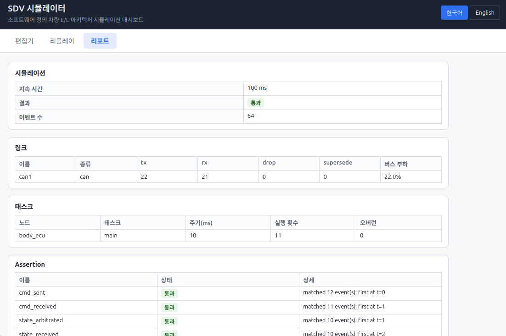

> 이 프로젝트는 [**Cocrates Agent Harness**](https://cocrates.ai)로 개발되었습니다.
> Cocrates는 AI를 올바르게 사용하는 방법을 제시합니다. 요청에 대해 정답을 마구 써 내려가는 대신,
> **"어떻게 설계해야 하는지"를 사용자와 함께 고민하고 사용자의 승인을 받아 진행**하는 Co-Socrates Agent 입니다.
> spec-driven 개발 방식으로 구조를 검토하고 설계합니다.
> 덕분에 이 저장소에는 코드뿐 아니라 **설계 결정의 근거**가 함께 남아 있습니다.

## 이 프로젝트가 만들어진 과정

이 프로젝트는 아래 6단계 파이프라인을 따라 개발되었습니다. 각 단계는 **사용자 승인 게이트**를 거치며,
검증 단계에서 새로 발견된 요구사항이 다시 앞 단계로 돌아가는 피드백 루프를 가집니다.

### 설계·개발 파이프라인 (구조설계서 부록 C.1)



- **PRD** — "무엇을 만들 것인가": 제품 목표·범위·성공 기준
- **ASR** — "어떤 요구가 아키텍처를 결정하는가": 아키텍처 중요 요구사항 등록·관리 (**21건**)
- **ADR** — "그 요구를 어떻게 충족할 것인가": 대안 ≥ 2개를 비교·트레이드오프 후 결정 (**49건**)
- **Spec** — "구현이 따라야 할 실행 사양": 승인된 결정을 검증 가능한 요구사항으로 인코딩
- **구현 → 검증** — Spec 항목별로 구현을 대조해 통과 여부를 확인하고, 미발견 ASR은 다시 정식화

이 방식을 통해 v1은 재검증 **86건 전부 pass**, v2도 **43건 pass**로 마무리되었습니다.

### 자세한 기록

- **[구조설계서 (architecture.md)](architecture.md)** — 전체 아키텍처 문서: 본문 13장 + 부록 A~D(설계 근거·결정 내역).
- **[prompts.md](prompts.md)** — 실제 과제 수행 과정의 대화 기록
- **[Cocrates Agent Harness](https://cocrates.ai)** — 설계와 구현을 함께하는 AI 에이전트

---

# SDV Simulator (sdv-sim)

SDV(Software Defined Vehicle) 차량 소프트웨어 플랫폼 시뮬레이터.
물리적 하드웨어 없이 E/E 아키텍처를 **정의 → 실행 → 검증**할 수 있는 헤드리스 시뮬레이션 환경입니다.

## 1. 프로젝트 소개

### 과제 내용

SDV에서 차량의 기능은 하드웨어가 아닌 **소프트웨어**에 의해 정의됩니다.
차량 SW 개발자/아키텍트가 E/E 아키텍처, 차량 내 통신, 앱 런타임을 개발·검증할 때,
물리적 하드웨어가 없어도 소프트웨어만으로 차량 플랫폼을 시뮬레이션할 수 있는 환경이 필요합니다.

이 프로젝트는 그 요구를 해결하는 **시뮬레이터 코어 라이브러리 + CLI**를 제공합니다.

### 주요 기능 (v1)

| 영역 | 내용 |
|------|------|
| **E/E 아키텍처 모델링** | ECU/HPC 노드 정의, 토폴로지(노드 간 연결) 정의 — `architecture.yaml` |
| **차량 내 통신** | CAN/Ethernet 링크, 메시지 라우팅·지연·대역폭 시뮬레이션, 게이트웨이 라우팅 |
| **앱 런타임** | 가상 ECU/HPC 위에서 SW 컴포넌트 실행 (비선점 스케줄링, 오버런 감지) |
| **자동 검증** | YAML 선언형 assertion — 종료 코드로 CI 연동 |
| **제공 형태** | 라이브러리 코어(`sdv_sim`) + CLI(`sdv-sim run`) |

### v1 범위

- 입력: `architecture.yaml`(노드·링크·게이트웨이·컴포넌트) + `scenario.yaml`(duration, 메시지 주입, assertions)
- 출력: JSON 이벤트 로그(결정적, `(t_ms, seq)` 순) + 사람용 요약
- 언어: 한국어/영어 (`--lang ko|en`)
- v2(웹 대시보드, OTA), v3(데스크톱 앱), 차량 동역학/ADAS 시뮬레이션은 범위 외

## 2. 설치

### 요구 사항

- Python 3.11+
- [uv](https://docs.astral.sh/uv/) (패키지 매니저)

### uv 설치

```bash
curl -LsSf https://astral.sh/uv/install.sh | sh
# 또는: pipx install uv
# 설치 후 새 셸을 열거나 `source ~/.bashrc` 로 PATH를 갱신
```

### 프로젝트 설치

```bash
git clone <repository-url>
cd sdv-simulator
uv sync --extra dev   # 런타임 + 개발 의존성 설치 (.venv)
```

## 3. 실행

### CLI 사용법

```bash
uv run sdv-sim run <architecture.yaml> <scenario.yaml> [--log <path>] [--quiet] [--lang ko|en]
```

| 옵션 | 기본값 | 설명 |
|------|--------|------|
| `--log <path>` | `events.json` | JSON 이벤트 로그 출력 경로. `-`는 stdout |
| `--quiet` | off | 사람용 요약 생략 (종료 코드로만 판정) |
| `--lang ko\|en` | 시스템 로케일 | 출력 언어. 우선순위: `--lang` > `SDV_SIM_LANG` env > 시스템 로케일(외 → `ko`) |

### 웹 대시보드 (v2, serve)

```bash
uv run sdv-sim serve [--port 8888] [--host 127.0.0.1] [--lang ko|en] [--dev]
```

| 옵션 | 기본값 | 설명 |
|------|--------|------|
| `--port <port>` | `8888` | 대시보드 서버 포트. 점유 중이면 exit 2 |
| `--host <ip>` | `127.0.0.1` | 바인딩 주소. `0.0.0.0` 지정 시 외부 접근 허용(아래 경고 참조) |
| `--lang ko\|en` | 시스템 로케일 | 대시보드 초기 언어. 우선순위: `--lang` > `SDV_SIM_LANG` env > 시스템 로케일(외 → `ko`). 브라우저 전환(상단 스위치)도 가능하며 선택값은 localStorage에 유지 |
| `--dev` | off | Vite 개발 서버(포트 5173) 프록시 — HMR로 프런트엔드 개발 시 사용 |

- 단일 프로세스로 동작하며 시작 시 `http://<host>:<port>` URL을 출력합니다. `Ctrl+C`로 종료합니다.
- 아키텍처/시나리오 편집, 시뮬레이션 실행 → 리플레이(구조 오버레이·이벤트·리포트)까지 브라우저에서 수행합니다.
- 대시보드 UI(`sdv_sim/server/static/`)는 프런트엔드 빌드 산출물이며 wheel에 포함됩니다(`npm run build` → `../sdv_sim/server/static`).
- **외부 접근 주의**: `--host 0.0.0.0`은 대시보드를 네트워크에 노출합니다. 인증 기능이 없으므로 방화벽(출발지 IP 제한 등)으로 보호해야 하며, 서버 시작 시 경고 문구가 출력됩니다. (ADR: serve-network-binding)

### 웹 대시보드 사용 방법

대시보드는 **편집기 → 리플레이 → 리포트** 3개 탭으로 구성되며,
**아키텍처·시나리오를 편집 → 실행 → 이벤트를 재생 → 결과를 리포트로 확인**하는 순서로 사용합니다.

#### ① 편집 (Edit) — 아키텍처·시나리오 작성



- **좌측 편집기**: `architecture.yaml`(노드·링크·게이트웨이·컴포넌트)과 `scenario.yaml`(duration·메시지 주입·assertion)을 탭으로 편집합니다. 시작 시 기본 샘플이 채워져 있어 파일 없이 바로 실행할 수 있습니다.
- **실시간 검증**: 편집 중 500ms 디바운스로 서버가 스키마를 검증해 `● 유효` 상태를 표시합니다. 오류가 있으면 원인을 알려주며, 오류 중에는 저장·실행이 거부됩니다(마지막 유효 상태는 유지).
- **우측 구조 뷰**: 작성 중인 아키텍처가 ECU/HPC 노드와 통신 링크 다이어그램으로 실시간 렌더링됩니다.
- **파일 관리**: `새 아키텍처`/`새 시나리오`/`파일 열기`/`최근 파일`/`저장` — 파일은 브라우저가 직접 관리하며(FS Access API, 미지원 시 업로드/다운로드 폴백) 최근 파일은 IndexedDB에 보관됩니다.
- **실행**: 파란 `실행` 버튼 — 저장/실행 시 강제 검증 후 시뮬레이션을 실행하고 리플레이 탭으로 전환합니다.

#### ② 리플레이 (Replay) — 이벤트 재생



- **재생 컨트롤러**: `재생`/`처음` 버튼, 타임라인 슬라이더(`0 / 100 ms`), 배속 조절(`0.5x`~`4x`)로 시뮬레이션 이벤트를 원하는 속도로 재생합니다.
- **구조 오버레이**: 좌측 구조 뷰에서 메시지가 링크를 따라 흐르는 애니메이션과 버스 부하율(예: `22%`) 배지를 실시간으로 보여줍니다.
- **이벤트 필터**: `tx`·`rx`·`task`·`drop`·`overrun`·`log` 체크박스로 유형별 이벤트를 골라 관찰할 수 있습니다.
- **이벤트 타임라인**: 우측 패널에 시간(ms)별 이벤트가 유형별 색상 태그와 함께 나열됩니다.
- **로그 파일 열기**: 기존 JSON 이벤트 로그(`--log` 산출물)를 불러와 다시 재생할 수도 있습니다.

#### ③ 리포트 (Report) — 결과·검증 확인



- **시뮬레이션 요약**: 지속 시간, 종합 결과(`통과`/`실패` 배지), 총 이벤트 수.
- **링크 통계**: 링크별 tx/rx/drop/supersede 건수와 버스 부하(%).
- **태스크 통계**: 태스크별 실행 횟수와 오버런 발생 여부.
- **Assertion 결과**: 시나리오에 선언한 검증 항목별 통과 여부와 매칭 상세(이벤트 수·발생 시점).

**전체 흐름 요약**: 서버 시작 → 편집기에서 YAML 작성/수정 → `실행` → 리플레이로 이벤트 흐름 확인 → 리포트로 결과·통계·assertion 확인. (API 5종 `validate`/`run`/`load-log`/`events`/`report`가 이 흐름을 구성하며, 상세 동작은 [구조설계서](architecture.md) 6~8장 참조)

### 종료 코드

| 코드 | 의미 |
|------|------|
| 0 | 통과 (모든 assertion pass) |
| 1 | assertion 실패 |
| 2 | 입력 오류 (파일 없음, YAML 구문, 스키마 위반, 로그 쓰기 실패) |
| 3 | 내부 오류 |

### 공식 예시

```yaml
# architecture.yaml
nodes:
  - name: body_ecu
    type: ECU
    components:
      - name: door_ctrl
        sends: [door_cmd]
        receives: [door_state]
        tasks:
          - { name: main, period_ms: 10, priority: 1, wcet_ms: 1 }
  - name: door_ecu
    type: ECU
    components:
      - name: door_act
        receives: [door_cmd]
links:
  - name: can1
    kind: can
    bitrate: 500
    nodes: [body_ecu, door_ecu]
    frames:
      - { name: door_cmd, id: 0x100, dlc: 4, period_ms: 10, source: body_ecu }
      - { name: door_state, id: 0x101, dlc: 4, period_ms: 10, source: door_ecu }
```

```yaml
# scenario.yaml
duration_ms: 100
messages:
  - { t_ms: 5, link: can1, frame: door_cmd, data: { state: open } }
assertions:
  - name: cmd_sent
    expect: { event: tx, frame: door_cmd, link: can1, at_ms: 0, count: 12 }
```

```bash
uv run sdv-sim run architecture.yaml scenario.yaml
# 결과: pass (exit 0). door_cmd 주기 tx 11건(t=0~100) + 주입 1건(t=5) = 12건 검증
```

### 출력

- **JSON 로그** — `{schema_version: 1, simulation: {...}, events: [...], assertions: [...]}` 단일 문서.
  이벤트: `tx | rx | task_start | task_end | drop | overrun | log`
- **사람용 요약** — 시뮬레이션 결과, 링크별 tx/rx/drop/버스 부하, 태스크별 실행·오버런, assertion 결과가 stdout으로 출력됩니다.

## 4. 샘플 예제 (samples/)

프로젝트의 기능을 실행으로 검증할 수 있는 샘플 2세트와 커스텀 컴포넌트 데모를 제공합니다.
모든 명령은 프로젝트 루트에서 실행합니다.

### 4.1 기본 샘플 — 문 제어 시스템 (`samples/basic/`)

공식 예시를 확장한 최소 구성입니다. body_ecu(제어 ECU) + door_ecu(실행 ECU) 2노드가
CAN 1링크(`can1`)에서 `door_cmd`/`door_state` 2프레임을 주고받으며, 주입 메시지와 assertion 5건을 검증합니다.

```bash
uv run sdv-sim run samples/basic/architecture.yaml samples/basic/scenario.yaml
# 결과: pass (exit 0) — assertion 5건 통과
```

- **CAN ID 중재**: 같은 tick에서 `door_cmd`(0x100)가 `door_state`(0x101)보다 먼저 전송됩니다
- **메시지 주입**: t=5에 `door_cmd {state: open}` — tx 이벤트에 data가 기록됩니다
- **assertion 5건**: cmd tx 12건 / cmd rx 11건 / state tx 10건 / state rx 10건 / task ≥ 11건

### 4.2 차량 샘플 — 3도메인 네트워크 (`samples/vehicle/`)

실제 차량 네트워크를 축약한 구성입니다. 바디 CAN / 파워트레인 CAN / Ethernet 백본
3도메인과 `domain_gw` 게이트웨이로 v1의 주요 기능을 전부 시연하며 assertion 9건을 검증합니다.

```bash
uv run sdv-sim run samples/vehicle/architecture.yaml samples/vehicle/scenario.yaml
# 결과: pass (exit 0) — assertion 9건 통과
# drop/overrun/supersede는 실패가 아니라 로그·리포트에서 관찰하는 정보입니다
```

| 기능 | 시연 내용 |
|------|-----------|
| **CAN ID 중재** | body_can 0x100 < 0x101 < 0x102 < 0x103 — 낮은 ID가 먼저 전송 |
| **게이트웨이 remap** | `door_state` → eth_backbone `0x520` 재매핑 + 처리 지연 2ms |
| **게이트웨이 ID 범위** | pt_can 0x200~0x202 전체 → eth_backbone 전달 + 지연 1ms |
| **Ethernet FIFO** | 스위치(`eth_sw`) 큐잉 — 같은 tick에서 주기 프레임이 주입보다 먼저 큐에 들어감 |
| **supersede** | 큐 대기 중 동일 프레임은 최신으로 교체 — 12건 |
| **테일 드롭** | `queue_depth: 4` 초과분 드롭 — 2건 (`gear_state` t=500/502) |
| **오버런 감지** | `body_ecu.diag` (period 100 < wcet 110) — overrun 5건, 다음 인스턴스 스킵 |
| **주입 버스트** | t=500~502에 Ethernet 프레임 15건 연속 주입 → 드롭·supersede 관찰 |
| **스텁/커스텀 컴포넌트** | `class: DoorActuator` 미등록 시 수신자 전용 스텁 (D-14) |

### 4.3 커스텀 컴포넌트 데모 (`samples/vehicle/components.py`)

YAML만으로는 표현할 수 없는 `log` 이벤트와 라이브러리 API를 보여줍니다.
`door_act` 컴포넌트가 `door_cmd`를 받으면 상태를 로그로 남기고 `door_state`로 응답합니다.

```bash
uv run python samples/vehicle/components.py
# 결과: pass (exit 0) — door_cmd 수신마다 log 11건 + door_state 응답 전송
```

- `load(arch, scenario, components={...})` — 컴포넌트 클래스 등록
- `Component.on_message` / `TaskContext.send` / `TaskContext.log` — 메시지 수신·응답·로그
- 클래스 키 매칭 — 컴포넌트 정의의 `class` 필드, 없으면 컴포넌트 `name`

### 4.4 샘플 구조

```
samples/
├── basic/
│   ├── architecture.yaml   # 2 ECU + CAN 1링크 (공식 예시 확장)
│   └── scenario.yaml       # duration 100 · 주입 1건 · assertion 5건
└── vehicle/
    ├── architecture.yaml   # 3도메인 + 게이트웨이 (전 기능 데모)
    ├── scenario.yaml       # duration 1000 · 주입 16건 · assertion 9건
    └── components.py       # 커스텀 컴포넌트 데모 (uv run python)
```

## 5. 테스트

```bash
uv run pytest   # 단위 테스트 (78 passed)
uv run mypy     # 타입 검사 (strict, 13 source files)
```

## 6. PyPI 릴리스

패키지는 [hatchling](https://hatch.pypa.io/) 빌드 백엔드를 사용합니다.
버전은 `pyproject.toml`의 `[project] version`에서 관리합니다.

### 1) 빌드

```bash
uv build
# dist/sdv_sim-<version>-py3-none-any.whl
# dist/sdv_sim-<version>.tar.gz
```

### 2) 업로드

PyPI 계정에서 **API 토큰**을 발급받아 사용합니다.

```bash
# 방법 A: 환경 변수
export UV_PUBLISH_TOKEN=<pypi-api-token>
uv publish

# 방법 B: 인자 직접 전달
uv publish --token <pypi-api-token>
```

### 3) Test PyPI (검증용)

공개 전에 테스트 인덱스에 올려 확인할 수 있습니다.

```bash
uv publish --publish-url https://test.pypi.org/legacy/
```

### 4) 설치 확인

```bash
uv pip install sdv-sim   # 또는: pip install sdv-sim
sdv-sim --help
```

## 7. 프로젝트 구조

```
sdv-simulator/
├── pyproject.toml          # 패키지 메타데이터 · 빌드 설정 (hatchling)
├── uv.lock                 # 잠금 파일
├── sdv_sim/                # 시뮬레이터 코어 라이브러리
│   ├── cli/                #   CLI (main.py — sdv-sim run)
│   ├── core/               #   엔진 (스케줄링, 통신, 게이트웨이, 서assertion)
│   ├── schema/             #   Pydantic 스키마 (arch.py, scenario.py)
│   └── i18n.py             #   한국어/영어 메시지
├── samples/                # 실행 가능한 샘플 (4장 참고)
│   ├── basic/              #   2 ECU + CAN 1링크 (공식 예시 확장)
│   └── vehicle/            #   3도메인 + 게이트웨이 + 커스텀 컴포넌트 데모
├── tests/                  # 단위 테스트 (pytest 78건)
├── spec/                   # PRD · ASR · v1 스펙 (spec-driven 개발 산출물)
├── adr/                    # 아키텍처 결정 레코드 (ADR)
├── verification/           # 스펙 검증 리포트
└── report/                 # 구조설계서
```
