# SDV Simulator 구조 설계서 (Architecture Design Document)

> **버전**: v2 (웹 대시보드 포함) — 2026-08-13
> **대상**: 차량 SW 개발자/아키텍트를 위한 SDV(Software Defined Vehicle) 시뮬레이터의 구조 설계
> **원본 산출물**: `spec/`(PRD·ASR·Spec), `adr/`(49건), `verification/`, `prompts.md`, `TODO-v1/v2.md`
> **구성**: 본문 1~13장(최종 설계) + 부록 A~D(사양·근거·개발 과정)

## 목차

1. [서론](#1-서론)
2. [시스템 개요](#2-시스템-개요)
3. [정의 형식 개요](#3-정의-형식-개요)
4. 코어 시뮬레이션 엔진
   - [4.1 엔진 동작 모델](#41-엔진-동작-모델)
   - [4.2 런타임 구조](#42-런타임-구조)
   - [4.3 실행 루프](#43-실행-루프)
   - [4.4 통신 동작 (CAN / Ethernet)](#44-통신-동작-can--ethernet)
   - [4.5 게이트웨이 라우팅](#45-게이트웨이-라우팅)
   - [4.6 앱 런타임 (SW 컴포넌트·태스크)](#46-앱-런타임-sw-컴포넌트태스크)
   - [4.7 검증과 자동화 (assertion · 이벤트 로그 · 리포트)](#47-검증과-자동화-assertion--이벤트-로그--리포트)
5. [CLI](#5-cli-command-line-interface)
6. [대시보드 서버](#6-대시보드-서버-dashboard-server)
7. 프런트엔드
   - [7.1 프런트엔드 모듈 구조](#71-프런트엔드-모듈-구조)
   - [7.2 상태 관리·라우팅](#72-상태-관리라우팅)
   - [7.3 구조 뷰 (Structure View)](#73-구조-뷰-structure-view)
   - [7.4 리플레이 (Replay)](#74-리플레이-replay)
   - [7.5 파일 접근](#75-파일-접근)
   - [7.6 검증 피드백 (useValidation)](#76-검증-피드백-usevalidation)
   - [7.7 i18n (언어 결정)](#77-i18n-언어-결정)
8. [핵심 데이터 흐름](#8-핵심-데이터-흐름-key-data-flows)
9. [모듈 의존성과 확장·변경 반영](#9-모듈-의존성과-확장변경-반영)
10. [배포](#10-배포-deployment)
11. [검증과 품질](#11-검증과-품질-verification--quality)
12. [향후 방향](#12-향후-방향-future-directions)
13. [결론](#13-결론-conclusion)
- [부록 A. SDV 정의 — YAML 사양](#부록-a-sdv-정의--yaml-사양)
- [부록 B. sdv-simulator 사양 요약 (spec v1/v2)](#부록-b-sdv-simulator-사양-요약-spec-v1v2)
- [부록 C. 설계 및 개발 과정](#부록-c-설계-및-개발-과정-prd--asr--adr--spec--구현--검증)
- [부록 D. ASR & ADR — 옵션 비교와 결정 근거](#부록-d-asr--adr--옵션-비교와-결정-근거)

---

# 1. 서론

## 1.1 문서 목적과 구성

이 문서는 **SDV(Software Defined Vehicle) 시뮬레이터 `sdv-simulator`의 구조 설계서**이다.
현재 구현된 시스템 전체 — v1(코어 시뮬레이션 엔진 + CLI), v2(웹 대시보드: FastAPI 서버 + React 프런트엔드),
배포(deploy) — 의 최종 구조를 기술한다.

문서의 역할 분담은 다음과 같다.

| 부분 | 역할 |
|------|------|
| **본문 (1~13장)** | 최종 설계를 **동작(flow)**과 **구조(모듈 의존성·확장성)** 중심으로 설명 — "어떤 결정이 포함되었는가", "어떻게 동작하는가"에 집중 |
| **부록 A** | SDV 정의를 위한 YAML 사양 (architecture.yaml / scenario.yaml 필드 상세) |
| **부록 B** | `spec/sdv-sim-v1.md` · `spec/sdv-sim-v2.md` 사양 요약 |
| **부록 C** | 설계 및 개발 과정 (PRD → ASR → ADR → Spec → 구현 → 검증) |
| **부록 D** | ASR별 ADR 검토 및 결정 내역 — "왜 이렇게 설계했는가"의 근거 |

본문에서 결정의 근거가 필요한 지점에는 부록 C/D를 참조로 표기한다.

**대상 독자**는 과제 평가자이다. 코드를 직접 읽지 않아도 이 문서만으로 프로젝트의 전체
구조와 핵심 설계의 타당성을 파악할 수 있도록 구성했다.

**범위 제외**: 모든 클래스/함수의 구현 수준 상세(핵심부만 상세), 개발 과정 기록
(`prompts.md`, `TODO-*`), 스펙 검증 산출물(`verification/`), 실행 산출물(`events.json`).

## 1.2 과제 배경: SDV와 차량 SW 시뮬레이션

**SDV(Software Defined Vehicle)**는 차량의 기능이 하드웨어가 아닌 **소프트웨어에 의해 정의**되는
차량을 의미한다. 차량 SW 개발자/아키텍트는 E/E(Electrical/Electronic) 아키텍처, 차량 내 통신,
앱 런타임을 개발·검증해야 하는데, 물리적 하드웨어가 없어도 소프트웨어만으로 차량 플랫폼을
시뮬레이션할 수 있는 환경이 필요하다.

이 프로젝트는 그 요구를 해결하는 **시뮬레이터**를 제공한다. 하드웨어 없이 차량 SW 플랫폼을
**정의 → 실행 → 검증**하는 흐름을 지원하며, 구체적으로는 다음을 목표로 한다.

- E/E 아키텍처(ECU/HPC 노드, 토폴로지)와 시나리오를 YAML로 **정의**
- 정의된 아키텍처 위에서 CAN/Ethernet 통신과 앱 태스크를 **실행**(시뮬레이션)
- 선언형 assertion과 종료 코드로 결과를 **검증** — CI 자동화 가능
- 웹 대시보드로 구조 확인·편집·실행·리플레이를 **시각화**

## 1.3 버전 체계와 제공 형태

프로젝트는 스테이지 단위로 확장되었다.

| 버전 | 내용 | 상태 |
|------|------|------|
| **v1** | 코어 라이브러리 + CLI — 정의·실행·검증의 헤드리스 환경 | 완료 |
| **v2** | 웹 대시보드 — 구조 뷰·편집·실행·리플레이 (`sdv-sim serve`) | 이번 스테이지 |
| **v3** | 데스크톱 앱 (가벼운 셸) | 연기 가능 |
| 후속 | OTA(업데이트 캠페인·배포 흐름) 등 | 미포함 |

모든 제공 형태는 **단일 코어 엔진을 공유**한다는 원칙 아래 설계되었다. CLI와 대시보드는
같은 `sdv_sim.core`를 백엔드로 사용하며, v3(데스크톱)도 코어 변경 없이 추가될 수 있는 경계를
유지한다. 이 구조의 실제 모습은 2장에서, 확장 방식은 9장에서 설명한다.
# 2. 시스템 개요

## 2.1 시스템 목표와 주요 기능

시스템의 최종 목표는 **하드웨어 없이 차량 소프트웨어 플랫폼을 정의 → 실행 → 검증**하는 것이다.
이를 위한 주요 기능은 다음과 같다.

| 영역 | 내용 |
|------|------|
| **E/E 아키텍처 모델링** | ECU/HPC 노드 정의, 토폴로지(노드 간 연결) 정의 — `architecture.yaml` |
| **차량 내 통신** | CAN/Ethernet 링크, 메시지 라우팅·지연·대역폭 시뮬레이션, 게이트웨이 라우팅 |
| **앱 런타임** | 가상 ECU/HPC 위에서 SW 컴포넌트 실행 (비선점 스케줄링, 오버런 감지) |
| **자동 검증** | YAML 선언형 assertion — JSON 이벤트 로그 + 종료 코드로 CI 연동 |
| **시각화 (v2)** | 구조 뷰 다이어그램, 편집·검증 피드백, 실행 결과 리플레이·리포트 |

실행 예로 `samples/basic/`(문 제어 시스템, assertion 5건)과 `samples/vehicle/`(3도메인 네트워크 + 게이트웨이 + 커스텀 컴포넌트, assertion 9건)를 제공한다. 설치·실행 절차는 저장소의 README에 정리되어 있고, 결과 분석 예시는 12장(검증·품질)과 부록 A.4에서 확인할 수 있다.

## 2.2 전체 구조

시스템은 **사용자 접점 → 제공 계층 → 코어 계층 → 실행 환경**의 4개 층으로 구성되며,
모든 제공 형태가 코어 계층을 공유한다.

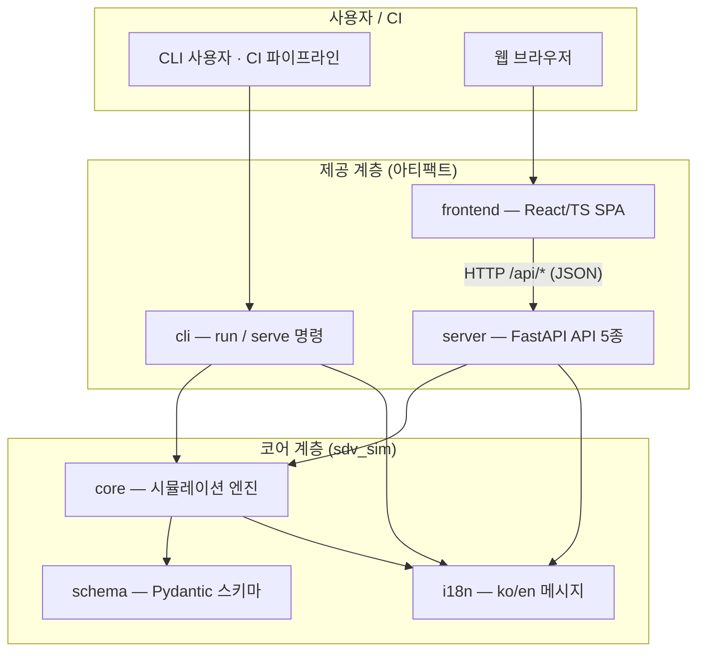

- **CLI**(`sdv-sim run`)와 **대시보드 서버**(`sdv-sim serve`)는 같은 코어 엔진을 호출한다.
  CLI는 파일 경로 기반 `load()`, 대시보드 서버는 YAML 문자열 기반 `loads()`를 사용한다
  (두 API의 관계는 4장·9장에서 설명).
- **프런트엔드**는 서버의 API 5종을 통해서만 코어에 접근한다. 파일을 직접 읽고 쓰는 것은
  브라우저이며, 서버는 파일 내용을 문자열로만 수신한다(2.4절 ④).
- 정적 UI 산출물(`sdv_sim/server/static/`)은 프런트엔드 빌드 결과이며, 패키지에 포함되어
  서버가 단일 프로세스로 서비스한다(10장).

## 2.3 구성 요소와 기술 스택

| 계층 | 구성 요소 | 기술 |
|------|-----------|------|
| 코어 | 시뮬레이션 엔진(`core/`), 정의 스키마(`schema/`), 메시지(`i18n.py`) | Python 3.11+, Pydantic 2.5+, PyYAML |
| CLI | `run`/`serve` 명령(`cli/`) | argparse, uvicorn |
| 대시보드 서버 | FastAPI 앱·세션·로그 로더(`server/`) | FastAPI, uvicorn, Pydantic |
| 프런트엔드 | SPA(`frontend/src/`) | React 19, TypeScript, Vite 6, js-yaml |
| 배포 | systemd 서비스(`deploy/`) | systemd user unit |
| 패키징 | PyPI 배포(`sdv-sim`) | hatchling, uv |

## 2.4 주요 설계 특성

시스템의 구조를 관통하는 4가지 설계 특성이다. 각 특성의 **선택 근거(대안·트레이드오프)는
부록 C/D**에 기록되어 있으며, 본문은 최종 설계가 어떤 모습인지를 설명한다.

1. **결정성(Determinism)** — 시뮬레이션은 난수를 사용하지 않으며, 모든 이벤트가
   `(t_ms, seq)` 완전 순서로 기록된다. 같은 입력은 항상 같은 결과를 낳으므로
   자동 검증(assertion)의 진실 소스로 쓸 수 있다. (4장)
2. **단일 코어 공유** — CLI·대시보드·(예정)데스크톱 모두 `sdv_sim.core`를 재사용한다.
   통신·스케줄링·검증 로직이 형태별로 분기되지 않아 일관성이 보장된다. (9장)
3. **헤드리스/CI 지원** — `run` 명령은 JSON 이벤트 로그와 종료 코드(0/1/2/3)만으로
   결과를 판정할 수 있어 무인 파이프라인에 통합된다. (5장)
4. **브라우저 파일 경계** — 대시보드의 파일 읽기/쓰기는 브라우저 권한 경계 안에서
   이루어지고(File System Access API 또는 업로드/다운로드), 서버는 사용자 파일을
   파일시스템에 저장하지 않는다. 서버 측 경로 검증·샌드박스가 필요 없어 보안 표면이
   줄어든다. (7.5절, 9.3절)
# 3. 정의 형식 개요

시스템의 입력은 **아키텍처 정의**와 **시나리오 정의** 두 개의 YAML 문서로 구성된다.
이 장에서는 두 문서의 도메인 모델(개념 구조)을 개관한다. 필드 단위의 완전한 사양은
**부록 A**에 있다.

## 3.1 아키텍처 정의 (architecture.yaml)

아키텍처 정의는 "차량의 구조가 어떻게 생겼는가"를 기술한다: 노드(ECU/HPC)와 그 위의
SW 컴포넌트, 노드 사이를 잇는 통신 링크(CAN/Ethernet)와 프레임, 링크 사이를 중계하는
게이트웨이.

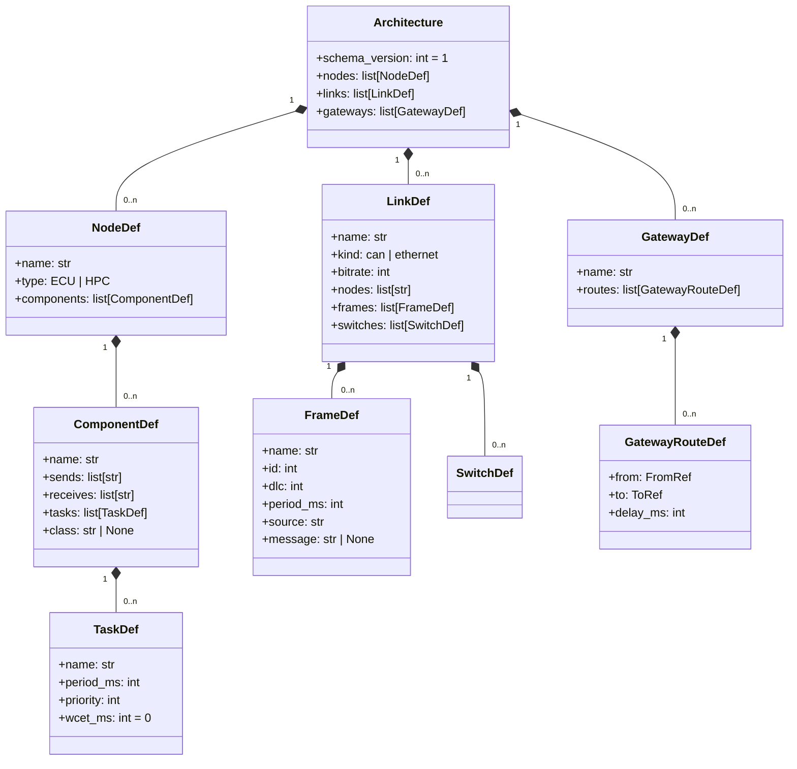

**도메인 개념**:

- **노드(NodeDef)** — 하나의 ECU 또는 HPC. 여러 **컴포넌트(ComponentDef)**를 호스팅한다.
  컴포넌트는 메시지 `sends`/`receives` 목록과 주기 **태스크(TaskDef)** 목록을 가진다.
  태스크는 `period_ms`(주기), `priority`(우선순위), `wcet_ms`(최악 실행 시간)로 정의된다.
  `class` 필드가 있으면 그 이름의 사용자 정의 컴포넌트 클래스로 인스턴스화된다(4.6절).
- **링크(LinkDef)** — 노드들 사이의 통신 매체. `kind`가 `can` 또는 `ethernet`이다.
  링크는 **프레임(FrameDef)**을 소유한다: L2 수준의 전송 단위로 `id`(중재 ID), `dlc`(데이터 길이),
  `period_ms`(주기), `source`(송신 노드)를 가진다. Ethernet 링크는 스위치 큐 파라미터
  `switches[].queue_depth`를 가질 수 있다(기본 1000).
- **게이트웨이(GatewayDef)** — 한 링크에서 다른 링크로 프레임을 중계하는 **라우트(GatewayRouteDef)**를
  가진다. `from`(출발 링크 + 특정 프레임 또는 ID 범위) → `to`(도착 링크 + 선택적 ID 재매핑)의
  규칙에 `delay_ms`(처리 지연)가 붙는다.
- **메시지-프레임 매핑** — 컴포넌트가 주고받는 `sends`/`receives`의 **메시지 이름**은
  링크 프레임의 `message` 필드에 매핑되고, `message`가 없으면 프레임 이름 자체가 메시지 이름이다.

## 3.2 시나리오 정의 (scenario.yaml)

시나리오 정의는 "그 구조에서 무엇이 일어나는가"를 기술한다: 시뮬레이션 시간, 외부에서
주입할 메시지, 그리고 검증할 assertion.

| 요소 | 역할 |
|------|------|
| `duration_ms` | 시뮬레이션 종료 시간(정수 ms, 종료 시각 포함) |
| `messages` | **메시지 주입** — 특정 시각(`t_ms`)에 특정 링크(`link`)의 프레임(`frame`)을 데이터(`data`)와 함께 버스에 주입 |
| `assertions` | **자동 검증** — `expect` 블록으로 이벤트 종류·속성·시각·최소 개수를 선언 |

assertion의 `expect`는 `event`(`tx`/`rx`/`task`/`drop`/`overrun`/`log`)와 선택 속성
(`frame`, `link`, `node`, `task`, `message`), 그리고 시간 조건(`at_ms` + `within_ms`)과
`count`(최소 개수)로 구성된다. 평가 규칙의 동작은 4.7절에서 설명한다.

## 3.3 스키마 검증 규칙

두 YAML 문서는 **Pydantic 모델**(`sdv_sim/schema/`)로 검증된다. 검증은 두 층위에서 이루어진다.

1. **필드·구조 검증** — 타입과 값 제약: `period_ms > 0`, `wcet_ms >= 0`, `id >= 0`,
   `bitrate > 0`, `queue_depth > 0`, `extra` 필드 금지 등.
2. **유일성·참조 무결성 검증** —
   - 유일성: 노드·링크·게이트웨이 이름, 링크 내 프레임 이름·노드 참조, 노드 내 컴포넌트 이름이 유일해야 한다.
   - 참조 무결성: 링크가 참조하는 노드가 존재해야 하며, 프레임의 `source`는 해당 링크에 연결된 노드여야 한다.
     게이트웨이 라우트의 `from`/`to` 링크가 존재하고, `from.frame`은 해당 링크에 정의된 프레임이어야 한다.
     컴포넌트의 `sends`/`receives` 메시지는 연결된 링크의 프레임에 매핑되어야 한다.

검증은 입력이 시스템에 들어오는 모든 지점에서 수행된다 — CLI 로드 시(`load()`),
대시보드 실행 시(`loads()`), 편집 중 검증 피드백 시(`/api/validate`). 각 지점의 동작은
5장·6장·7장에서 설명한다.
# 4.1 엔진 동작 모델

코어 시뮬레이션 엔진(`sdv_sim/core/engine.py`)은 **이산 사건 시뮬레이션(DES)** 방식으로 동작한다.
시뮬레이션은 연속된 시간을 도는 것이 아니라, **이벤트들의 시퀀스**로 진행된다.

## 시간 모델

- 모든 시간은 **정수 밀리초(ms)**이다. 실수 시간 표현을 사용하지 않는다.
- 시뮬레이션은 `t=0`에서 시작하여 `scenario.duration_ms`까지 진행하며, **종료 시각을 포함**한다.
- 시간 진행은 이벤트가 있는 시각으로만 점프한다 (시간-점프 방식).

## 이벤트 큐

- 이벤트는 **단일 우선순위 큐(heap)**에 저장된다.
- 큐의 원소는 `(t_ms, priority, decl, seq, kind, payload)` 튜플이며, heapq가 이 순서대로 정렬한다.
- 이 4단계 키가 이벤트의 **완전 순서**를 결정한다:

```
(t_ms, priority, decl, seq)
```

| 키 | 의미 |
|----|------|
| `t_ms` | 이벤트 발생 시각 (정수 ms) |
| `priority` | 태스크의 `priority` 값. **비-태스크 이벤트(tx/rx/drop 등)는 가상 우선순위 `2^30`(MAX_PRIO)**을 가져, 같은 시각의 모든 태스크 이벤트보다 나중에 처리된다 (D-19) |
| `decl` | 정의 파일에서의 선언 순서 인덱스 (동일 우선순위의 안정적 순서 보장) |
| `seq` | 이벤트 생성 순서 (완전 순서의 최종 결정자) |

## 결정성

- 시뮬레이션에는 **난수가 없다**. 모든 동작은 정의(architecture/scenario)와 위의 순서 규칙만으로 결정된다.
- 따라서 같은 입력은 항상 같은 이벤트 시퀀스를 생성하며, 출력 이벤트는 `(t_ms, seq)` 오름차순으로 정렬되어
  자동 검증(assertion)의 진실 소스로 사용된다.
- 엔진은 **단일 스레드**로 동작한다. 병렬 처리로 인한 순서 불확정성이 원천적으로 없다.

## tick 처리 방식

이벤트 큐는 시각 `t`에 속한 이벤트들을 모두 꺼내 처리한 뒤, 그 **시각의 마지막에** 링크들의
버스/스위치 동작을 일괄(drain) 해소한다. 이 "tick별 일괄 처리"가 같은 시각에 발생하는
전송·중재·큐잉을 결정적으로 재현하는 핵심이다. (4.3절의 실행 루프 참조)
# 4.2 런타임 구조

시뮬레이션이 실행되는 동안 정의 문서(Architecture/Scenario)는 실행 가능한 **런타임 객체**로
변환된다. 엔진이 시뮬레이션 중 들고 있는 구조는 다음과 같다.

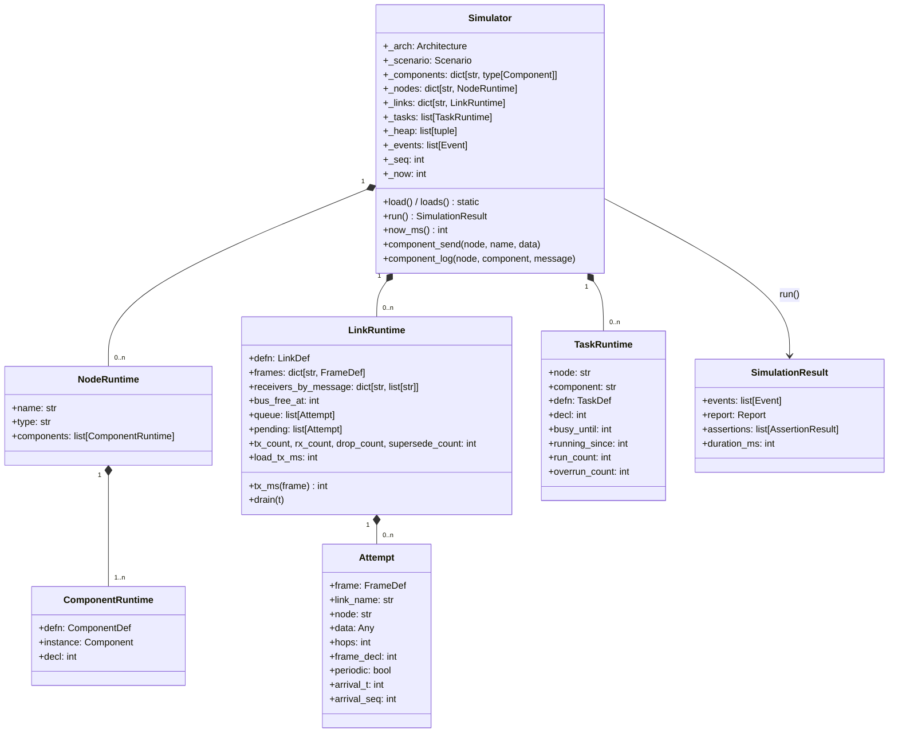

- **Simulator** — 엔진의 루트. 입력(정의)과 실행 상태(런타임, 이벤트 큐, 이벤트 로그)를 소유한다.
  사용자 정의 컴포넌트 클래스의 레지스트리(`_components`)를 가진다.
- **NodeRuntime / ComponentRuntime** — 정의의 노드·컴포넌트를 실행 상태로 변환한 것.
  컴포넌트는 `class` 이름에 매핑된 **Component 인스턴스**(4.6절)를 들고, `sends`/`receives`는
  링크의 프레임과 매핑되어 있다.
- **LinkRuntime** — 링크의 실행 상태. **버스가 바쁜 시각(`bus_free_at`)**, **전송 대기 큐(`queue`)**,
  **이번 tick에 도착한 시도(`pending`)**, 그리고 통계(전송/수신/드롭/supersede 횟수, 버스 점유 ms)를
  유지한다. `tx_ms(frame)`가 프레임 전송 시간을 계산한다(4.4절).
- **TaskRuntime** — 주기 태스크의 실행 상태. `busy_until`(실행 중 완료 시각)과 `running_since`(실행 시작
  시각)로 오버런을 판정한다.
- **Attempt** — 한 번의 "전송 시도"를 나타내는 불변 객체. 어떤 프레임을, 어떤 노드가, 몇 홉째에,
  몇 바이트 데이터로 보내려 하는지를 담는다. 링크의 큐/버스 점유 시뮬레이션의 단위가 된다.
- **SimulationResult** — `run()`의 반환 값: 정렬된 이벤트 목록, 리포트, assertion 결과, 실제 진행 시간.

## 공개 팩토리

코어를 감싸는 CLI와 서버는 서로 다른 입력 형태를 쓰므로, 두 가지 진입점을 제공한다.

| 팩토리 | 입력 | 사용처 |
|--------|------|--------|
| `Simulator.load(arch_path, scenario_path, components=None)` | 파일 경로 | CLI `run` |
| `Simulator.loads(arch_yaml, scenario_yaml, components=None)` | YAML 문자열 | 대시보드 서버 (파일 접촉 없음) |

두 팩토리는 스키마 검증(3.3절)을 거쳐 동일한 런타임을 구성한다. 이는 v1 코어를 변경하지 않고
v2 대시보드를 얹기 위해 추가된 문자열 입력 계약이며, 9.3절의 변경 사례 ①에서 자세히 설명한다.
# 4.3 실행 루프

`Simulator.run()`은 초기 스케줄 → 이벤트 루프 → 정리(검증·리포트)의 세 단계로 진행된다.

```mermaid
sequenceDiagram
    participant Caller as 호출자 (CLI/서버)
    participant Sim as Simulator
    participant Heap as 이벤트 큐 (heap)
    participant Link as LinkRuntime

    Caller->>Sim: run()
    Note over Sim, Heap: ① 초기 스케줄 (t=0 기준)
    Sim->>Heap: 주기 프레임 tx_attempt (t=0, 이후 period_ms마다)
    Sim->>Heap: 주기 태스크 task_start (t=0, 이후 period_ms마다)
    Sim->>Heap: 시나리오 주입 tx_attempt (t=t_ms)

    Note over Sim, Heap: ② 이벤트 루프 (t <= duration_ms)
    loop 큐에 이벤트가 있고 t <= duration_ms
        Heap-->>Sim: (t, priority, decl, seq) 순으로 pop
        alt task_start
            Sim->>Sim: on_periodic 실행, task_end 스케줄
        else task_end
            Sim->>Sim: 오버런 검사·기록
        else tx_attempt
            Link->>Link: pending에 추가 (arrival_t, arrival_seq)
        else rx
            Sim->>Sim: 수신자 on_message 전달
        else link_service
            Sim->>Link: 웨이크 (큐 후속 전송 기회)
        end
        Sim->>Link: tick 종료 후 drain(t) — 버스/스위치 배치 해소
    end

    Note over Sim: ③ 정리
    Sim->>Sim: 이벤트 (t_ms, seq) 오름차순 정렬
    Sim->>Sim: assertion 평가 + 리포트 생성
    Sim-->>Caller: SimulationResult
```

## ① 초기 스케줄

- 각 링크의 **주기 프레임**: 첫 전송 시도 `t=0`, 이후 `period_ms` 간격으로 반복 스케줄된다.
  (`frame.period_ms == 0`이면 1회만 전송)
- 각 컴포넌트의 **주기 태스크**: 첫 `task_start`가 `t=0`, 이후 `period_ms` 간격으로 반복된다.
- **시나리오 주입**: `scenario.messages`의 각 항목이 해당 `t_ms`에 `tx_attempt`로 스케줄된다.

## ② 이벤트 루프

시각 `t`의 이벤트들을 큐 순서대로 꺼내 처리한 뒤, 같은 시각의 통신 동작을 **일괄 해소(drain)**한다.

- **task_start** — 태스크 실행을 시작한다 (4.6절). `on_periodic()` 호출과 `task_end` 스케줄.
- **task_end** — 태스크 완료 시각에 오버런을 판정·기록한다 (4.6절).
- **tx_attempt** — 전송 시도를 해당 링크의 `pending`에 추가한다. 실제 버스 동작은 drain에서 처리된다.
- **rx** — 링크의 수신 완료 시각에, 해당 메시지를 `receives`하는 컴포넌트들의 `on_message()`를 호출한다.
- **link_service** — 동작 없는 웨이크-업 이벤트. 버스가 비는 시각에 큐에 대기 중인 프레임이
  전송될 기회를 얻도록 한다.
- **drain(t)** — tick의 마지막에 각 링크가 대기 중인 시도들을 버스/스위치 규칙(4.4절)대로 배치하고
  `tx`/`rx`/`drop`/`supersede` 이벤트를 스케줄한다. 같은 시각의 전송들이 버스 경쟁(중재/큐잉)을
  동시에 놓고 결정되는 지점이다.

## ③ 정리

- 모든 이벤트는 `(t_ms, seq)` 오름차순으로 정렬되어 결과에 담긴다.
- assertion을 평가하고(4.7절) 리포트를 생성한 뒤 `SimulationResult`를 반환한다.
# 4.4 통신 동작 (CAN / Ethernet)

이 절은 프레임이 "전송 시도(tx_attempt) → 버스/스위치 → 수신(rx)"에 이르는 통신 동작을 설명한다.
게이트웨이 라우팅은 4.5절에서, 최종 설계의 순서 규칙은 위 4.1절의 이벤트 키를 따른다.

## 전송 시도의 수명주기

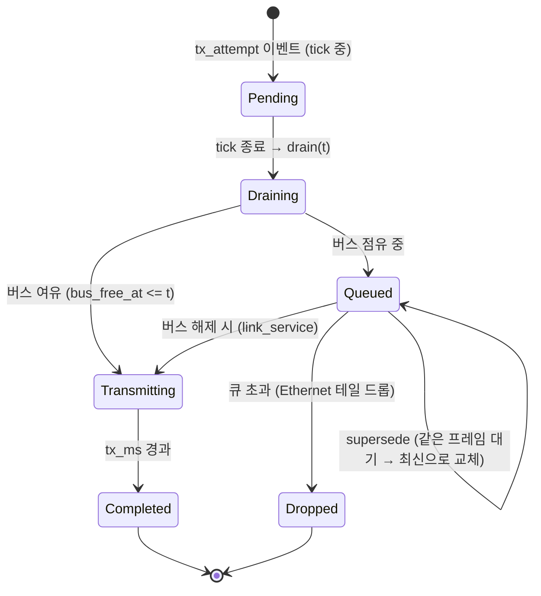

- 전송 시도는 tick이 끝날 때(4.3절의 `drain`)까지 대기했다가, **버스 여유 여부**에 따라
  즉시 전송되거나 큐에 들어간다.
- 전송이 시작되면 `tx` 이벤트가 `start` 시각에 기록되고, 링크의 `bus_free_at`이
  `start + tx_ms(frame)`로 갱신된다.
- **완료 시각**에 `rx` 이벤트가 스케줄되고, 링크가 비는 시각에 `link_service` 웨이크가 스케줄되어
  큐의 후속 프레임이 전송 기회를 얻는다.
- 게이트웨이 중계가 필요한 프레임은 완료 시각에 4.5절의 라우팅을 거친다.

## CAN 링크

**전송 시간**: `tx_ms = ceil((44 + 8·dlc) / (bitrate_kbps))` ms — CAN 프레임의 44비트
오버헤드 + 데이터 비트를 비트레이트로 나눈 값의 올림이다.

**중재(arbitration)**: 같은 시각에 여러 프레임이 전송을 시도하면, 버스 접근은 다음 순서로 결정된다.

1. **ID가 작을수록 우선** (CAN 중재 규칙의 재현)
2. ID가 같으면 **정의 선언 순서(frame_decl)**
3. 그다음 **도착 순서(arrival_seq)**

**버스 점유**: 버스가 바쁘면(`bus_free_at > t`) 시도는 큐에 대기한다. 대기 중인 프레임은
버스가 비는 시각부터 위 중재 순서대로 전송된다. CAN에는 큐 길이 제한이 없다
(모든 프레임은 결국 전송된다).

## Ethernet 링크

**전송 시간**: `tx_ms = ceil((dlc + 42) · 8 / (bitrate_mbps · 1000))` ms — 42바이트의
Ethernet 프레임 오버헤드(프리앰블·주소·타입·FCS)를 포함한 전송량을 비트레이트로 나눈다.

**스위치 큐**: 링크는 단일 스위치 FIFO를 가정한다.

- 큐의 순서는 **도착 순서(arrival_seq) 우선**, 같은 시각이면 정의 선언 순서로 결정된다.
- `switches[].queue_depth`(기본 1000)를 초과하는 시도는 **테일 드롭**되어 즉시 `drop` 이벤트가
  기록된다 (D-16).
- 큐에 **같은 프레임의 이전 인스턴스가 대기 중이면**, 대기 중인 것을 제거하고 최신 인스턴스로
  교체한다 — **supersede**(D-18). 중복 데이터의 전송을 생략해 대역폭을 절약하는 동작이며,
  `supersede_count`로 리포트에 집계된다.

## 전송·수신 이벤트

- `tx`: 전송 시작 시각에 기록 — `node`(송신자), `link`, `frame`, `data`.
- `rx`: 완료 시각에 기록 — 링크의 프레임 `message`를 `receives`하는 노드의 컴포넌트에게
  `on_message()`가 전달된다. 수신 매핑이 없는 노드는 이벤트에서 제외된다.
# 4.5 게이트웨이 라우팅

게이트웨이는 한 링크에서 수신·완료된 프레임을 다른 링크로 중계한다. 중계 규칙(라우트)은
아키텍처 정의의 `gateways[].routes`로 선언되며, 프레임이 출발 링크에서 **완료된 시각**에 평가된다.

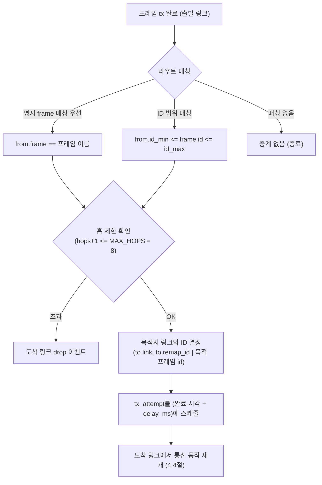

## 라우트 매칭

- 한 프레임에 여러 라우트가 걸릴 수 있다. **`from.frame`으로 특정 프레임을 지목하는 명시 라우트가
  ID 범위 라우트보다 우선**하며, 같은 종류끼리는 선언 순서대로 적용된다.
- 매칭된 각 라우트마다 목적지 링크로의 중계가 하나씩 생성된다.

## 중계 동작

- **목적지 프레임 결정**: 라우트의 `to.remap_id`가 지정되면 그 ID로, 아니면 목적지 링크에서
  같은 이름의 프레임(또는 동일 ID)이 있으면 그 프레임의 `id`/`dlc`를 사용한다.
- **지연**: 중계된 시도는 `완료 시각 + delay_ms`에 도착 링크의 `tx_attempt`로 스케줄된다
  (라우트의 `delay_ms`, 기본 0).
- **홉 제한**: 시도가 이미 `MAX_HOPS(8)`개의 링크를 거쳤다면 중계하지 않고, 목적지 링크에서
  즉시 `drop` 이벤트로 기록된다 — 라우팅 루프로 인한 무한 전파를 방지한다.

## 중계된 시도의 흐름

중계된 시도는 `hops`가 1 증가한 채 도착 링크의 일반 통신 경로(4.4절)를 그대로 따른다 —
대기·중재·큐잉·supersede·테일 드롭 모두 동일하게 적용되며, `tx` 이벤트의 `node`는 원본
송신 노드가 아니라 **중계를 수행한 게이트웨이가 속한 노드**가 된다.
# 4.6 앱 런타임 (SW 컴포넌트·태스크)

가상 ECU/HPC 위에는 정의의 컴포넌트들이 앱으로서 실행된다. 엔진은 **비선점 스케줄링**으로
주기 태스크를 구동하고, 사용자 정의 컴포넌트에 실행 훅과 통신 API를 제공한다.

## 주기 태스크 스케줄링

각 태스크는 **절대 주기**로 동작한다 — 첫 실행은 `t=0`, 이후 `period_ms`마다 반복된다.
실행은 비선점이며, `wcet_ms` 동안 노드(가상 CPU)를 독점한다.

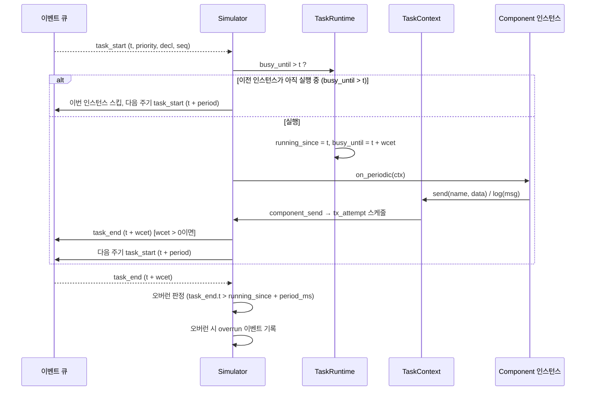

- **동일 노드의 동시 실행**은 없다: 다음 인스턴스가 시작될 시각에 이전 인스턴스가 아직
  `busy_until`이면, 그 인스턴스는 **스킵**되고 다음 주기로 넘어간다 (D-17).
- `wcet_ms == 0`이면 즉시 완료로 처리된다 (task_end가 같은 시각, 우선순위 열로 기록).
- 우선순위는 **순서의 키**로만 사용된다 — 같은 시각의 task_start들은 `priority`(그다음 decl,
  seq) 순으로 처리된다 (4.1절의 이벤트 키).

## 오버런 (D-17)

`task_end`가 `running_since + period_ms`를 초과하면 **오버런**으로 판정하고 `overrun` 이벤트를
기록한다. 태스크의 `run_count`/`overrun_count`는 리포트(TaskReport)에 집계된다.

## Component API

사용자 정의 컴포넌트는 `sdv_sim.core.component.Component`를 상속해 다음 훅을 구현할 수 있다.

```python
class Component:
    def on_start(self, ctx: TaskContext) -> None: ...      # 시뮬레이션 시작 시 1회
    def on_stop(self, ctx: TaskContext) -> None: ...       # 종료 시 1회
    def on_periodic(self, ctx: TaskContext) -> None: ...   # 주기 태스크마다
    def on_message(self, ctx: TaskContext, message: Message) -> None: ...  # 메시지 수신 시
```

- **TaskContext**는 실행 환경이다: `now_ms()`(현재 시각), `send(name, data)`(메시지 송신),
  `log(message)`(로그 이벤트 기록)를 제공한다.
- 컴포넌트 클래스는 `Simulator.load(..., components={...})`의 **클래스 레지스트리**에서
  `ComponentDef.class` 이름으로 매칭된다. 매칭되지 않으면 수신 전용 스텁(D-14)으로 취급되어
  `on_message`만 기본 동작(무시)으로 처리된다.
- **메시지 송신**: `ctx.send()`는 메시지 이름을 링크 프레임에 매핑해(3.1절) 해당 노드의
  `tx_attempt`를 **현재 시각**에 스케줄한다. 이후 동작은 4.4절의 통신 경로를 따른다.
- 컴포넌트 코드에서 예외가 발생하면 내부 오류(종료 코드 3)로 처리된다 — 사용자 컴포넌트의
  버그가 시뮬레이션을 불확정하게 만들지 않도록 한다.
# 4.7 검증과 자동화 (assertion · 이벤트 로그 · 리포트)

시뮬레이션의 결과는 **이벤트 로그**로 남고, **assertion 평가**와 **리포트 생성**으로
검증·자동화에 연결된다.

## 이벤트 로그

실행 중 모든 사건은 단일 `Event`로 기록된다: `(t_ms, seq, type, node, link, frame, task, data)`.
이벤트 종류는 7가지다.

| type | 의미 |
|------|------|
| `tx` | 프레임 전송 시작 |
| `rx` | 프레임 수신 완료 |
| `task_start` | 주기 태스크 실행 시작 |
| `task_end` | 주기 태스크 실행 완료 |
| `drop` | 프레임 드롭 (Ethernet 큐 초과, 홉 제한 초과) |
| `overrun` | 태스크 오버런 (4.6절) |
| `log` | 컴포넌트가 기록한 로그 (`TaskContext.log`) |

데이터 페이로드는 있으면 포함되고, 없으면 `null`로 생략된다. 로그는 이벤트 생성 순서가 아니라
`(t_ms, seq)` 정렬로 저장되어 재생(replay)이 결정적이다 (7.4절).

## Assertion 평가

시나리오의 `assertions` 각 항목은 다음 조건을 모두 만족하면 통과한다.

1. **매칭**: `expect.event`와 일치하는 이벤트가 존재한다. 이벤트별 추가 속성(`frame`, `link`,
   `node`, `task`, `message`)이 지정되면 그 속성도 일치해야 한다. `event: task`는
   `task_start`와 `task_end` **둘 모두**와 매칭한다.
2. **최소 개수**: 매칭된 이벤트 수가 `count` 이상이다 (D-20: "이상" 의미).
   `count`는 기본 1.
3. **시간**: `at_ms`가 지정되면, 첫 매칭 이벤트의 시각이 `at_ms ± within_ms` 안에 있다.
   (`within_ms` 기본 0)

모든 assertion이 통과하면 결과는 `pass`, 하나라도 실패하면 `fail`이다.

## 리포트

리포트는 이벤트 로그에서 집계된다. 구조는 4가지 파트로 나뉜다.

| 파트 | 내용 |
|------|------|
| **Summary** | `duration_ms`, 결과(`pass`/`fail`), 이벤트 총 개수 |
| **LinkReport** | 링크별 `kind`, tx/rx/drop/supersede 횟수, 버스 점유율(`bus_load_percent`) |
| **TaskReport** | 태스크별 노드·주기, `run_count`, `overrun_count` |
| **AssertionResult** | assertion별 이름·상태·상세(첫 매칭 시각, 실패 사유) |

리포트는 CLI 출력(5장), 서버 `/api/report`(6장)을 통해 사용자에게 제공되며, 이벤트 로그만으로
재구성 가능한 부분과 아키텍처 정보가 필요한 부분은 M-1 규칙(6.5절)으로 구분된다.

## CI 계약

자동 검증의 최종 인터페이스는 **종료 코드**이다. `run` 명령은 assertion 결과에 따라
0(pass) / 1(fail)을 반환하므로, CI 파이프라인은 로그·리포트를 파싱하지 않고도 성공 여부를
판정할 수 있다 (5장).
# 5. CLI (Command-Line Interface)

CLI는 코어의 1차 제공 형태이다. 패키지 설치 시 `sdv-sim` 실행 파일이 제공되며
(`pyproject.toml`의 entry point), 서버 없이 정의 → 실행 → 검증을 무인으로 수행한다.

## 5.1 명령 구조와 옵션

```
sdv-sim run <arch.yaml> <scenario.yaml> [--log PATH] [--quiet] [--lang ko|en]
sdv-sim serve [--port PORT] [--host HOST] [--dev] [--lang ko|en]
```

| 하위 명령 | 역할 |
|-----------|------|
| `run` | 아키텍처+시나리오를 로드·실행·검증하고 로그를 저장한다 |
| `serve` | 대시보드 서버를 시작한다 (6장) |

`run`의 주요 옵션:

| 옵션 | 기본값 | 의미 |
|------|--------|------|
| `--log PATH` | `events.json` | 이벤트 로그 저장 경로. `-`를 주면 stdout으로 출력 |
| `--quiet` | 꺼짐 | 요약 출력(assertion 결과·리포트)을 생략 |
| `--lang ko\|en` | 자동(5.4절) | 메시지 언어 강제 |

## 5.2 실행 흐름과 입출력 계약

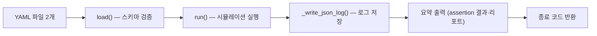

1. `load()`: 두 YAML 파일을 읽고 스키마 검증(3.3절)을 수행한다. 실패 시 입력 오류로 처리(종료 코드 2).
2. `run()`: 4장의 엔진을 실행하고 `SimulationResult`를 얻는다.
3. 로그를 `--log` 경로에 JSON으로 저장한다. 로그는 `schema_version`, `duration_ms`, `events`,
   `assertions`, `warnings`를 포함하는 단일 JSON 객체이다 — 대시보드의 `/api/load-log`(6.2절)와
   리플레이(7.4절)의 입력 형식이다.
4. 요약(assertion별 결과, 리포트 요약)을 터미널에 출력한다. `--quiet`면 생략한다.
5. 종료 코드로 결과를 전달한다 (5.3절).

CI 파이프라인은 파일 경로와 종료 코드만으로 성공 여부를 판정할 수 있다.

## 5.3 종료 코드와 오류 처리

| 코드 | 의미 | 예 |
|------|------|----|
| `0` | **pass** — 모든 assertion 통과 | 정상 검증 성공 |
| `1` | **assertion fail** — 하나 이상 실패 | 예상 drop이 발생하지 않음 |
| `2` | **입력 오류** — 파일 없음, YAML 파싱 오류, 스키마 검증 실패, 잘못된 사용법 | 잘못된 필드, 존재하지 않는 경로 |
| `3` | **내부 오류** — 엔진/컴포넌트 예외 | 사용자 컴포넌트의 `RuntimeError` |

오류 메시지는 메시지 코드(`SdvSimInputError.code`)와 번역(5.4절)으로 구성되어, 언어 설정에
따라 한국어 또는 영어로 출력된다. 오류 원인(파일·라인·규칙)이 메시지에 포함된다.

## 5.4 i18n 체계

사용자 메시지의 언어는 다음 우선순위로 결정된다.

```
--lang 옵션 > SDV_SIM_LANG 환경 변수 > 시스템 로케일(유효하면) > ko
```

- CLI 오류·요약·리포트 문자열은 메시지 코드와 번역 테이블(`sdv_sim/i18n.py`)로 관리된다.
- 예: `--lang en`으로 실행하면 시스템 로케일과 무관하게 영어 메시지가 출력된다.
- 대시보드의 프런트엔드 언어 결정은 별도 경로를 따른다 (7.7절).
# 6. 대시보드 서버

v2의 백엔드는 `sdv-sim serve`로 실행되는 **FastAPI 서버**(`sdv_sim/server/`)이다.
브라우저와 코어 사이의 얇은 API 계층으로, 파일시스템에 닿지 않고(YAML/JSON 문자열만 수신)
단일 세션을 유지하며 모든 오류를 일관된 계약으로 반환한다.

## 6.1 서버 구조

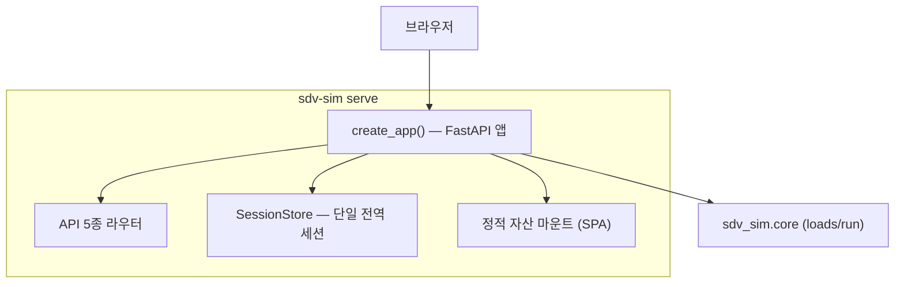

- **`create_app()` 팩토리**: 서버 앱을 구성하는 유일한 진입점이다. 테스트에서 앱을 직접 구성해
  httpx/uvicorn으로 검증한다 (11장).
- **SessionStore**: 전역 **단일 세션** 객체를 보유한다. 새 실행이 세션을 **교체**하는
  last-write-wins 정책이다 (6.4절).
- **정적 자산**: 운영 모드에서는 프런트엔드 빌드 결과(`sdv_sim/server/static/`)를 같은 서버가
  마운트해 단일 프로세스로 서비스한다. 개발 모드(`--dev`)에서는 Vite 개발 서버가 `/api`를
  이 서버로 프록시하므로 정적 마운트를 사용하지 않는다.
- 서버는 `--port`를 **바인딩 전에 점유 여부를 확인**하고, 이미 사용 중이면 종료 코드 2로
  즉시 실패한다. `--host`(기본 `127.0.0.1`)로 바인딩 주소를 제어한다 (9.3절).

## 6.2 API 5종

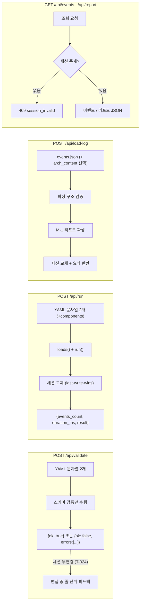

| 메서드 | 경로 | 요청 본문 | 응답 | 동작 |
|--------|------|-----------|------|------|
| POST | `/api/validate` | `{arch_content, scenario_content}` | `{ok}` 또는 `{ok, errors[]}` | 스키마 검증만. 세션을 건드리지 않는다 (T-024) |
| POST | `/api/run` | `{arch_content, scenario_content, components?}` | `{events_count, duration_ms, result}` | YAML 문자열로 `loads()`→`run()` 후 세션 교체 |
| POST | `/api/load-log` | `{events_content, arch_content?}` | `{events_count, duration_ms, result}` | 로그 파싱·검증 → 리포트 파생(M-1) → 세션 교체 |
| GET | `/api/events` | — | 이벤트 JSON | 세션의 이벤트를 `(t_ms, seq)` 정렬로 반환 |
| GET | `/api/report` | — | 리포트 JSON | 세션의 리포트를 반환 |

- 모든 요청·응답은 JSON이며, 파일 경로가 아니라 **파일 내용 문자열**만 오간다.
- `validate`는 **실행하지 않는 순수 검증**이다. 편집 중 디바운스(7.6절)로 호출되어
  오류를 줄 단위로 피드백하지만, 기존 세션(리플레이/리포트)을 무효화하지 않는다.

## 6.3 오류 계약 (F-8)

모든 오류 응답은 다음 형태의 단일 envelope를 따른다.

```json
{ "error": { "code": "validation_error", "message": "...", "detail": "..." } }
```

| HTTP | code | 의미 |
|------|------|------|
| 400 | `validation_error` | 입력 YAML 검증 실패 (validate/run) |
| 400 | `log_invalid` | 로그 JSON 구조·이벤트 형식 오류 (load-log) |
| 404 | `not_found` | 존재하지 않는 리소스 |
| 409 | `session_invalid` | 세션이 없거나 무효 (GET 계열) — 프런트가 재실행을 유도 |
| 500 | `internal` | 서버 내부 오류 |

프런트엔드는 `code`를 기준으로 사용자 메시지를 결정한다 (7.6절).

## 6.4 세션 수명주기

- 세션은 `{arch?, scenario?, events, report, created_at}` 묶음으로, **서버 전역에 단 하나**만 존재한다.
- `run`/`load-log`가 성공하면 **세션이 통째로 교체**된다 (last-write-wins). 동시 실행 요청은
  마지막 요청이 이긴다 — 단일 사용자 대시보드에 적합한 단순성 정책이다.
- `validate`는 세션을 변경하지 않는다 (T-024). 편집 중 "세션 무효화"는 서버 API가 아니라
  **프런트의 로컬 상태**(`invalidated`)로 처리되어, 실행된 결과가 오래된 입력과 연결되는
  문제를 프런트가 직접 막는다 (7.6절).
- GET 계열은 세션이 없으면 `409 session_invalid`를 반환한다. 프런트는 리플레이/리포트 진입
  시 이를 감지하고 사용자에게 실행을 안내한다.

## 6.5 로그 로드·리포트 파생 (M-1)

`/api/load-log`는 실행 없이 기존 이벤트 로그(CLI가 저장한 `events.json` 등)를 세션으로
올린다. 리포트는 로그에서 **파생**되며, 파생 가능 여부는 항목별로 다르다 (M-1 규칙).

| 파생 가능 | 파생 불가 (아키텍처 필요) | 로그만으로 불가 |
|-----------|----------------------------|-----------------|
| 링크 tx/rx/drop 횟수 | 버스 점유율(`bus_load_percent`) | supersede 횟수 |
| 태스크 run/overrun 횟수 | 링크 `kind`, 태스크 `period_ms` | warnings (엔진 경고) |
| assertion 결과 | — | — |

- `arch_content`를 함께 주면 버스 점유율 등 아키텍처 의존 항목이 보강된 리포트를 만든다.
- 이 규칙 덕분에 CLI가 남긴 로그 파일만으로도 웹에서 동일한 리플레이·리포트를 재현할 수 있다.
# 7.1 프런트엔드 모듈 구조

프런트엔드(`frontend/`)는 React 19 + TypeScript + Vite 6 기반의 SPA이다.
백엔드(6장)와 달리 **파일을 소유하는 계층**이며(7.5절), 서버 API를 통해 코어에 접근한다.

주요 소스 모듈과 역할:

```
frontend/src/
├── App.tsx                 # 전역 상태·라우팅 소유 (7.2)
├── main.tsx                # 진입점, 언어 주입 (7.7)
├── api/
│   └── client.ts           # API 5종 호출 클라이언트 (6.2절 계약)
├── components/
│   ├── StructureView.tsx   # 구조 뷰 (SVG) (7.3)
│   ├── EditorPane.tsx      # YAML 편집기 (줄 단위 오류 표시)
│   ├── EventPanel.tsx      # 이벤트 로그 패널
│   └── ReportView.tsx      # 리포트 패널
├── replay/
│   ├── ReplayView.tsx      # 리플레이 뷰 (7.4)
│   ├── ReplayOverlay.tsx   # 구조 뷰 위 오버레이 렌더링
│   ├── replayIndex.ts      # 스냅샷 인덱스·시크 로직
│   └── useReplayClock.ts   # 재생 시계 (rAF, 배속)
├── fileManager.ts          # 파일 열기/저장·최근 파일 (7.5)
├── layout.ts               # 구조 뷰 결정적 레이아웃 계산 (7.3)
├── useValidation.ts        # 편집 검증 훅 (7.6)
├── i18n/                   # 번역 사전·언어 결정 (7.7)
├── types/
│   ├── schema.ts           # 서버 계약 타입
│   └── ...
└── yaml.ts                 # YAML 파싱·직렬화 헬퍼
```

계층 규칙: **컴포넌트(뷰) → 훅/모듈(로직) → api/client(계약)** 방향으로만 의존한다.
`replayIndex`·`layout`·`fileManager`는 React에 의존하지 않는 **순수 로직 모듈**로 분리되어
Node에서 직접 테스트된다 (11.2절).
# 7.2 상태 관리·라우팅

프런트엔드는 전역 상태를 하나의 트리로 관리한다.

## 전역 상태 (App.tsx)

| 상태 | 내용 | 수명 |
|------|------|------|
| `archFile`, `scenarioFile` | 편집 중인 두 YAML **EditorFile** `{name, content, saved}` | 세션 |
| `session` | 서버 세션 메타 `{events_count, duration_ms, result, createdAt}` | 세션 |
| `invalidated` | 세션 무효화 플래그 — 현재 편집 내용이 실행 결과와 다름을 표시 (T-024, 6.4절) | 세션 |
| `recentFiles` | 최근 연 파일 목록 (IndexedDB, 최대 20개) | 영속 (7.5절) |
| `lang` | UI 언어 (7.7절) | 영속 |

- **EditorFile**: 파일 내용이 항상 상태에 있으므로, 저장되지 않은 편집은 서버와 무관하게
  브라우저 안에서만 존재한다.
- **invalidated**: `archFile`/`scenarioFile`이 수정되면 `true`가 되고, `run`/`load-log` 성공 시
  `false`로 돌아온다. 리플레이/리포트 진입 시 `invalidated`면 재실행을 안내한다.
  서버가 세션을 강제로 무효화하지 않는 대신, 브라우저가 "표시 중인 결과 = 현재 입력"을 보장한다.

## 라우팅 (hash)

- `#/editor` — 편집·구조 뷰·실행 (기본)
- `#/replay` — 리플레이 뷰 (7.4절)
- `#/report` — 리포트 패널

라우팅은 해시 기반이라 서버 정적 서빙에 추가 경로 규칙이 필요 없다 — SPA가
단일 `index.html`에서 동작한다. 브라우저 새로고침 시에도 해시로 상태를 복원한다.
# 7.3 구조 뷰 (Structure View)

구조 뷰는 아키텍처 정의(YAML)를 **SVG 다이어그램**으로 렌더링하는 컴포넌트이다.
렌더링은 `StructureView.tsx`(표시)와 `layout.ts`(좌표 계산)로 분리된다.

## 결정적 레이아웃 (layout.ts)

`layout.ts`는 순수 함수로 노드·링크·프레임의 좌표를 계산한다. **같은 아키텍처 입력은 항상
같은 좌표**를 만든다 — 재현성과 테스트 용이성(11.2절)을 위한 설계이다.

- **타입 밴드 배치**: 노드를 타입별 세로 밴드로 배치한다. HPC 밴드 → 게이트웨이 밴드 → ECU
  밴드 순서로, 데이터 흐름(게이트웨이 중계)을 왼쪽→오른쪽으로 자연스럽게 읽을 수 있다.
- **밴드 내 정렬**: 같은 밴드 안의 노드는 **연결된 링크 수 내림차순, 이름 오름차순**으로
  정렬되어, 허브 역할을 하는 노드가 위쪽에 온다. 순서 불안정성을 없애기 위해 정렬 키가
  (링크 수, 이름)으로 결정적이다.
- **CAN/Ethernet 시각 구분**: 링크 종류에 따라 색·선 스타일을 달리한다.

## 렌더링 (StructureView.tsx)

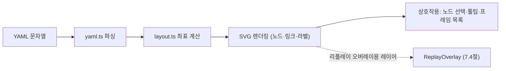

- SVG는 좌표가 결정적이므로 리플레이 오버레이(7.4절)가 같은 좌표 체계를 재사용한다.
- 구조 뷰는 **검증이 유효할 때만** 갱신된다 — 파싱/검증 오류가 있는 동안에는 마지막 유효
  다이어그램을 유지한다 (7.6절).
# 7.4 리플레이 (Replay)

리플레이 뷰는 실행 결과(이벤트 로그)를 구조 뷰 위에서 **시간에 따라 재생**한다.
핵심 요구사항은 "10만~100만 개의 이벤트를 부드럽게 시크(seek)할 수 있어야 한다"이다.

## 동작 설계: 스냅샷 인덱스 + 증분 재적용

전체 이벤트를 매 프레임마다 처음부터 재스캔하면 대형 로그에서 버벅인다. 리플레이는
**스냅샷 인덱스**와 **증분 적용**의 조합으로 시크를 O(log n + k)에 근접하게 만든다.

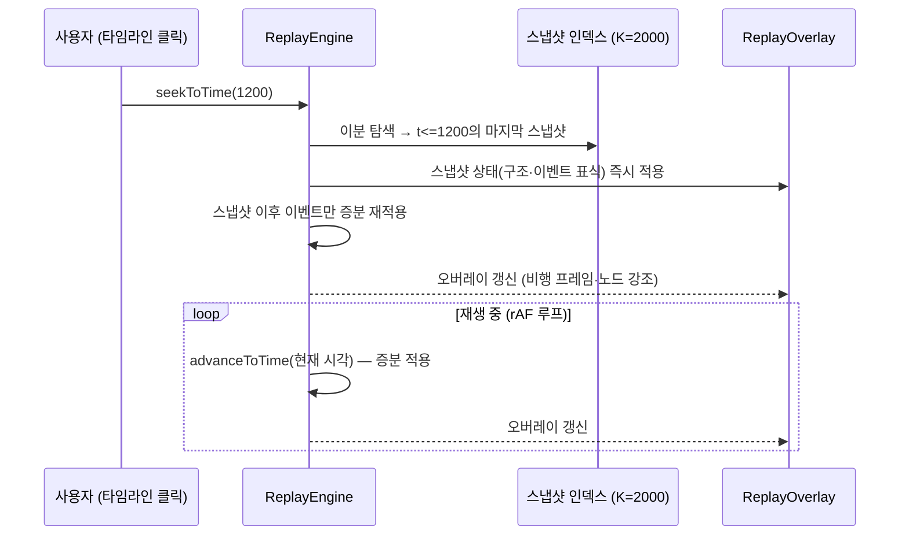

1. **이벤트 로드**: 이벤트는 이미 `(t_ms, seq)`로 정렬되어 있다 (4.7절).
2. **스냅샷 인덱스**: 로드 시 이벤트를 고정 간격(K=2000개)으로 스캔해, 각 스냅샷에
   "그 시점까지의 상태 요약"(전송 중 프레임, 노드 상태, 집계 카운터)을 저장한다.
3. **seekToTime(t)**: 이분 탐색으로 `t` 이전의 마지막 스냅샷을 찾아 상태를 복원한 뒤,
   그 스냅샷 이후의 이벤트만 순서대로 재적용한다. 시크는 100ms 이내를 목표로 한다.
4. **advanceToTime(t)**: 재생 중에는 현재 상태에서 이벤트를 증분 적용만 한다.

## 오버레이 렌더링 (ReplayOverlay)

구조 뷰(7.3절)의 결정적 좌표 위에 다음을 그린다.

- **비행 프레임**: 전송 중인 메시지가 링크 위를 이동 (시각 `t`에서 전송 시작/완료 사이)
- **노드 강조**: 현재 실행 중인 태스크의 노드 하이라이트
- **신호 표식**: `drop`/`overrun` 이벤트 발생 지점의 경고 표시

## 재생 모드

| 모드 | 시간 진행 | 용도 |
|------|-----------|------|
| **물리 모드** | 이벤트의 실제 `tx_ms`(통신 지연)를 그대로 재현 | 정확한 통신 순서 관찰 |
| **펄스 모드** | 이벤트 간격을 일정 펄스(약 300ms)로 압축 | 빠른 개관·긴 로그 브라우징 |

- **useReplayClock**: `requestAnimationFrame` 기반 시계로 배속(1x/2x/4x…)·일시정지·시크를
  제공한다. 물리 모드에서는 시뮬레이션 ms를 실제 시간으로 매핑하고, 펄스 모드에서는
  이벤트 수 기준으로 진행한다.

## 검증·정합성

- `scripts/check-replay.ts`가 **시크 결과 == 전체 재스캔 결과**를 검증한다 — 인덱스 근사화가
  상태를 왜곡하지 않는지를 CI에서 보장한다 (11.2절).
- 리플레이는 세션(`/api/events`) 또는 로그 파일(`/api/load-log`, 6.5절)에서 이벤트를 얻는다.
  두 경로 모두 동일한 `(t_ms, seq)` 정렬 입력을 쓰므로 렌더링 로직이 하나로 재사용된다.
# 7.5 파일 접근

대시보드의 파일 읽기/쓰기는 **브라우저 권한 경계 안**에서 이루어진다(2.4절 ④). 서버는
파일 경로를 받지 않고 내용 문자열만 받으므로, 서버 측 경로 검증·샌드박스가 필요 없다.

## 열기·저장 경로

| 방식 | 열기 | 저장 | 조건 |
|------|------|------|------|
| **File System Access API** | 파일 선택 → 핸들 유지 | **같은 파일에 그대로 저장** (`showSaveFilePicker` 불필요) | Chromium 계열 브라우저에서 사용 |
| **폴백 (input file / 다운로드)** | `<input type=file>`로 내용 읽기 | Blob 다운로드로 저장 | 지원하지 않는 브라우저 |

- 편집이 시작되면 파일 핸들이 `EditorFile`에 유지되고, 저장 시 핸들이 있으면 덮어쓰고
  없으면 다운로드 폴백을 쓴다.
- 저장되지 않은 편집이 있는 파일은 `saved=false`로 표시되어 닫기·새로고침 시 경고한다.

## 최근 파일 (IndexedDB)

- 열었던 파일의 이름·내용·핸들 정보를 **IndexedDB**에 저장한다 (최대 20개).
- 재방문 시 최근 파일 목록에서 다시 열 수 있다. 핸들은 세션이 끝나면 재인가가 필요하므로,
  저장된 내용으로 재편집을 시작하고 저장 시 다시 권한을 요청한다.
- 로컬 저장소가 아닌 IndexedDB를 쓰는 이유: 파일 내용이 클 수 있고(대형 아키텍처),
  핸들 객체는 localStorage에 직렬화할 수 없기 때문이다.

## 서버 파일시스템 미접촉

- 열기/저장 어디에도 서버 파일 경로가 개입하지 않는다.
- CLI가 남긴 `events.json`을 불러오는 것도 브라우저에서 파일을 선택해 `/api/load-log`로
  **내용 문자열**을 보내는 방식이다 (6.2절).
# 7.6 검증 피드백 (useValidation)

편집 중 YAML 오류를 **즉시** 사용자에게 보여주는 훅이다. 서버의 `/api/validate`(6.2절)를
사용하며, 실행(`/api/run`)과 분리된 순수 검증 경로로 동작한다.

## 동작

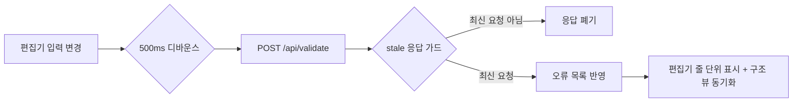

1. **디바운스**: 입력이 멈춘 뒤 500ms 후에만 검증을 호출한다 — 타이핑마다 요청이 가지
   않도록 한다.
2. **stale 응답 가드**: 연속 편집 중 이전 요청의 응답이 뒤늦게 도착하면, 최신 편집에 대한
   응답이 아닐 수 있으므로 **폐기**한다. 요청 시퀀스 번호로 최신 여부를 판별한다.
3. **반영**: 오류가 있으면 편집기에 줄 번호·메시지를 표시하고, **구조 뷰는 갱신하지 않는다**
   (마지막 유효 다이어그램 유지). 유효하면 구조 뷰를 동기화한다.
4. **forceValidate**: "실행" 버튼 클릭 시 디바운스와 무관하게 즉시 검증을 수행한다 —
   실행 요청 전에 입력이 유효한지 보장한다.

## 세션 무효화와의 관계 (T-024)

- `validate`는 세션을 변경하지 않는다(6.4절). 대신 **편집이 수정되면 `invalidated` 로컬
  플래그**가 켜지고, 리플레이/리포트 뷰가 "현재 입력과 다른 결과"임을 표시한다.
- 실행(`/api/run`) 성공 시 `invalidated`가 꺼지고 세션이 교체된다.

## 오류 표시

- 서버는 `{ok: false, errors: [{line, col, message}]}`를 반환하고(6.3절), 편집기는
  라인 숫자 옆에 오류 마커를 그린다.
- 오류 메시지는 서버가 `code`와 함께 반환하므로, 프런트는 코드별로 추가 해설을 붙일 수 있다.
# 7.7 i18n (언어 결정)

프런트엔드 UI 문자열은 서버(5.4절)와 별도 경로로 언어가 결정된다.

## 언어 결정 우선순위

```
window.__SDV_SIM_LANG__ (서버가 HTML에 주입) > localStorage 선택값 > 브라우저 로케일(navigator.language) > ko
```

| 단계 | 근거 |
|------|------|
| `window.__SDV_SIM_LANG__` | 서버가 `--lang`/환경 설정(5.4절)을 HTML 주입으로 전달 — CLI·서버 설정과 일관된 기본값 제공 |
| `localStorage` | 사용자가 UI에서 언어를 바꾸면 저장 (영속) |
| 브라우저 로케일 | 언어 설정이 없을 때 브라우저 언어를 사용 (`ko-KR`/`ko` → `ko`, 그 외 기본 `en`·`ko`) |
| 기본값 `ko` | 프로젝트 기본 언어 |

- 서버 주입값(`__SDV_SIM_LANG__`)은 로컬 선택값보다 **우선순위가 낮은 기본값**으로
  취급된다 — 사용자의 명시적 선택이 항상 이긴다.
- 번역 사전은 `i18n/`에 언어별 모듈로 분리되어 있고, 모든 UI 문자열은 키 기반으로
  참조된다. 언어 변경 시 뷰가 즉시 다시 렌더링된다.
# 8. 핵심 데이터 흐름

4·5·6·7장에서 설명한 구성 요소가 하나로 묶여 움직이는 **통합 흐름**을 보여준다.
시스템에는 두 개의 진입 흐름이 있다: ① 대시보드에서 정의를 편집·실행하는 **run 경로**,
② 기존 로그 파일을 불러와 재현하는 **load-log 경로**. CLI의 `run`은 ①의 서버 없이 코어를
직접 호출하는 변형이다. 모든 데이터는 문자열/YAML/JSON으로 서버를 통과한다.

## 8.1 run 경로 (대시보드 실행)

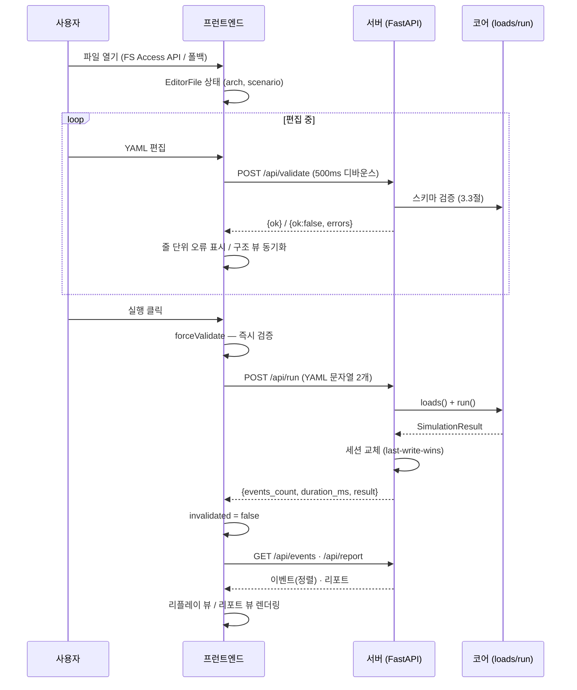

- 편집은 서버와 독립적으로 진행되며, 검증만 서버를 거친다.
- 실행은 **YAML 문자열**로 서버에 전달되고, 결과 이벤트·리포트는 **JSON**으로 돌아온다 —
  어느 단계에서도 파일 경로가 오가지 않는다 (2.4절 ④).
- 세션이 교체되면 프런트의 `invalidated`가 꺼져, 현재 편집 내용과 실행 결과가 일치함을
  보장한다 (7.6절).

## 8.2 load-log 경로 (로그 파일 재현)

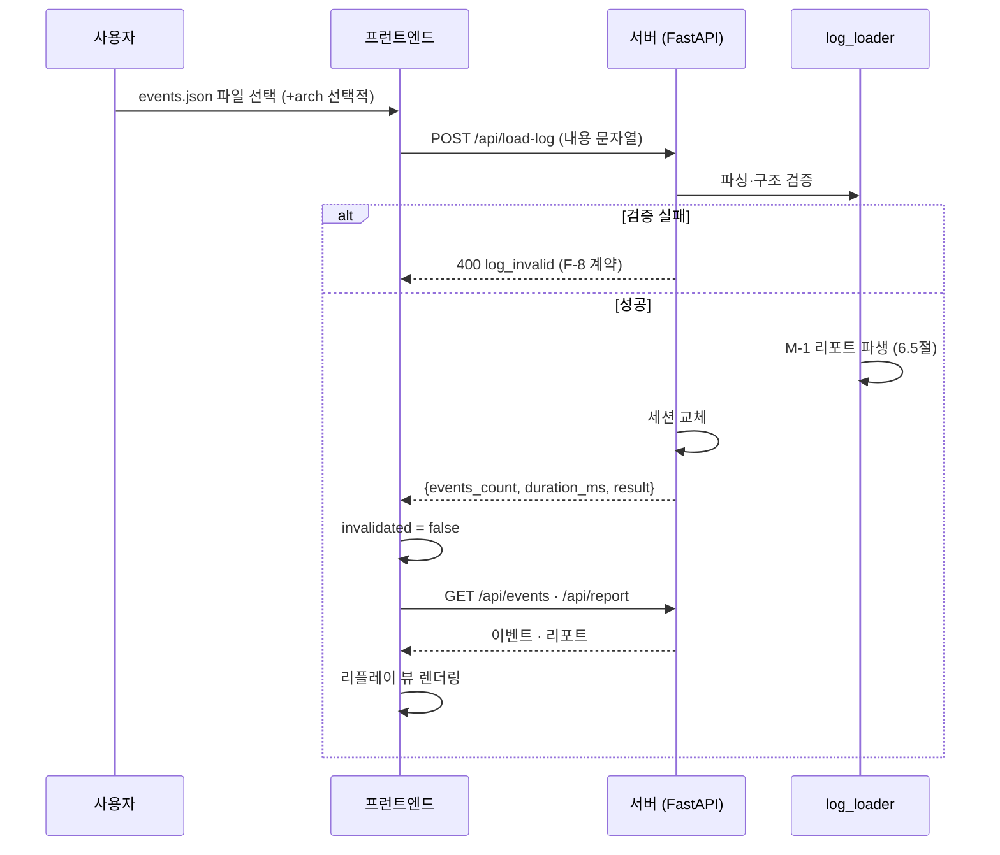

- CLI가 남긴 `events.json`(5.2절)이 이 경로의 대표 입력이다. 실행 없이 같은 리플레이·
  리포트를 웹에서 재현한다.
- 아키텍처를 함께 주면 버스 점유율 등 M-1 보강 항목이 리포트에 포함된다 (6.5절).

## 8.3 재생·시크 흐름

리플레이 뷰 내부의 시간 축 이동은 7.4절의 설계를 따른다:

```
이벤트 로드 (이미 (t_ms, seq) 정렬) → 스냅샷 인덱스 생성 (K=2000)
→ seekToTime(시크) = 이분 탐색 + 잔여 증분 재적용
→ advanceToTime(재생) = 증분 적용 (rAF 루프)
→ ReplayOverlay가 구조 뷰 위에 상태 렌더링
```

run 경로와 load-log 경로 중 어느 쪽으로 세션이 만들어졌든, 이벤트는 같은 정렬 계약을
따르므로 리플레이 로직은 하나로 재사용된다.
# 9. 모듈 의존성과 확장·변경 반영

이 장은 개발 측면의 관점에서 시스템을 본다: 모듈이 **어느 방향으로** 의존하는지,
확장이 어디에서 일어나는지, 그리고 실제 변경 요구가 구조에 **어떻게 반영**되었는지.

## 9.1 모듈 의존성

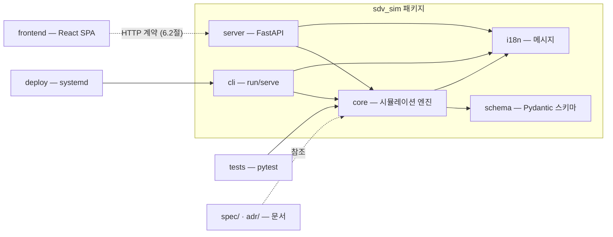

**의존성 규칙**: 화살표는 항상 "사용하는 쪽 → 사용되는 쪽"이다.

1. `core`는 `schema`(정의 타입)와 `i18n`(메시지)에만 의존하고, `cli`/`server`에 **역의존하지 않는다**.
   코어는 어떤 제공 형태로도 재사용될 수 있는 독립 실행 계층이다.
2. `cli`와 `server`는 같은 코어 API(`load`/`loads`/`run`)를 사용한다 — 통신·스케줄링·검증
   로직이 형태별로 분기되지 않는다 (2.4절 ②).
3. `frontend`는 서버의 **HTTP 계약**(6.2절)에만 의존한다. 서버 구현이나 코어 내부에
   의존하지 않으며, 브라우저에서 서버 코드를 알지 못한다.
4. `tests`는 코어(및 서버 팩토리)를 직접 사용한다 — 제공 형태를 거치지 않고 엔진 동작을 검증한다.

## 9.2 확장 지점

새 요구는 대부분 코어를 고치지 않고 **추가**로 흡수된다.

| 확장 지점 | 방식 | 예 |
|-----------|------|----|
| **사용자 정의 컴포넌트** | `components={...}` 클래스 레지스트리, `class` 키 매칭 | 샘플의 신호등 컴포넌트 (11.3절) |
| **새 링크 종류 / 라우트 / assertion** | 스키마(부록 A) + 엔진 처리기 확장 | CAN/Ethernet에 새 링크 종류 추가 |
| **새 제공 형태 (v2 사례)** | 코어는 무변경, 계층만 추가 | `loads()` 문자열 API 추가 → 대시보드 재사용 |
| **새 제공 형태 (v3 예정)** | 같은 코어 + API 계약 재사용 | 데스크톱 셸 (12장) |

- **레이어 추가 원칙**: "코어를 바꾸지 않고 어떻게 얹을까"를 먼저 묻는다. v2는 이 원칙의
  검증 사례이다 — v1 코어에 문자열 입력 API 하나를 추가하고, CLI와 별개로 서버·프런트를
  얹었다 (9.3절 ①).

## 9.3 변경 요구 반영 사례

실제 프로젝트에서 발생한 요구가 구조에 반영된 세 사례이다. 공통점은 **기존 계약을
깨지 않으면서** 새 요구를 흡수한 것이다.

### ① F-11 방향 전환: 서버 파일 접근 → 브라우저 파일 접근

- **요구**: v2 설계 초기에는 서버가 `--root` 샌드박스 안에서 파일을 읽는 방식이었다.
  사용자 피드백으로 "브라우저에서 원하는 파일을 열고, 서버가 파일을 몰라도 되는" 방향으로
  전환되었다 (F-11).
- **반영**: 서버에서 경로 처리·샌드박스 로직을 **제거**하고, 코어에 문자열 입력 팩토리
  `loads()`를 추가했다. 기존 `load()`(파일 경로, CLI용) 계약은 그대로 유지되어 CLI는
  변경 없이 재사용된다. 브라우저가 파일 소유자가 되면서(7.5절) 서버 보안 표면이 줄었다 (2.4절 ④).

### ② 네트워크 바인딩 제어: `--host` 추가

- **요구**: systemd 서비스 배포(10장)에서 `127.0.0.1` 기본값만으로는 외부 접근이 불가능하다.
- **반영**: `serve`에 `--host` 옵션을 추가하고 기본값을 `127.0.0.1`로 유지했다. `0.0.0.0`
  지정 시 경고를 출력하고, 포트가 이미 사용 중이면 종료 코드 2로 즉시 실패한다 (5.3절).

### ③ T-024 재설계: 세션 무효화를 프런트로 이동

- **요구**: "입력이 수정되면 실행 결과(리플레이/리포트)를 무효화"하는 요구가 초기에는
  서버 API(`/api/validate`가 세션을 무효화)로 설계되었다. 그러나 검증이 편집 중 수시로
  호출되어 **유효한 실행 결과까지 계속 무효화**되는 문제가 드러났다.
- **반영**: 서버의 `validate`를 **순수 검증**(세션 무변경)으로 고정하고, 무효화 판단을
  프런트 로컬 상태(`invalidated`, 7.2절)로 옮겼다. "표시 중인 결과 = 현재 입력" 보장은
  서버 대신 브라우저가 담당한다 (7.6절).

이 세 사례는 모두 9.2절의 "추가로 흡수" 원칙을 따른다: 계약을 유지하면서 기능을
얹거나, 책임을 더 적합한 계층으로 이동했다.
# 10. 배포

배포는 **하나의 Python 패키지**가 **하나의 서버 프로세스**로 실행되는 구조이다.
프런트엔드 정적 자산이 패키지에 포함되어 별도 정적 서버가 필요 없다.

## 10.1 패키징

- 빌드 백엔드는 **hatchling**이며, `uv build`(또는 `python -m build`)로 wheel을 만든다.
- 프런트엔드 빌드 결과(`frontend/dist/`)는 `sdv_sim/server/static/`으로 복사되고,
  wheel 빌드 시 **강제 포함**(force-include)된다 — 정적 자산이 누락되면 빌드가 실패하도록
  구성되어, "서버는 있으나 UI가 없는" 패키지가 나오지 않는다.
- 정적 자산이 없는 상태로 `serve`를 실행하면 `/` 요청에
  `{"message": "static not built"}`를 반환해 상태를 명확히 알린다 (11.2절의 check-files 검증과 연동).
- 패키지 이름은 `sdv-sim`, 진입점은 `sdv-sim = sdv_sim.cli.main:main`이다.

## 10.2 serve 실행 모델

`sdv-sim serve`는 **단일 프로세스**로 전체 서비스를 제공한다.

| 항목 | 동작 |
|------|------|
| 프로세스 | FastAPI 앱 + 정적 자산을 하나의 uvicorn 프로세스로 실행 |
| 포트 | `--port` (기본 `8888`) — 바인딩 전에 **점유 여부 확인**, 사용 중이면 종료 코드 2로 즉시 실패 |
| 호스트 | `--host` (기본 `127.0.0.1`). `0.0.0.0` 지정 시 외부 노출 경고 출력 (9.3절 ②) |
| 개발 모드 | `--dev`: 정적 마운트 대신 **Vite 개발 서버**가 `/api`를 이 서버로 프록시 (6.1절) |
| 로그 | uvicorn 로그를 **stdout**으로 출력 (spec 요구) — systemd journal에서 확인 |

## 10.3 systemd 서비스

`deploy/`에는 systemd **user unit**과 설치 스크립트가 포함되어 있다.

```ini
[Service]
Type=simple
WorkingDirectory=%h/work/sdv-simulator
Environment=SDV_SIM_LANG=ko
ExecStart=%h/work/sdv-simulator/.venv/bin/sdv-sim serve --port 8888 --host 0.0.0.0
Restart=always
RestartSec=5

[Install]
WantedBy=default.target
```

- **user unit**: 시스템 서비스가 아니라 로그인 사용자 단위로 동작한다 (`WantedBy=default.target`).
  부팅 시 자동 시작이 필요하면 `loginctl enable-linger`를 사용하며 `install.sh`가 자동 처리한다.
- `Restart=always`로 프로세스가 죽으면 5초 후 재시작한다.
- `--host 0.0.0.0`은 **인증 없이 네트워크에 대시보드를 노출**하므로, 방화벽에서 소스 IP를
  제한하는 것을 전제로 한다 (spec 제약).
- `install.sh` / `uninstall.sh`가 서비스 설치·제거를 수행한다.
- **실제 설치는 보류** 상태이다 — 개발 머신에서는 개발 모드로만 검증되었으며,
  시스템 서비스로의 설치 여부는 별도 결정으로 남겨 두었다 (부록 C.4).
# 11. 검증과 품질

구조가 의도대로 동작함을 보장하는 검증 체계는 **백엔드 테스트 + 프런트 로직 검증 스크립트 +
샘플 실행**의 세 축으로 구성된다.

## 11.1 백엔드: pytest + mypy strict

- **pytest**: `tests/`에 **113개 테스트**가 있으며 전부 통과한다. 엔진 동작별로 분리되어 있다.

  | 파일 | 대상 |
  |------|------|
  | `test_can.py` / `test_ethernet.py` | 통신 동작 — 전송 시간·중재·큐잉·supersede·테일 드롭 (4.4절) |
  | `test_gateway.py` | 게이트웨이 라우팅·홉 제한 (4.5절) |
  | `test_tasks.py` | 태스크 스케줄링·오버런 (4.6절) |
  | `test_assertions.py` | assertion 평가 규칙 (4.7절) |
  | `test_schema.py` | 스키마 검증 — 필드 제약·유일성·참조 무결성 (3.3절) |
  | `test_cli.py` | CLI 명령·종료 코드·로그 계약 (5장) |
  | `test_api.py` / `test_server.py` | 서버 API 5종·세션·오류 계약 (6장) — FastAPI TestClient 사용 |
  | `test_string_input.py` | `loads()` 문자열 입력 계약 (4.2절) |
  | `test_i18n.py` | 메시지 번역·언어 결정 (5.4절) |

- **mypy strict**: `[tool.mypy] strict = true, files = ["sdv_sim"]` — 코어·CLI·서버 전체가
  strict 타입 검사를 통과해야 한다. 이벤트/리포트/API 응답 타입이 계약으로 강제된다.
- 결정성(2.4절 ①) 덕분에 테스트는 시간·순서에 대해 **결정적인 기대값**을 assert할 수 있다.

## 11.2 프런트: 순수 로직 검증 스크립트

프런트의 뷰 로직은 브라우저 테스트 러너 없이 **Node로 실행되는 검증 스크립트**로 검증한다
(React에 의존하지 않는 순수 모듈 분리 — 7.1절).

| 스크립트 | 검증 내용 |
|----------|-----------|
| `check-layout.ts` | 구조 뷰 레이아웃 **결정성** — 같은 아키텍처 입력이 항상 같은 좌표를 만든다 (7.3절) |
| `check-replay.ts` | 리플레이 **시크 정확성** — 스냅샷 인덱스 기반 시크 결과가 전체 이벤트 재스캔 결과와 일치한다 (7.4절) |
| `check-files.ts` | 배포 필수 파일 존재 — `frontend/dist/`와 `sdv_sim/server/static/` 동기화 상태 (10.1절) |

이 구조 덕분에 리플레이 시크(대형 로그 성능의 핵심)와 레이아웃 결정성을 브라우저 없이
CI에서 회귀 검증할 수 있다.

## 11.3 샘플 실행 검증

`sample/`에 포함된 두 예제가 실행 검증(integration) 역할을 한다.

| 샘플 | 내용 |
|------|------|
| `samples/basic` | 소형 아키텍처 — **assertion 5건**: CAN 프레임 주기 전송·수신, 중재 우선순위, 태스크 실행 |
| `samples/vehicle` | 차량형 아키텍처 — **assertion 9건**: CAN 중재(door/seat), Ethernet 전송·수신, **드롭·오버런·supersede 관찰**, 사용자 정의 컴포넌트(`components.py`) 포함 |

- `components.py`는 4.6절의 Component API(`on_periodic`/`on_message`/`TaskContext.send`)의
  실제 사용 예이다.
- 두 샘플 모두 `sdv-sim run`이 종료 코드 0(pass)으로 끝나는 것이 수동 검증 경로이며,
  각 assertion은 drop/overrun/supersede 같은 고급 동작까지 예상 시각·횟수로 명시한다.
# 12. 향후 방향

현재 구조는 9.2절의 **레이어 추가 원칙**(코어 무변경, 계층만 추가)을 전제로 확장된다.
이 장은 후보 확장들을 상세 없이 표시한다.

| 후보 | 내용 | 연결되는 확장 지점 (9.2절) |
|------|------|----------------------------|
| **v3 데스크톱 셸** | 코어 + API 계약을 재사용하는 데스크톱 앱(경량 셸) | 새 제공 형태 — 같은 코어 |
| **OTA** | 업데이트 캠페인·버전·배포 흐름 시뮬레이션 | 새 도메인 — 스키마 + 엔진 처리기 확장 |
| **Ethernet 다중 스위치** | 현재 단일 스위치 FIFO를 다중 스위치 토폴로지로 확장 | 새 링크 동작 — 스키마 + 엔진 처리기 확장 |
| **구조화 폼 편집** | YAML 직접 편집 외 드래그/폼 기반 편집 | 프런트 계층 — 서버 계약 무변경 |

모든 후보는 본문 4~7장에서 설명한 **코어 계약·API 계약을 유지한 채** 추가된다.
예를 들어 v3 데스크톱은 `loads()`/`run()`과 이벤트 로그 형식(4.7절)을 그대로 사용하므로,
대시보드의 리플레이·리포트 로직을 재사용할 수 있다.
# 13. 결론

## 구조 요약

sdv-simulator는 **결정적 이산 사건 시뮬레이션 코어** 하나를 중심으로, 이를 감싸는
여러 제공 형태가 같은 계약을 공유하는 구조이다.

| 계층 | 핵심 | 장 |
|------|------|----|
| 코어 | 이벤트 순서 규칙으로 결정되는 통신·태스크·라우팅 시뮬레이션 | 4장 |
| CLI | 파일 입력 → 실행 → JSON 로그 + 종료 코드 0/1/2/3 | 5장 |
| 대시보드 서버 | 문자열 계약의 API 5종, 단일 세션, F-8 오류 계약 | 6장 |
| 프런트엔드 | 결정적 레이아웃 구조 뷰, 스냅샷 인덱스 리플레이, 브라우저 파일 경계 | 7장 |
| 배포 | 프런트 포함 단일 패키지, 단일 프로세스 serve, systemd | 10장 |

## 설계 특성 재확인

2.4절의 네 가지 특성이 본문 전체에서 실제 구조로 확인되었다.

1. **결정성** — `(t_ms, priority, decl, seq)` 완전 순서로 모든 이벤트가 결정된다 (4.1절).
2. **단일 코어 공유** — CLI와 서버가 같은 `load`/`loads`/`run` API를 사용한다 (9.1절).
3. **헤드리스/CI** — 로그·종료 코드만으로 판정 가능하다 (5장, 11.1절).
4. **브라우저 파일 경계** — 서버는 파일 경로를 받지 않는다 (7.5절, 8장).

## 검증 기준 충족 근거

overview(정의 단계)에서 설정한 네 가지 검증 기준과 이 문서의 충족 지점이다.

| 검증 기준 | 충족 근거 |
|-----------|-----------|
| **① 코드 없이 구조 파악 가능** | 2장 전체 개요 + 각 장의 동작 설명(D1~D11)으로 코드 없이 읽을 수 있음 |
| **② 핵심 설계 설명력** | 4장(엔진 이벤트 루프·통신 충실도·스케줄링), 7.4절(리플레이)이 동작을 단계적으로 서술 |
| **③ 코드·spec/ADR 정합성** | 모든 식별자·용어·동작은 코드와 spec(sdv-sim-v1/v2)에 근거하고, 부록 B의 인용 매핑으로 추적 가능 |
| **④ 설계 근거 연결** | 부록 C(개발 과정)와 부록 D(ASR별 ADR 결정 내역)가 본문의 설계 사실을 근거와 연결 |

결론적으로 이 구조는 "정의 → 실행 → 검증"이라는 프로젝트 목표를 **결정적인 코어와
계층형 제공 형태**로 달성하며, 이후 확장(v3·OTA 등)도 코어 계약을 유지한 채 흡수할 수
있는 기반을 제공한다.
# 부록 A. SDV 정의 — YAML 사양

- **범위**: `architecture.yaml` / `scenario.yaml`의 모든 필드·제약·예시 (본문 3장의 필드 단위 상세판)
- **정합**: 본 부록의 필드 트리는 `spec/sdv-sim-v1.md` D-12와 `sdv_sim/schema/arch.py`·`sdv_sim/schema/scenario.py` Pydantic 모델에 1:1로 대응한다 (구현 SSOT)
- **표기 규칙**: `[필수]` = 지정해야 하는 필드, `(기본 X)` = 생략 시 기본값. 모든 모델은 `extra="forbid"` — 스키마에 정의되지 않은 필드는 오류

## A.1 architecture.yaml

최상위 구조:

```yaml
schema_version: 1
nodes:    [ ... ]
links:    [ ... ]
gateways: [ ... ]
```

### A.1.1 최상위

| 필드 | 타입 | 필수 | 설명 | 제약 |
|------|------|------|------|------|
| `schema_version` | int | 아니오 (기본 1) | 스키마 버전 | — |
| `nodes` | list[Node] | 아니오 (기본 []) | ECU/HPC 노드 목록 | 이름 전역 유일 |
| `links` | list[Link] | 아니오 (기본 []) | CAN/Ethernet 링크 목록 | 이름 전역 유일 |
| `gateways` | list[Gateway] | 아니오 (기본 []) | 게이트웨이 목록 | 이름 전역 유일 |

### A.1.2 Node

| 필드 | 타입 | 필수 | 설명 | 제약 |
|------|------|------|------|------|
| `name` | str | 예 | 노드 이름 | 전역 유일, 링크 `nodes`에서 참조됨 |
| `type` | `ECU` \| `HPC` | 아니오 (기본 `ECU`) | 노드 종류 | — |
| `components` | list[Component] | 아니오 (기본 []) | 탑재 소프트웨어 컴포넌트 | 노드 내 이름 유일 |

### A.1.3 Component

| 필드 | 타입 | 필수 | 설명 | 제약 |
|------|------|------|------|------|
| `name` | str | 예 | 컴포넌트 이름 | 노드 내 유일 |
| `sends` | list[str] | 아니오 (기본 []) | 송신 논리 메시지명 | 각 메시지가 연결 링크 프레임에 매핑되어야 함 (A.3.3) |
| `receives` | list[str] | 아니오 (기본 []) | 수신 논리 메시지명 | 각 메시지가 연결 링크 프레임에 매핑되어야 함 (A.3.3) |
| `tasks` | list[Task] | 아니오 (기본 []) | 주기 태스크 | — |
| `class` | str \| null | 아니오 (기본 null) | Python 컴포넌트 클래스 등록명 (`load(..., components={...})` 키와 일치) | 미지정 시 스텁 동작 (D-14) |

### A.1.4 Task

| 필드 | 타입 | 필수 | 설명 | 제약 |
|------|------|------|------|------|
| `name` | str | 예 | 태스크 이름 | — |
| `period_ms` | int | 예 | 주기 (정수 ms) | > 0 |
| `priority` | int | 예 | 우선순위 | 작을수록 우선 |
| `wcet_ms` | int | 아니오 (기본 0) | 최악 실행 시간 | ≥ 0 (0 = 즉시 완료) |

### A.1.5 Link

| 필드 | 타입 | 필수 | 설명 | 제약 |
|------|------|------|------|------|
| `name` | str | 예 | 링크 이름 | 전역 유일 |
| `kind` | `can` \| `ethernet` | 예 | 링크 종류 | — |
| `bitrate` | int | 예 | 전송 속도 (CAN: kbps, Ethernet: Mbps) | > 0 |
| `nodes` | list[str] | 아니오 (기본 []) | 연결 노드 이름 | 전부 정의된 노드여야 하며, 링크 내 중복 참조 금지 |
| `frames` | list[Frame] | 아니오 (기본 []) | 링크가 소유한 L2 프레임 | 링크 내 이름 유일 |
| `switches` | list[Switch] | 아니오 (기본 []) | Ethernet 스위치 | 2개 이상 정의해도 **첫 번째만 사용** (U-2) |

### A.1.6 Frame

| 필드 | 타입 | 필수 | 설명 | 제약 |
|------|------|------|------|------|
| `name` | str | 예 | 프레임 이름 | 링크 내 유일 |
| `id` | int | 예 | CAN ID / 프레임 식별자 | ≥ 0 (CAN 중재: 작을수록 우선) |
| `dlc` | int | 예 | 데이터 길이 코드 (바이트) | ≥ 0 |
| `period_ms` | int | 예 | 주기 (t=0 첫 발생) | > 0 |
| `source` | str | 예 | 송신 노드 이름 | 해당 링크 `nodes`에 포함되어야 함 |
| `message` | str \| null | 아니오 (기본 null) | 매핑할 논리 메시지명 | 미지정 시 프레임명 = 메시지명 (A.3.3) |

### A.1.7 Switch

| 필드 | 타입 | 필수 | 설명 | 제약 |
|------|------|------|------|------|
| `name` | str | 아니오 (기본 `"default"`) | 스위치 이름 | — |
| `queue_depth` | int | 아니오 (기본 1000) | FIFO 큐 깊이 | > 0, 초과 시 테일 드롭 → `drop` 이벤트 |

### A.1.8 Gateway

| 필드 | 타입 | 필수 | 설명 | 제약 |
|------|------|------|------|------|
| `name` | str | 예 | 게이트웨이 이름 | 전역 유일 |
| `routes` | list[Route] | 아니오 (기본 []) | 라우팅 규칙 | 규칙 순서대로 매칭 시도, 명시 frame > ID 범위 우선 |

### A.1.9 Route (`from` / `to`)

| 필드 | 타입 | 필수 | 설명 | 제약 |
|------|------|------|------|------|
| `from.link` | str | 예 | 소스 링크 이름 | 정의된 링크 |
| `from.frame` | str | 아니오 | 특정 프레임 지정 | `frame` 또는 `(id_min, id_max)` 중 **정확히 하나**만 지정, 소스 링크에 정의된 프레임 |
| `from.id_min` / `from.id_max` | int | 아니오 | ID 범위 지정 | 함께 지정해야 하며 `id_min <= id_max` |
| `to.link` | str | 예 | 대상 링크 이름 | 정의된 링크 |
| `to.remap_id` | int \| null | 아니오 (기본 null) | 라우팅 시 ID 재매핑 | ≥ 0 |
| `delay_ms` | int | 아니오 (기본 0) | 라우팅 처리 지연 | ≥ 0 |

## A.2 scenario.yaml

최상위 구조:

```yaml
schema_version: 1
duration_ms: 100
seed:          # v1에서 무시
messages:    [ ... ]
assertions:  [ ... ]
```

### A.2.1 최상위

| 필드 | 타입 | 필수 | 설명 | 제약 |
|------|------|------|------|------|
| `schema_version` | int | 아니오 (기본 1) | 스키마 버전 | — |
| `duration_ms` | int | 예 | 시뮬레이션 종료 시각 (`t == duration_ms`까지 처리) | ≥ 0 |
| `seed` | int \| null | 아니오 (기본 null) | 난수 시드 | **v1에서 무시** (결정성 — 난수 미사용) |
| `messages` | list[Message] | 아니오 (기본 []) | 메시지 주입 목록 | 주입은 tx 이벤트로 기록됨 |
| `assertions` | list[Assertion] | 아니오 (기본 []) | 선언형 검증 목록 | — |

### A.2.2 Message (주입)

| 필드 | 타입 | 필수 | 설명 | 제약 |
|------|------|------|------|------|
| `t_ms` | int | 예 | 주입 시각 | ≥ 0 |
| `link` | str | 예 | 대상 링크 이름 | 정의된 링크 |
| `frame` | str | 예 | 대상 프레임 이름 | 해당 링크에 정의된 프레임 |
| `data` | dict \| null | 아니오 (기본 null) | 페이로드 데이터 (객체) | Ethernet 전송 시간 계산과 무관 (payload = DLC 바이트) |

### A.2.3 Assertion (`expect`)

| 필드 | 타입 | 필수 | 설명 | 제약 |
|------|------|------|------|------|
| `name` | str \| null | 아니오 (기본 null) | assertion 이름 (리포트·실패 메시지에 표시) | — |
| `expect.event` | `tx` \| `rx` \| `task` | 예 | 매칭할 이벤트 타입 | `task`는 `task_start`+`task_end` **둘 다** 매칭 (U-4) |
| `expect.frame` | str \| null | 아니오 | 프레임 이름 | 지정 속성은 **모두 일치**해야 매칭 |
| `expect.message` | str \| null | 아니오 | 논리 메시지명 | — |
| `expect.node` | str \| null | 아니오 | 노드 이름 | — |
| `expect.link` | str \| null | 아니오 | 링크 이름 | — |
| `expect.task` | str \| null | 아니오 | 태스크 이름 | — |
| `expect.at_ms` | int \| null | 아니오 (기본 null) | 기대 시각 | ≥ 0. 명시 시 `\|t_ms - at_ms\| <= within_ms`, **생략 시 시간 무관** |
| `expect.within_ms` | int | 아니오 (기본 0) | 허용 오차 | ≥ 0 (0 = 정확 일치) |
| `expect.count` | int | 아니오 (기본 1) | 기대 개수 | ≥ 0. **최소 n건 이상(≥)** 통과 — 시간 조건과 독립 (U-5) |

## A.3 검증 규칙 상세

스키마 검증은 Pydantic으로 수행되며, 위반 시 오류 메시지에 **파일명·줄 번호·필드 경로**가 포함된다. 오류는 입력 오류로 분류되어 CLI 종료 코드 2를 반환한다.

### A.3.1 유일성

| 대상 | 범위 | 위반 예 |
|------|------|---------|
| 노드 이름 | 파일 전체 | `duplicate node name: 'body_ecu'` |
| 링크 이름 | 파일 전체 | `duplicate link name: 'can1'` |
| 게이트웨이 이름 | 파일 전체 | `duplicate gateway name: 'gw1'` |
| 프레임 이름 | 해당 링크 내 | `duplicate frame name on link 'can1': 'door_cmd'` |
| 컴포넌트 이름 | 해당 노드 내 | `duplicate component name on node 'body_ecu': 'door_ctrl'` |
| 링크의 노드 참조 | 해당 링크 내 | 링크 `nodes`에 같은 노드 2회 지정 |

### A.3.2 참조 무결성

| 규칙 | 위반 예 |
|------|---------|
| 링크 `nodes`의 모든 이름은 정의된 노드여야 함 | `link 'can1' references unknown node(s): ['hvac_ecu']` |
| 프레임 `source`는 해당 링크에 연결된 노드여야 함 | `frame 'door_cmd' on link 'can1': source 'hvac_ecu' is not connected to the link` |
| 라우트 `from.link`/`to.link`는 정의된 링크여야 함 | `gateway 'gw1' route #0: unknown from link 'can2'` |
| 라우트 `from.frame`는 소스 링크에 정의된 프레임이어야 함 | `gateway 'gw1' route #0: frame 'door_cmd' is not defined on link 'can1'` |
| 라우트 소스는 `frame` 또는 `(id_min, id_max)` 중 정확히 하나 | `from must specify either frame or (id_min, id_max)` |
| 컴포넌트 `sends`/`receives`의 메시지는 연결 링크 프레임에 매핑되어야 함 | `component 'door_ctrl' on node 'body_ecu': message 'hvac_cmd' does not map to a frame on any connected link` |

### A.3.3 메시지-프레임 매핑 규칙

- 컴포넌트의 `sends`/`receives`는 **논리 메시지** 이름을 참조한다.
- 프레임에 `message` 필드가 명시되면 그 메시지에 매핑된다.
- `message` 미명시 시 **프레임 이름 = 메시지 이름**으로 매핑된다.
- 컴포넌트가 속한 노드에 연결된 링크들의 프레임(매핑 메시지 집합)에 없는 메시지는 스키마 오류다.

## A.4 예시 — samples/basic (문 제어 시스템)

`report` 본문과 `samples/basic/`에 있는 축약 예제. 2 ECU + CAN 1링크, 주기 프레임 2종, 주입 메시지 1건, assertion 5건.

```yaml
# architecture.yaml
schema_version: 1
nodes:
  - name: body_ecu
    type: ECU
    components:
      - name: door_ctrl
        sends: [door_cmd]
        receives: [door_state]
        tasks:
          - { name: main, period_ms: 10, priority: 1, wcet_ms: 1 }
  - name: door_ecu
    type: ECU
    components:
      - name: door_act
        receives: [door_cmd]

links:
  - name: can1
    kind: can
    bitrate: 500            # kbps → tx_ms = ceil((44 + 8*4) / 500) = 1ms
    nodes: [body_ecu, door_ecu]
    frames:
      - { name: door_cmd,   id: 0x100, dlc: 4, period_ms: 10, source: body_ecu }
      - { name: door_state, id: 0x101, dlc: 4, period_ms: 10, source: door_ecu }
```

```yaml
# scenario.yaml
schema_version: 1
duration_ms: 100

messages:
  - { t_ms: 5, link: can1, frame: door_cmd, data: { state: open } }

assertions:
  # door_cmd tx: 주기 11건(t=0,10,...,100) + 주입 1건(t=5) = 12건, 첫 전송 t=0
  - name: cmd_sent
    expect: { event: tx, frame: door_cmd, link: can1, at_ms: 0, count: 12 }
  # door_cmd rx: tx 완료(+1ms) 후 door_ecu 수신 — 11건
  - name: cmd_received
    expect: { event: rx, frame: door_cmd, link: can1, node: door_ecu, at_ms: 1, count: 11 }
  # door_state tx: 같은 tick에서 door_cmd에 밀려 1ms 지연 → CAN ID 중재 관찰
  - name: state_arbitrated
    expect: { event: tx, frame: door_state, link: can1, at_ms: 1, count: 10 }
  # door_state rx: body_ecu의 door_ctrl 수신 — 10건
  - name: state_received
    expect: { event: rx, frame: door_state, link: can1, node: body_ecu, at_ms: 2, count: 10 }
  # task 이벤트: task_start 11건 + task_end 10건 → 21건 ≥ 11
  - name: task_runs
    expect: { event: task, node: body_ecu, task: main, at_ms: 0, count: 11 }
```

실행: `uv run sdv-sim run samples/basic/architecture.yaml samples/basic/scenario.yaml` → `pass` (exit 0, assertions 5/5)
# 부록 B. sdv-simulator 사양 요약 (spec v1/v2)

- **범위**: 본문이 참조하는 Spec(`spec/sdv-sim-v1.md` v1, `spec/sdv-sim-v2.md` v2)의 핵심 요구사항 집합 요약 — 원문 재생산이 아닌 요약 표 중심
- **용도**: 본문의 D-번호/F-번호/M-번호 인용이 어느 spec의 어떤 절에 근거하는지 추적 (B.3)
- **SSOT**: `spec/`가 유일한 요구사항 원천 — 본 부록은 요약이며, 모순 발생 시 spec이 우선한다

## B.1 v1 요약 — D-번호별 핵심 요구

v1 상세 설계 ADR 10건(D-12~D-21, 2026-08-12 승인)의 결정이 인코딩된 요구사항 1줄 요약:

| 번호 | 주제 | 핵심 요구 (1줄) |
|------|------|-----------------|
| D-12 | 정의 필드-레벨 스키마 & 메시지 주입 | `architecture.yaml`(nodes/links/gateways)과 `scenario.yaml`(duration_ms/messages/assertions) 필드 트리를 정의하고, `messages` 주입 항목(`t_ms`/`link`/`frame`/`data?`)은 tx 이벤트로 기록 (필드 상세 = 부록 A) |
| D-13 | 통신 이벤트 기록 의미론 | tx는 주기 프레임·`ctx.send`·주입 3경로, rx는 `receives` 매핑된 노드에만, 게이트웨이는 인프라(규칙 체인, 홉 ≤ 8), Ethernet은 스위치 FIFO 방출 시각에 rx |
| D-14 | 스텁 컴포넌트 동작 | `class` 미등록 컴포넌트는 수신자 전용 — `sends` 무시, 자동 송신 없음 (tx 3경로만 존재) |
| D-15 | 공개 API 계약 | `load(경로)`/`loads(YAML 문자열)`/`load_scenario`/`load_scenario_yaml` → `Simulator`, `run()` → `SimulationResult`(events 리스트·report·assertions·duration_ms), `TaskContext`(send/log/now_ms) |
| D-16 | CLI 입출력 채널 | `--log <path>`(기본 `events.json`, `-`=stdout)/`--quiet`/`--lang` — 파일 쓰기 실패는 exit 2, 오류 카테고리·공통 메시지는 ko/en, 내부 예외 상세는 원문 유지 |
| D-17 | 태스크 오버런 정책 | 오버런 후 다음 인스턴스는 **절대 주기**(원래 t=0 기준) 유지, 놓친 주기는 스킵 — 밀림 없음 |
| D-18 | 프레임 큐 인스턴스 정책 | 큐 대기 중 동일 프레임의 새 주기 인스턴스 도착 시 **최신 교체**(supersede) — 교체는 큐 depth 비소모, 별도 이벤트 없음 |
| D-19 | 이벤트 순서·종료 경계 | 동일 시각 = 태스크 우선순위(작을수록) → 파일 선언 순서 → seq, 비-태스크는 모든 태스크 뒤(가상 우선순위 2^30), `t == duration_ms` 포함(inclusive) 종료 |
| D-20 | Assertion 평가 규칙 | event 타입 + 지정 속성 모두 일치, `event: task`는 start+end 둘 다, `at_ms` 명시 시 `\|t_ms-at_ms\| ≤ within_ms` / 생략 시 시간 무관, `count` = 최소 n건(≥), 실패 메시지 = 매칭 최대 3건 + 기대/실제 |
| D-21 | 결과 리포트 스키마 | `simulation` + `links`(tx/rx/drop/supersede/bus_load_percent) + `tasks`(run/overrun) + `assertions` + `warnings`, `bus_load_percent = tx_ms 합 / duration_ms` |

### v1 기본 결정 그룹 (1차 ADR 11건 — D-번호 없이 Decisions에 인코딩)

| 주제 | 핵심 결정 |
|------|-----------|
| 언어/런타임 | Python 3.11+ (타입 힌트 + mypy strict), pip 패키지 + CLI 진입점, 난수 미사용(결정성) |
| 성능 목표 | v1 순수 Python — 노드 ≤ 50, 링크 ≤ 20, 프레임 ≤ 200, duration ≤ 60s, 이벤트 ≤ 100만 건 → 수 초 내 실행 |
| 패키지 구조 | 배포명 `sdv-sim` / 임포트명 `sdv_sim`, 단일 패키지 + `sdv_sim/core`·`sdv_sim/cli` 모듈 경계 |
| 시뮬레이션 엔진 | DES(이벤트 큐 + 단일 스레드 + fast-forward), 모든 시간은 정수 ms, 이벤트 `(t_ms, seq)` 완전 순서 |
| 정의 형식 | YAML (PyYAML + Pydantic), 메시지-프레임 2계층 + 매핑 규칙, architecture/scenario 파일 분리 |
| 통신 충실도 | L2 — CAN `ceil((44+8·DLC)/bitrate)` + ID 우선 중재 + 우선순위 큐, Ethernet `ceil((dlc+42)·8/(bitrate·1000))` + FIFO + 테일 드롭, 게이트웨이 `from/to` 명시 규칙 |
| 앱 런타임 | RTE 스타일(주기 태스크 + 이벤트 핸들러), 비선점 + `wcet_ms` + overrun 기록, `Component` 베이스 클래스 + `ctx.send/log/now_ms` |
| 검증·자동화 | YAML 선언형 assertion + 결정적 JSON 이벤트 로그(단일 문서, type enum 7종) + CLI 종료 코드 0/1/2/3 |

### v1 검증 발굴 항목 (U-1~U-6 — spec-driven-verification에서 식별 → 스펙 인코딩)

| # | 결정 내용 | 스펙 인코딩 위치 |
|---|-----------|------------------|
| U-1 | 같은 tick 비-태스크 이벤트는 모든 태스크 뒤 (가상 우선순위 2^30) | D-19 |
| U-2 | Ethernet `switches` 2개 이상 정의 시 첫 번째만 사용 | 통신 충실도 (L2) |
| U-3 | 로그 파일 쓰기 실패 시 종료 코드 2 (입력 오류 분류) | D-16 |
| U-4 | assertion `event: task`는 task_start + task_end 둘 다 매칭 | D-20 |
| U-5 | `count` = 최소 n건 이상(≥), 초과는 실패 아님 | D-20 |
| U-6 | Ethernet payload = 프레임 DLC 바이트 (`bytes = dlc + 42`) | 통신 충실도 (L2) |

## B.2 v2 요약 — F/M/T 번호별 핵심 요구

### B.2.1 spec-review 발굴 항목 (F-1~F-11)

v2 스펙 작성·검토 중 식별된 미정의/모순 항목 — 전부 `spec/sdv-sim-v2.md`에 인코딩·해소:

| 번호 | 핵심 요구 (1줄) | 해소 위치 |
|------|-----------------|-----------|
| F-1 | supersede 관련 문구 명확화 | v1 Report 파생 규칙 |
| F-2 | load-log에서 전체 Report 계산 — `POST /api/load-log`에 `arch_content` 포함 시 전체, 미포함 시 파생 가능 항목만 | 데이터 흐름·리플레이 (ASR-015) |
| F-3 | 설계 결정 근거를 스펙에 명시 | Context·Decisions 절 |
| F-4 | 검증 범위 — 시나리오 단독 = 구조 검증만, `arch` 페어링 시 참조 검증까지 | 편집·파일 관리 (ASR-018) |
| F-5 | load-log 경로 시크 상태 — 고정 펄스 근사 또는 in-flight 미표시 (tx_ms 계산 불가) | 데이터 흐름·리플레이 (ASR-015) |
| F-6 | 구조 뷰 자동 레이아웃 = 타입 밴드 (HPC 상단/게이트웨이 중앙/ECU 하단, 밴드 내 링크 수 내림차순 → 이름 사전순) | 구조 뷰 렌더링·성능 (ASR-016) |
| F-7 | 세션 없음 시 events/report 조회 = 409 + `{error: {code: session_invalid}}` | API (REST, JSON) |
| F-8 | 오류 응답 스키마 = `{error: {code, message, detail?}}` (code: validation_error/log_invalid/session_invalid/not_found/internal) | API (REST, JSON) |
| F-9 | 서버 파일 API(`/api/files*`)·`--root` 샌드박스 제거 — 서버는 파일 내용만 수신 | 파일 접근·보안 경계 (ASR-017) |
| F-10 | SPA 라우팅 = 해시 라우팅 (비-API GET 서빙 정책 불필요) | Constraints |
| F-11 | **방향 전환** — 브라우저가 로컬 파일 직접 관리(FS Access API + 업로드/다운로드 폴백) + v1 코어 `loads()` 문자열 입력 API 추가 | 파일 접근·보안 경계 (ASR-017) + v1 Spec D-15 |

### B.2.2 v2 설계 결정 (M-1~M-5)

| 번호 | 주제 | 핵심 요구 (1줄) |
|------|------|-----------------|
| M-1 | load-log 리포트 파생 규칙 | `simulation{duration_ms, result}`·`links[](tx/rx/drop)`·`tasks[](run/overrun)`·`assertions[]` 표시, 파생 불가 항목(bus_load/supersede/period_ms/warnings)은 미표시 — `arch_content` 포함 시 전체 Report |
| M-2 | 리플레이 애니메이션 타이밍 | run 경로: 지속시간 = `tx_ms`(DLC/bitrate)로 `[tx, tx+tx_ms)` 재생 — rx 시각과 정합. load-log 경로: 고정 펄스 + "근사 표시" 라벨 |
| M-3 | 시크 상태 인덱싱 | `(t_ms, seq)` 이진 탐색 + 주기적 상태 스냅샷(K개마다) + 잔여 ≤ K 재적용 — 시크 비용 상한 O(K), 반영 ≤ 100ms |
| M-4 | 세션 수명주기 | 세션 = events/report/duration_ms/source/스냅샷, run·load-log가 교체, 편집 시작 시 무효화 — **무효화는 프런트 로컬 상태(`SessionMeta.invalidated`)** (T-024) |
| M-5 | 레이아웃 결정성 | 동일 YAML → 동일 좌표. 비결정적 D3 포스 사용 금지, YAML 좌표 필드 없음 |

### B.2.3 후속 버그 수정·추가 요구 (T-023, T-024)

| 번호 | 주제 | 핵심 요구 (1줄) |
|------|------|-----------------|
| T-023 | 기본 샘플 시드 | 새 세션(기본 실행) 시 아키텍처·시나리오 슬롯이 `samples/basic` 미러 템플릿으로 시드 — 파일 생성 없이 [실행]으로 리플레이 확인 가능 |
| T-024 | 리포트 409 재설계 | `POST /api/validate`는 **순수 검증**(세션 부작용 없음) — 세션 무효화는 프런트 로컬 `SessionMeta.invalidated`로 이동 (기존 "무효화 신호 = validate 호출" 설계 폐기) |

### B.2.4 v2 ASR 요약

| ASR | 제목 | 핵심 결정 |
|-----|------|-----------|
| ASR-014 | 대시보드 기술 스택 | FastAPI + React/TypeScript + Vite, 신규 `sdv_sim/server/` 모듈 |
| ASR-015 | 데이터 흐름·리플레이 모델 | 서버 임베드 + 문자열 입력 API(`loads`), 일괄 JSON 전달, 로컬 재생/시크, 세션 수명주기 |
| ASR-016 | 구조 뷰 렌더링·성능 | SVG + React, 타입 밴드 결정적 레이아웃, 60fps/2s/100ms 성능 기준 |
| ASR-017 | 파일시스템 접근·보안 경계 | 서버 FS 비접촉, 브라우저 권한 경계 (FS Access API + 폴백) |
| ASR-018 | 편집·검증 피드백 | YAML 편집기 + 500ms 디바운스 검증 (v1 스키마 재사용) + 강제 검증 |
| ASR-019 | 패키지 통합·서버 명령 | `sdv-sim serve` 단일 프로세스, 정적 자산 패키지 내부, `--host` 옵션(기본 127.0.0.1) |
| ASR-020 | UI 언어 지원 | 프런트 i18n 카탈로그 ko/en, 언어 결정 `--lang` > env > 브라우저 로케일 |
| ASR-021 | 상시 실행 서비스 등록 | systemd user unit + install/uninstall (deploy/ — 실제 설치는 보류) |

## B.3 인용 매핑 표 (본문 장 ↔ 참조 번호 ↔ spec 파일/절)

| 본문 장/절 | 참조 D/F/M/U/T | spec 파일·절 |
|-----------|----------------|--------------|
| 1. 서론 | — | PRD.md (목표·범위·성공 기준), sdv-sim-v1.md Requirement |
| 2. 시스템 개요 | — | sdv-sim-v1.md Context·Decisions, sdv-sim-v2.md Requirement |
| 3. 정의 형식 개요 | D-12 | sdv-sim-v1.md "정의 필드-레벨 스키마 & 메시지 주입" (+ 부록 A) |
| 4.1 엔진 동작 모델 | D-19 | sdv-sim-v1.md "시뮬레이션 엔진 & 시간 모델" (순서·종료 경계) |
| 4.2 런타임 구조 | D-15 | sdv-sim-v1.md "공개 API 계약" |
| 4.3 실행 루프 | D-19 | sdv-sim-v1.md "시뮬레이션 엔진 & 시간 모델" |
| 4.4 통신 동작 (CAN/Ethernet) | D-13, D-18, U-2, U-6 | sdv-sim-v1.md "통신 충실도 (L2)"·"통신 이벤트 기록 의미론"·"프레임 큐 인스턴스 정책" |
| 4.5 게이트웨이 라우팅 | D-13 | sdv-sim-v1.md "통신 이벤트 기록 의미론" (게이트웨이·홉 ≤ 8) |
| 4.6 앱 런타임 | D-14, D-17 | sdv-sim-v1.md "앱 런타임"·"스텁 컴포넌트 동작"·"태스크 오버런 정책" |
| 4.7 검증과 자동화 | D-20, D-21 | sdv-sim-v1.md "Assertion 평가 규칙"·"결과 리포트 스키마"·"검증·자동화 & CLI" |
| 5. CLI | D-16 | sdv-sim-v1.md "CLI 입출력 채널"·"검증·자동화 & CLI", U-3 |
| 6. 대시보드 서버 | F-7, F-8, ASR-014/019 | sdv-sim-v2.md "기술 스택"·"제공 형태·서버"·"API (REST, JSON)" |
| 7.1 프런트엔드 모듈 구조 | F-10, F-11 | sdv-sim-v2.md Constraints·"파일 접근·보안 경계" |
| 7.2 상태 관리·라우팅 | F-10, M-4, T-024 | sdv-sim-v2.md Constraints·"데이터 흐름·리플레이" (세션 수명주기) |
| 7.3 구조 뷰 | F-6, M-5 | sdv-sim-v2.md "구조 뷰 렌더링·성능" |
| 7.4 리플레이 | M-1, M-2, M-3, F-5 | sdv-sim-v2.md "구조 뷰 렌더링·성능"·"데이터 흐름·리플레이" |
| 7.5 파일 접근 | F-9, F-11, ASR-017 | sdv-sim-v2.md "파일 접근·보안 경계"·"편집·파일 관리" |
| 7.6 검증 피드백 | F-4, T-024, ASR-018 | sdv-sim-v2.md "편집·검증"·API `POST /api/validate` |
| 7.7 i18n | ASR-020 | sdv-sim-v2.md "UI 언어" |
| 8. 핵심 데이터 흐름 | M-1, M-4, F-2, F-7, F-8, T-024 | sdv-sim-v2.md "데이터 흐름·리플레이"·"API (REST, JSON)" |
| 9. 모듈 의존성·확장성 | F-11 | sdv-sim-v2.md Constraints·"파일 접근·보안 경계", v1 D-15 `loads()` |
| 10. 배포 | ASR-019/021, T-025~T-028 | sdv-sim-v2.md "제공 형태·서버", deploy/ 산출물 |
| 11. 검증과 품질 | U-1~U-6, F-1~F-11 | verification/sdv-sim-v1.md, verification/sdv-sim-v2.md |
| 12. 향후 방향 | — | PRD.md (v3 데스크톱·OTA 후속 후보) |
| 13. 결론 | — | 전체 |
# 부록 C. 설계 및 개발 과정 (PRD → ASR → ADR → Spec → 구현 → 검증)

- **범위**: 이 프로젝트가 어떤 과정으로 설계·개발되었는지와 산출물 개념 — 본문의 "최종 설계"가 도출된 배경
- **자료**: `prompts.md`(대화 기록), `TODO-v1.md`/`TODO-v2.md`(작업 추적), `spec/`·`adr/`·`verification/` (요약·개념화 — 진행 로그 재생산 아님)

## C.1 단계 파이프라인 개요

이 프로젝트는 **spec-driven 개발** 워크플로우를 따른다. 각 단계는 사용자 승인 게이트를 거치며, 후속 단계에서 식별된 미해결 항목이 이전 단계로 되돌아가는 **피드백 루프**를 가진다.

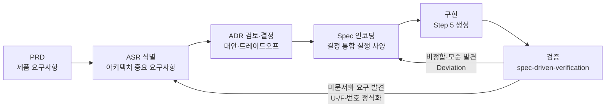

- **PRD**: "무엇을 만들 것인가" — 목표·범위·성공 기준
- **ASR**: "어떤 요구가 아키텍처를 결정하는가" — ASR 등록부에 식별·검토·승인 상태로 관리
- **ADR**: "그 요구를 어떻게 충족할 것인가" — 1 concern = 1 ADR, 대안 ≥ 2 + 트레이드오프 + 결정·근거
- **Spec**: "구현이 따라야 할 실행 사양" — 승인된 ADR 결정을 검증 가능한 요구사항으로 인코딩 (SSOT)
- **검증**: Spec 항목별로 구현을 대조 — pass/fail 인벤토리 + Deviation + **미문서화 ASR(U-/F-번호)** 식별

## C.2 산출물 개념

| 산출물 | 위치 | 역할 | 주요 내용 |
|--------|------|------|-----------|
| PRD | `spec/PRD.md` | 제품 수준 요구사항 | 배경·문제 정의, 목표(정의→실행→검증), 대상 청중, v1/v2/v3 범위, 비목표, 제약, 성공 기준 |
| ASR | `spec/ASR.md` | 아키텍처 중요 요구사항 등록부 | ASR-001~021 (ID·카테고리·상태·Resolution·관련 ADR·의존성 순서) |
| ADR | `adr/*.md` (49건) | 결정 레코드 | Concern·Context·Options≥2·Tradeoffs·Recommendation·Downstream Concerns |
| Spec | `spec/sdv-sim-v1.md`, `spec/sdv-sim-v2.md` | 결정 통합 실행 사양 | Decisions·Requirements(검증 가능 항목)·Constraints·Out of Scope·Open Questions |
| 검증 | `verification/` | 사양 대비 구현 검증 | 항목별 pass/fail 인벤토리, Deviation, Undocumented ASR, 권장 조치 |
| 작업 추적 | `TODO-v1.md`, `TODO-v2.md` | 단계·게이트 추적 | T-번호 단위 작업 + Snapshot + Notes |

**상태 의미**: ASR — `identified`(식별) → `reviewing`(검토 중) → `designed`(결정 채택) → `approved`(스펙 인코딩·승인 완료). ADR — `proposed` → `approved` (일부는 후속 결정으로 `superseded`, 예: dashboard-run-path).

## C.3 단계별 활동

### C.3.1 v1 진행 (라이브러리 코어 + CLI)

| 단계 | 활동 | 산출·결정 |
|------|------|-----------|
| PRD | 시뮬레이션 대상(A: 차량 SW 플랫폼)·청중(a: 차량 SW 개발자)·아티팩트 형태(모두 선택 → 스테이징) 확정 | v1 = E/E 아키텍처 + 통신(CAN/Ethernet) + 앱 런타임, OTA는 v2로 연기. PRD 승인 |
| ASR 식별 | 의존성 순서로 7건 등록 | ASR-001~007 (언어/엔진/형식/통신/런타임/API 경계/검증) |
| ADR 검토 (1차) | ASR별 설계 검토 | ADR 2건 승인(언어·엔진) + Direct Input 5건(형식/통신 충실도 L2/런타임 RTE/패키지/검증) |
| Spec 작성 | Gate 5(구현 충분성) 검토 | **1차 판정: 아키텍처 충분 / 구현 상세 미흡** — 미진 설계 14건 식별 → 사용자 "① 전부 상세화" 선택 |
| ADR 검토 (2차) | 갭 14건 → concern 11건 분해 | ADR 11건 작성·일괄 Option A 승인 (simulation-time-model 등) |
| Spec 재작성 | 2차 배치 인코딩 후 Gate 5 재검토 | **구현 SSOT 여전히 불충분** — 그룹 A 5건(필드 스키마·이벤트 의미론·스텁·API 시그니처·CLI 채널) 차단성 판정 |
| ADR 검토 (3차) | 그룹 A+B → 1 ADR = 1 concern | **D-12~D-21 10건** 작성·전부 Option A 승인 (definition-field-schema, communication-event-semantics 등) |
| Spec 인코딩 | 상세 설계 21건(1차 11 + 2차 10) 반영 | Requirements +14, Out of Scope +7 — **Spec 승인**(T-007) |
| 구현 (Step 5) | uv + Python 3.12, Pydantic 스키마, DES 엔진, CLI | 생성 시 해석 결정 5건 명시(조용한 발명 방지). pytest 실패 5건 수정(엔진 버그 1건 포함) → 63 passed, mypy strict |
| 검증 | spec-driven-verification | 인벤토리 81건(78 pass / 1 fail / 2 partial) — **Deviation 2건**(공식 예시 자기 비정합·i18n 불완전) + **U-1~U-6** 미문서화 요구 식별 |
| 수정 루프 | 스펙 수정 + i18n 구현 + ADR 사후 정식화 | Deviation 해소, U-1~U-6 스펙 인코딩 + **ADR 6건(ASR-008~013) 사후 설계 검토 승인** → 재검증 **86 pass / 0 fail** |

### C.3.2 v2 진행 (웹 대시보드)

| 단계 | 활동 | 산출·결정 |
|------|------|-----------|
| PRD v2 | 사용자 지시로 v2 TODO 재생성, OTA 제외 확정 | v2 = 웹 대시보드 (구조 뷰·편집·리플레이·리포트) |
| ASR 식별 | v2 범위로 등록 | ASR-014~020 (기술 스택/데이터 흐름/구조 뷰/파일 접근/편집 검증/서버 명령/UI 언어) |
| ADR 검토 | ASR별 검토 + spec-review | ADR 14건 승인 + direct-input 1건(ASR-020) |
| **F-11 방향 전환** | 사용자 지시 — "서버에 저장한다는 개념은 부적절" | (1) v1 코어에 `loads()` 문자열 입력 API 추가 (2) 브라우저 로컬 파일 직접 사용 — `dashboard-run-path` ADR **superseded**, ASR-006/015/017 재검토, PRD "v1 코어 무변경" 제약 개정 |
| Spec v2 | F-1~F-11 전부 인코딩·해소 + v1 Spec D-15 갱신 | **v2 Spec 승인** → ASR-014~020 approved |
| 구현 (Step 5) | 단위 작업 T-013~T-021 | v1 문자열 API → 서버(FastAPI·API 5종) → CLI serve → 프런트(Vite/React/TS) → 패키징(static 포함) → 통합 테스트 (pytest 113, mypy 18 files, check-* 스크립트) |
| 검증 | spec-driven-verification | 43 pass / 1 partial(E15) / 3 not-verifiable, fail 0 — E15 수용 → U-1(무효화 신호) 인코딩 |
| 피드백 수정 | 사용자 버그 리포트 | **T-024 재설계** — `/api/validate` 순수 검증 전환, 세션 무효화를 프런트 로컬 상태로 이동 (기존 "validate=무효화 신호" 설계 폐기) |
| 추가 요구 | 사용자 요청 3건 | T-022 `--host` 외부 접근(serve-network-binding ADR 승인 + OS 방화벽 허용) / T-023 기본 샘플 시드 / T-025~T-028 deploy 산출물(설계·작성·검증 — **실제 설치 보류**) |
| 완료 게이트 | v2 완료 승인 | 2026-08-13 사용자 승인 — v2 확정, v3(데스크톱)는 별도 논의 |

### C.3.3 검증 반복 요약

| 검증 대상 | 결과 | 피드백 → 정식화 |
|-----------|------|-----------------|
| v1 (1차) | 78 pass / 1 fail / 2 partial | Deviation 2건(스펙 수정) + U-1~U-6(스펙 인코딩 + ADR 6건) |
| v1 (재검증) | **86 pass / 0 fail / 0 partial** | — |
| v2 | 43 pass / 1 partial(E15 수용) / 3 not-verifiable | E15 → U-1 인코딩 → 이후 T-024에서 재설계(폐기·대체) |

## C.4 사용자 개입 지점

설계·개발 과정에서 사용자가 내린 주요 결정·게이트 통과 지점 (자료: prompts.md, TODO-*.md):

| 시점 | 개입 | 영향 |
|------|------|------|
| 프로젝트 시작 | 시뮬레이션 대상 A(차량 SW 플랫폼)·청중 a(개발자)·형태 모두(스테이징 제안) 선택 | v1/v2/v3 스테이징 구도 성립 |
| PRD 승인 | Gate 1 통과 | v1 범위 확정 (통신 CAN/Ethernet + 앱 런타임, OTA v2 연기) |
| ASR별 승인 | ADR 승인 / Direct Input 확정 7건 | ASR-001~007 designed |
| Gate 5 | "① 전부 상세화" 선택 | 상세 설계 ADR 2차 배치(11건)로 전환 |
| 2차 배치 | "전부 A 옵션으로 승인" | ADR 11건 → Spec 인코딩 |
| Gate 5 재검토 | 미진 항목 ADR 생성 지시 | D-12~D-21 10건 → Spec 인코딩 → Spec 승인 |
| 구현 | "uv로 venv를 생성하고 개발" | Spec 승인 신호로 간주 → Step 5 시작 |
| 검증 수정 | 공식 예시 수정·i18n 로컬라이즈 지시 | Deviation 2건 해소 |
| U 정식화 | "Undocumented ASR에 대해 ADR 작성" | ADR 6건 + ASR-008~013 등록·승인 |
| v2 시작 | v2 TODO 생성 지시, OTA 제외 | v2 = 웹 대시보드 |
| **F-11 방향 전환** | "서버에 저장한다는 개념은 부적절" | 브라우저 로컬 파일 직접 관리 + v1 `loads()` 추가 — 기존 PRD 제약 개정 |
| v2 Spec 승인 | "v2 spec을 승인함. 구현을 시작해줘" | ASR-014~020 approved → Step 5 시작 |
| 외부 접근 | "외부 브라우저에서 접근" | serve-network-binding ADR Option B 승인 + 방화벽 8888 허용 |
| 기본 샘플 | "모르는 사람도 그냥 실행" | T-023 기본 시드 |
| 버그 리포트 | "실행→재생 후 리포트에서 로그 파일 요구" | **T-024 재설계** — validate 순수 검증 + 프런트 로컬 무효화 |
| deploy | "deploy 스크립트 작성 (실제 설치는 하지 말아줘)" | deploy/ 3종 작성·검증, ASR-021, 설치 보류 |
| 완료 | v2 완료 승인 / 구조 설계서 게이트 승인 | 스테이징 종료, v3 별도 논의 |
# 부록 D. ASR & ADR — 옵션 비교와 결정 근거

- **범위**: 21개 ASR × 관련 ADR 49건의 결정 내역
- **표기 규칙**: 각 표에서 <b style="color:#1a7f37;">초록색 굵은 옵션명</b> = 채택된 옵션. **결정(Decision)**과 **결정 근거(Rationale)**는 해당 표 **하단**에 기술.
- **공유 ADR**은 최초 소절에 전체 표, 이후 소절에는 결정·근거만 기술하고 원 표를 참조.

## D.1 ASR-ADR 요약표

| ID | 제목 | 카테고리 | 상태 | 관련 ADR | 결정 요약 |
|----|------|----------|------|----------|-----------|
| ASR-001 | 언어/기술 스택 | Constraints & Integration | approved | 2 | Python 3.11+ (mypy strict), v1 순수 Python + 명시적 목표 규모 |
| ASR-002 | 시뮬레이션 엔진 모델 | Structure & Organization | approved | 5 | DES + 주기 태스크 하이브리드, 정수 ms + (t_ms, seq), 수신자 매핑 rx, 전체 로그 count, 구조화 리포트 |
| ASR-003 | 아키텍처/시나리오 정의 형식 | Structure & Organization | approved | 3 | YAML, 메시지-프레임 2계층 + 매핑 규칙, 명시적 완전 스키마 + 공식 예시 |
| ASR-004 | 통신 프로토콜 충실도 | Structure & Organization | approved | 7 | L2(프레임/버스), CAN 비트 수식+ID 중재, Ethernet 스위치 FIFO, 명시 라우팅, 최신 교체 |
| ASR-005 | 앱 런타임 모델 | Structure & Organization | approved | 6 | RTE 스타일(주기 태스크+이벤트 핸들러), 비선점+wcet, 베이스 클래스 API, 스텁 수신자 전용, 절대 주기+스킵 |
| ASR-006 | 코어 API 경계 & 다중 아티팩트 구조 | Deliverable form & Structure | designed | 6 | 단일 패키지+모듈 경계, 4채널 IO, --lang+0/1/2/3, loads() 계열 추가(F-11) |
| ASR-007 | 검증·자동화 지원 | Quality bar | approved | 7 | 선언형 assertion+JSON 스트림, 전체 count+시간 무관, 단일 JSON 로그 |
| ASR-008 | 동일 시각 비-태스크 이벤트 순서 | Structure & Organization | designed | 1 | 비-태스크는 모든 태스크 뒤 (가상 우선순위 2^30) |
| ASR-009 | Ethernet 스위치 다중 정의 정책 | Structure & Organization | designed | 1 | 첫 항목만 사용, 스키마 오류 없음 |
| ASR-010 | 로그 쓰기 실패 종료 코드 | Quality bar | designed | 1 | exit 2 (입력/파일 오류로 분류) |
| ASR-011 | Assertion `event: task` 매칭 범위 | Quality bar | designed | 1 | task_start+task_end 둘 다 매칭 |
| ASR-012 | Assertion count 비교 연산 | Quality bar | designed | 1 | 최소 n건 이상 (≥) |
| ASR-013 | Ethernet payload 크기 기준 | Structure & Organization | designed | 1 | 프레임 DLC 기준 (bytes = dlc + 42) |
| ASR-014 | 대시보드 기술 스택 | Constraints & Integration | approved | 1 | FastAPI + React/TS + Vite |
| ASR-015 | 데이터 흐름·리플레이 모델 | Structure & Organization | approved | 6 | 코어 임베드+일괄 JSON, F-11 후 loads() 경로, 스냅샷 세션+무효화, 파생 가능 리포트만 |
| ASR-016 | 구조 뷰 렌더링·성능 | Structure & Organization | approved | 5 | SVG+React(D3 보조), 물리 재생+폴백, 스냅샷+재적용, 결정성, 타입 밴드 배치 |
| ASR-017 | 파일시스템 접근·보안 경계 | Constraints | approved | 1 | 브라우저 권한 경계 — 하이브리드(FS Access + 업로드/다운로드), 서버 파일 API 제거 |
| ASR-018 | 편집·검증 피드백 | Quality bar | approved | 1 | 서버 Pydantic 검증(v1 스키마 재사용) + 500ms 디바운스 |
| ASR-019 | 패키지 통합·서버 명령 (serve) | Deliverable form | designed | 3 | 단일 프로세스+패키지 내부 정적 자산, --root 제거, --host 옵션(기본 127.0.0.1) |
| ASR-020 | UI 언어 지원 (ko/en) | Constraints | approved | 0 (direct-input) | 프런트 i18n 카탈로그, v1 우선순위 패턴 대응 |
| ASR-021 | 상시 실행 서비스 등록 (deploy) | Integration & dependencies | approved | 0 (direct-input) | systemd user unit + install/uninstall (설치 보류) |

## D.2 ASR별 상세

### ASR-001 — 언어/기술 스택

**언어/기술 스택 (adr/language-tech-stack.md)**

| 옵션 | 개요 | 장점 | 단점 |
|---|---|---|---|
| <b style="color:#1a7f37;">A. Python</b> | 고수준 언어, 타입 힌트+mypy로 안전성 보완 | 생산성 최고, 자동차 테스트 에코(python-can) 친화, 임베드·테스트 하네스 자연스러움 | CPU 집약 시뮬레이션 성능 제한, 런타임 의존 |
| B. TypeScript/Node | 타입 안정성 갖춘 웹 생태계 | v2 대시보드와 동일 언어, 타입 안정, npm 생태계 | 시뮬레이션 성능 불리, 차량 SW 청중 친화성 낮음, Node 의존 |
| C. Go | 간결·단일 바이너리 | 성능·생산성 균형, CI/자동화 친화 | CAN/Ethernet 도메인 에코 부족 |
| D. Rust | 시스템 언어, 최고 성능 | 결정적 실행·정확성 유지에 유리 | 생산성 낮음, 에코 상대적으로 부족 |
| E. C++ (참고) | 차량 SW 산업 표준 계열 | 성능 우수 | 생산성 낮음, 메모리 안전 위험 |

**결정 (Decision):** Option A — Python 3.11+ (타입 힌트 + mypy strict, pip 패키지 + CLI 진입점)<br/>
**결정 근거 (Rationale):** v1 목표(헤드리스 CLI + 라이브러리 임베드 + CI)에 개발 생산성·차량 SW 청중 친화성(python-can 등)이 최우선. v2는 FastAPI 백엔드로 코어를 노출하므로 프런트만 JS를 써도 정합.

**성능 목표 (adr/performance-targets.md)**

| 옵션 | 개요 | 장점 | 단점 |
|---|---|---|---|
| <b style="color:#1a7f37;">A. 순수 Python + 목표 규모</b> | v1은 Python 유지, 목표 규모 명시, 병목 시 후속 확장 | 구현 단순·일관, 성능 검증 기준 제공, ADR-001과 정합 | 대규모(수천 노드) 미지원 |
| B. 확장 모듈 선제 | 이벤트 큐 등 핫 경로를 Rust/C 확장으로 설계 | 성능 여유 | v1 범위 초과, 개발 비용↑, 결정성 검증 부담 |
| C. 목표 미설정 | — | 없음 | 성능 회귀 판정 불가, 확장 근거 부재 |

**결정 (Decision):** Option A — v1 순수 Python + 명시적 목표 규모 (노드 ≤ 50, 링크 ≤ 20, 프레임 ≤ 200, duration ≤ 60s, 이벤트 ≤ 100만)<br/>
**결정 근거 (Rationale):** 목표 규모를 명시해 성능 회귀 판정 기준을 확보. 확장 모듈은 병목이 실제 확인된 후에만 도입(선제 도입은 v1 범위 초과).

### ASR-002 — 시뮬레이션 엔진 모델

**엔진 모델 (adr/simulation-engine-model.md)**

| 옵션 | 개요 | 장점 | 단점 |
|---|---|---|---|
| <b style="color:#1a7f37;">A. DES</b> | 이벤트 큐 기반, 지연·도착·태스크 실행을 이벤트로 모델링 (ns-3/OMNeT++ 방식) | 지연·대역폭·큐잉·라우팅 정확, fast-forward로 대규모에 효율, 결정적 | 주기적 태스크(CAN 주기 메시지, RTE)를 이벤트로 변환하는 추상화 필요 |
| B. Time-step | 고정 간격마다 전 컴포넌트 순차 실행 (AUTOSAR RTE에 가까움) | 주기 태스크 모델과 자연 일치, 구현 단순 | 지연·경합 정확 모델링 어려움, 간격이 작을수록 느림 |
| C. Continuous | 미분방정식 기반 연속 시간 | 물리적 정확성 | 차량 SW 플랫폼 검증엔 과도, 결정성·구현 불리 |

**결정 (Decision):** Option A — 이산 사건 시뮬레이션(DES) + 주기 태스크 하이브리드. 코어는 이벤트 큐, 앱 주기 태스크는 스케줄러가 이벤트로 생성·실행. 단일 스레드 + 고정 이벤트 순서로 결정성 보장.<br/>
**결정 근거 (Rationale):** "결정성"이 검증 도구의 생명. 지연·대역폭·큐잉·게이트웨이를 정확히 재현하며 이벤트 없이 시간을 도약하는 DES가 목표 규모에서 효율적.

**시간 모델 (adr/simulation-time-model.md)**

| 옵션 | 개요 | 장점 | 단점 |
|---|---|---|---|
| <b style="color:#1a7f37;">A. 정수 ms + (t_ms, seq)</b> | 모든 시간을 정수 ms, (t_ms, seq) 완전 순서, duration_ms 도달 시 종료, 난수 없음 | 결정성 최대, 구현·디버깅 단순, 로그 비교 용이 | ms 미만 정밀도 표현 불가 (v1 L2 충실도엔 충분) |
| B. float ms | 서브-ms 정밀도 허용 | 실행 시간·지연 세부 표현 | 부동소수점 결정성 리스크, 로그 가독성 저하 |
| C. 설정 단위 (ms/us) | 전역 time_unit 설정 | 필요에 따라 정밀도 조정 | 스키마·엔진·로그가 단위 의존 → 복잡·결정성 확인 부담 |

**결정 (Decision):** Option A — 정수 ms + (t_ms, seq) 완전 순서 + duration_ms 종료 + 난수 없음<br/>
**결정 근거 (Rationale):** 부동소수점 비교의 결정성 리스크를 원천 제거. 정수 로그는 비교·디버깅이 용이하고, v1 L2 충실도에 ms 정밀도는 충분.

**통신 이벤트 의미론 (adr/communication-event-semantics.md)** — ASR-004에도 적용되는 공유 ADR

| 옵션 | 개요 | 장점 | 단점 |
|---|---|---|---|
| <b style="color:#1a7f37;">A. 수신자 매핑 기반 rx</b> | tx 경로 3가지(주기 프레임·ctx.send·주입), rx는 receives 매핑된 노드에만, 게이트웨이는 규칙 체인으로 표현(홉 최대 8 초과 시 drop), Ethernet은 스위치 FIFO 방출 시각에 rx | 로그가 "누가 받았는가" 기준으로 검증 가치 높음, 게이트웨이 별도 노드 불필요(스키마 변경 없음) | 게이트웨이 흐름이 노드 로그가 아닌 규칙으로만 추적됨 |
| B. 브로드캐스트 rx | 링크의 모든 노드에 rx 기록 | 버스 현실(브로드캐스트) 재현 | 로그 폭증(프레임×노드), node 매칭 과잉 |
| C. 게이트웨이 노드화 | 게이트웨이도 node처럼 rx/tx 기록 | 흐름 추적이 명시적 | architecture 스키마 변경, 노드 수 목표에 영향 |

**결정 (Decision):** Option A — 수신자 매핑 기반 rx + 게이트웨이 link rx + 규칙 체인 다중 홉 (홉 최대 8 초과 시 drop)<br/>
**결정 근거 (Rationale):** rx는 "누가 받았는가" 기준으로 기록해야 assertion 검증 가치가 있음. 게이트웨이를 노드로 승격하면 스키마가 바뀌므로 규칙 체인으로 표현.

**동일 시각 순서·종료 경계 (adr/event-ordering-boundary.md)**

| 옵션 | 개요 | 장점 | 단점 |
|---|---|---|---|
| <b style="color:#1a7f37;">A. 우선순위→정의 순서→seq + inclusive</b> | 태스크 우선순위(작을수록 우선) → 파일 선언 순서 → seq. `t == duration_ms`까지 처리 후 종료 | 정의 순서가 결정적·사용자 제어 가능, duration 경계 이벤트 검증 직관 | "선언 순서" 개념 문서화 필요 |
| B. seq만 + inclusive | (t_ms, seq)만 사용 | 단순 | 같은 시각 이벤트 순서를 사용자 제어 불가 |
| C. 정의 순서 + exclusive | A와 동일하되 t==duration_ms 미처리 | "duration까지" 경계가 깔끔 | duration 직전 스케줄 이벤트 검증 불가 — at_ms=duration assertion 실패 |

**결정 (Decision):** Option A — 우선순위 → 정의 순서 → seq + inclusive 종료 (`t == duration_ms`의 이벤트까지 처리)<br/>
**결정 근거 (Rationale):** 동일 시각 이벤트의 순서를 사용자가 제어할 수 있어야 검증이 가능. inclusive는 경계 시각 assertion 검증을 가능하게 함.

**결과 리포트 (adr/result-report-schema.md)** — ASR-004·ASR-007에도 적용되는 공유 ADR

| 옵션 | 개요 | 장점 | 단점 |
|---|---|---|---|
| <b style="color:#1a7f37;">A. 구조화 리포트</b> | simulation + links(링크 부하·드롭·supersede) + tasks(오버런) + assertions + warnings | PRD 성공 기준 2 직접 지원, 라이브러리 소비 가능, 결정적 | 항목 확정·문서화 부담 |
| B. 최소 리포트 | duration_ms + result + assertion 결과만 | 최소 구현 | 버스 부하·오버런 "확인" 수단 부재 — 성공 기준 2 미달 위험 |
| C. 로그 통합(리포트 없음) | 리포트 없이 이벤트 로그에서 사용자가 집계 | API 단순 | 결과 확인 UX 저하, CLI 요약 불가 |

**결정 (Decision):** Option A — 구조화 리포트 (simulation + links + tasks + assertions + warnings), CLI 요약은 이 표의 요약판<br/>
**결정 근거 (Rationale):** PRD 성공 기준 2(버스 부하·오버런 확인)를 직접 지원하면서 라이브러리 소비도 가능. 결정적 출력이라 CI 비교가 용이.

### ASR-003 — 아키텍처/시나리오 정의 형식

**정의 파일 형식 (adr/definition-file-format.md)**

| 옵션 | 개요 | 장점 | 단점 |
|---|---|---|---|
| <b style="color:#1a7f37;">A. YAML</b> | 계층 구조 + 주석 | 가독성·주석·계층, Python 에코 성숙, 자동차 도구 관행과 일치 | 타입 엄격성 낮음 (Pydantic으로 보완) |
| B. JSON | 기계 친화적, 엄격 파싱 | 스키마 검증 용이 | 주석 불가, 수기 작성 불편 |
| C. TOML | 설정 중심 단순 문법 | 단순함 | 깊은 계층/목록 표현 불편 |
| D. 전용 DSL | 도메인 특화 문법 | 도메인 최적화 | 개발 비용 큼 (v1에 과도) |

**결정 (Decision):** Option A — YAML (PyYAML 파싱 + Pydantic 모델 기반 스키마 검증, architecture.yaml/scenario.yaml 분리)<br/>
**결정 근거 (Rationale):** 정의 파일 = CLI의 1차 UX. 사람이 작성·주석·계층 표현이 우선이며, 자동차 도구 관행과 일치. 타입 엄격성은 Pydantic으로 보완.

**스키마 구조 (adr/definition-schema-structure.md)**

| 옵션 | 개요 | 장점 | 단점 |
|---|---|---|---|
| <b style="color:#1a7f37;">A. 메시지-프레임 2계층</b> | 컴포넌트는 논리 메시지, 링크는 L2 프레임(id/dlc/period/source/message). 매핑: message 필드 또는 동일 이름. architecture.yaml/scenario.yaml 분리 | L2/L7 분리 명확, 프레임 독립 시뮬레이션 가능, 스키마 검증 명확 | 매핑 개념 1개 추가 (학습 비용 소폭 증가) |
| B. 단일 프레임 레벨 | 컴포넌트가 프레임 직접 송수신 | 스키마 단순 | 앱 로직과 L2 충실도 혼재, 컴포넌트 재사용·신호 표현 불편 |
| C. 신호 레벨 포함 | DBC 스타일 신호 정의 추가 | 실제 신호 의미 표현 | v1 범위 초과, 스키마 복잡도 급증 |

**결정 (Decision):** Option A — 메시지-프레임 2계층 분리 + 매핑 규칙 (프레임 `message` 필드 명시 또는 프레임명=메시지명 기본 규칙)<br/>
**결정 근거 (Rationale):** L2/L7 계층을 분리해야 프레임 독립 시뮬레이션(YAML만)이 가능하고 스키마 검증이 명확. 신호 레벨은 v1 범위 초과.

**필드 스키마 (adr/definition-field-schema.md)**

| 옵션 | 개요 | 장점 | 단점 |
|---|---|---|---|
| <b style="color:#1a7f37;">A. 명시적 완전 스키마 + 공식 예시</b> | 전체 필드 트리를 ADR에 문서화 + Spec 예시 YAML 포함 | SSOT 달성, 구현 발명 제거 | 문서 부담 |
| B. 최소 스키마 | 블록 레벨만, 세부는 구현 시 확정 | 문서 부담 최소 | 구현 발명 잔존 — SSOT 미달 |
| C. 외부 JSON Schema 파일 | 별도 파일로 관리 | 코드 검증과 단일 소스 | 관리 포인트 추가, YAML 작성자 관점 문서 분산 |

**결정 (Decision):** Option A — 명시적 완전 스키마 + 공식 예시 (architecture.yaml/scenario.yaml 필드 트리를 ADR·Spec에 문서화)<br/>
**결정 근거 (Rationale):** 이 ADR의 목적이 SSOT — 최소 스키마나 외부 파일 관리는 문서 분산·구현 발명을 남김.

### ASR-004 — 통신 프로토콜 충실도 (CAN/Ethernet)

**충실도 수준 (adr/communication-fidelity-level.md)**

| 옵션 | 개요 | 장점 | 단점 |
|---|---|---|---|
| A. L1 (신호/메시지) | 메시지·신호만 전달, 지연 단순화 | 구현 단순, 앱 로직 검증에 충분 | 대역폭·부하·라우팅 검증 불가 (PRD 미충족) |
| <b style="color:#1a7f37;">B. L2 (프레임/버스)</b> | CAN 프레임·버스 부하·지연·큐잉, 게이트웨이 라우팅, Ethernet 대역폭·스위치 큐잉 | 라우팅·지연·대역폭 검증 가능 (PRD 충족), 비용 합리적 | 비트 레벨 타이밍·프로토콜 스택 세부 제외 |
| C. L3 (프로토콜 스택/물리) | 비트 타이밍·오류 프레임·QoS·Some/IP | 실제 스택 수준 검증 | 구현 비용 급증 (v1 범위 초과) |

**결정 (Decision):** Option B — L2 (프레임/버스 수준). CAN: 비트 수식+ID 중재+큐, Ethernet: 스위치 FIFO+테일 드롭, 게이트웨이: 명시 라우팅. L3(비트 타이밍·QoS·Some/IP)는 v1 제외.<br/>
**결정 근거 (Rationale):** PRD가 요구하는 "라우팅·지연·대역폭 검증"을 충족하는 최소 수준이 L2. L3는 구현 비용 급증이라 v1 범위 초과.

**CAN 모델 (adr/can-fidelity-model.md)**

| 옵션 | 개요 | 장점 | 단점 |
|---|---|---|---|
| <b style="color:#1a7f37;">A. 비트 수식 + 중재 + 큐</b> | `tx_ms = ceil((44 + 8·DLC) / bitrate)`, 동시 전송 시 ID 작을수록 우선, 버스 점유 중이면 우선순위 큐 대기, 버스 부하 % 리포트 | 현실적·결정적, 버스 부하 검증 가능, 구현 합리적 | 비트 스터핑 등 비트 레벨 상세 미포함 |
| B. 고정 지연 상수 | 프레임별 고정 지연 | 구현 최단 | 부하·경합 지연 변화 재현 불가 (PRD 미충족) |
| C. 오류 프레임/재전송/버스 오프 | 프로토콜 오류까지 모델링 | 오류 시나리오 검증 가능 | v1 범위 초과, 복잡도 급증 |

**결정 (Decision):** Option A — 표준 프레임 비트 수식 + ID 우선 중재 + 우선순위 큐 대기 (버스 부하 % 리포트 포함)<br/>
**결정 근거 (Rationale):** L2 목표(부하·경합 검증)를 충족하면서 결정적이고 구현이 합리적. 오류 프레임 모델링은 v1 범위 초과.

**Ethernet 모델 (adr/ethernet-fidelity-model.md)**

| 옵션 | 개요 | 장점 | 단점 |
|---|---|---|---|
| <b style="color:#1a7f37;">A. 스위치 + FIFO + 테일 드롭</b> | `bytes = data + 42`, `tx_ms = ceil(bytes·8 / (bitrate·1000))`, 단일 스위치 FIFO, queue_depth(기본 1000) 초과 시 테일 드롭→drop 이벤트 | 대역폭·큐잉·드롭 검증 가능, 결정적, 구현 합리적 | 우선순위 큐/VLAN 미지원 |
| B. 대역폭만 | 전송 지연만, 큐잉 없음 | 구현 단순 | 스위치 큐잉·드롭 검증 불가 (L2 목표 미달) |
| C. QoS/VLAN 포함 | 802.1p 우선순위 큐 모델링 | QoS 시나리오 검증 | v1 범위 초과, 복잡도 급증 |

**결정 (Decision):** Option A — 프레임 크기 수식 + 단일 스위치 FIFO 큐 + 테일 드롭 (queue_depth 기본 1000)<br/>
**결정 근거 (Rationale):** 대역폭·큐잉·드롭 검증이라는 L2 목표를 충족. 우선순위 큐/VLAN은 v1 범위 초과.

**게이트웨이 라우팅 (adr/gateway-routing-rules.md)**

| 옵션 | 개요 | 장점 | 단점 |
|---|---|---|---|
| <b style="color:#1a7f37;">A. 명시 규칙 + 변환</b> | `routes: [{from: {link, frame|id_min/id_max}, to: {link, remap_id?}}]`, 매칭 우선순위 명시 frame > ID 범위, delay_ms 기본 0 | 라우팅 의도를 명시적으로 검증 가능, ID 변환(remap) 지원 | 규칙 작성 필요 (자동 대비 작성량) |
| B. 자동 라우팅 | 양쪽 링크에 연결된 노드 = 자동 전달 | 작성 부담 없음 | 의도가 코드에 숨음, 제어력 없음, 검증 가치 저하 |
| C. 신호 변환 포함 | DBC 스타일 신호 매핑·데이터 변환 | 실제 게이트웨이 데이터 변환 재현 | v1 범위 초과 (L2는 프레임 단위) |

**결정 (Decision):** Option A — from/to 명시 규칙 + 선택적 변환 (명시 frame > ID 범위 우선순위, delay_ms 기본 0)<br/>
**결정 근거 (Rationale):** 라우팅 의도를 명시적으로 검증 가능해야 검증 도구로서 가치가 있음. 신호 변환은 L2 범위 밖.

**큐 오버플로 정책 (adr/frame-queue-overflow-policy.md)**

| 옵션 | 개요 | 장점 | 단점 |
|---|---|---|---|
| <b style="color:#1a7f37;">A. 최신 교체 (supersede)</b> | 대기 중 동일 프레임 인스턴스가 있으면 기존 제거·신규 교체 | 오래된 데이터 폐기 = CAN 현실과 정합, 큐 폭주 방지, 로그 명확 | 폐기 사실이 별도 이벤트 없음(교체로만 표현) |
| B. 복수 인스턴스 큐잉 | 모든 인스턴스 적재 | 큐 동작 단순 | 폭주 시 오래된 프레임이 뒤늦게 전송(시점 왜곡), 테일 드롭까지 |
| C. 신규 인스턴스 폐기 | 기존 있으면 신규 폐기(drop 이벤트) | 대기열 안정 | 신규 데이터 손실 — 주기 데이터는 최신이 중요한데 역방향 |

**결정 (Decision):** Option A — 최신 교체 (supersede) — 대기 중 동일 프레임은 신규 인스턴스로 교체<br/>
**결정 근거 (Rationale):** 주기 데이터는 최신이 중요 — 오래된 인스턴스 폐기가 CAN 현실과 정합하고 큐 폭주를 방지.

> 참고: 이벤트 의미론·결과 리포트는 공유 ADR — 전체 표는 ASR-002 소절 참조 (결정: 각각 A).

### ASR-005 — 앱 런타임 모델

**런타임 모델 (adr/app-runtime-model.md)**

| 옵션 | 개요 | 장점 | 단점 |
|---|---|---|---|
| A. 메시지 구동 | 메시지 수신 핸들러만 보유 | 단순, 결정적, DES와 자연 정합 | 주기적 동작(센서 폴링, 주기 제어) 표현 불가 |
| B. 스레드/태스크 | 실제 스레드로 실행 | 현실적 동시성 표현 | 스케줄링 비결정성 → 결정성 위반, 복잡도↑ |
| <b style="color:#1a7f37;">C. RTE 스타일</b> | 주기 태스크 + 메시지 수신 핸들러, 스케줄러가 이벤트로 스케줄 | AUTOSAR RTE 관행 일치, DES와 정합, 결정적 | 실제 OS 스레드 동작과는 차이 (시뮬레이션 수준) |

**결정 (Decision):** Option C — 주기 태스크 + 이벤트 핸들러 (RTE 스타일) — 주기 태스크와 메시지 수신 핸들러, 스케줄러가 이벤트로 스케줄<br/>
**결정 근거 (Rationale):** 자동차 SW의 주기성이 핵심 — RTE 스타일이 AUTOSAR 관행과 정합하면서 DES 엔진(ASR-002)과 자연스럽게 결합. 스레드 기반은 결정성을 깨뜨림.

**스케줄링 정책 (adr/task-scheduling-policy.md)**

| 옵션 | 개요 | 장점 | 단점 |
|---|---|---|---|
| <b style="color:#1a7f37;">A. 비선점 + wcet + overrun 기록</b> | 이벤트 큐 순차 처리, wcet_ms(기본 0)만큼 시간 경과, 주기 초과 시 overrun 이벤트 + 리포트 경고 | DES와 정합, 결정성 보장, 오버런 관찰 가능 | 실제 RTOS 선점과 상이 (v1 목적상 허용) |
| B. 선점형 | 높은 우선순위가 낮은 것을 선점 | RTOS에 더 근접 | 중단/재개 상태 모델 필요, 결정성 검증 복잡 |
| C. 라운드로빈 | 정의 순서 순환 | 구현 최단 | 우선순위 의미 상실 (ASR-005 불일치) |

**결정 (Decision):** Option A — 비선점 + wcet_ms(기본 0) + overrun 기록<br/>
**결정 근거 (Rationale):** 결정성을 지키되 오버런은 관찰 대상으로 남김(실패가 아니라 기록·경고) — PRD 목적(오버런 관찰·검증)과 정합.

**컴포넌트 API (adr/component-api.md)** — ASR-006에도 적용되는 공유 ADR

| 옵션 | 개요 | 장점 | 단점 |
|---|---|---|---|
| <b style="color:#1a7f37;">A. 베이스 클래스 + 콜백 + registry</b> | `on_periodic(ctx)`/`on_message(ctx, msg)` 오버라이드, `ctx.send`/`ctx.log`, `load(..., components={...})` + YAML class 필드 | 명시적·타입 힌트 친화, mypy 검증 용이, RTE 관행 정합 | 상속 기반 — 클래스 구조 이해 필요 |
| B. 데코레이터 기반 | `@component`/`@periodic` 스타일 | 선언적, YAML 매핑 간결 | 매직/리플렉션 의존, IDE·타입 검사 지원 약함 |
| C. 순수 함수 콜백 | dict에 함수 매핑 | 최단 작성 | 상태 유지 불편, API 계약 문서화 부담 |

**결정 (Decision):** Option A — Component 베이스 클래스 + 콜백 오버라이드 + registry 등록 (`on_periodic`/`on_message`/`ctx.send`/`ctx.log`, `load(..., components={...})`)<br/>
**결정 근거 (Rationale):** 명시적이고 타입 힌트 친화적이라 mypy 검증이 용이하며 RTE 관행과 정합. 데코레이터 매직은 IDE·타입 검사 지원이 약함.

**스텁 동작 (adr/stub-component-behavior.md)**

| 옵션 | 개요 | 장점 | 단점 |
|---|---|---|---|
| <b style="color:#1a7f37;">A. 수신자 전용</b> | tx는 주기 프레임·시나리오 주입·ctx.send 3경로만, 스텁은 rx 기록만 | 단순·결정적, YAML-only 시나리오는 프레임 주기로 충분 | 컴포넌트 없이 sends 기반 메시지 흐름 생성 불가 |
| B. 스텁 자동 송신 | sends 메시지를 period에 맞춰 자동 tx | YAML만으로 송신 흐름 재현 | "스텁" 의미 모호, 주기·우선순위 파생 결정 필요, 예상 밖 tx 위험 |
| C. class 미지정 시 오류 | 모든 컴포넌트에 class 필수 | 의미 명확 | YAML-only 검증 경로 차단 — v1 목표와 상충 |

**결정 (Decision):** Option A — 스텁은 수신자로만 동작 (sends 무시, tx는 주기 프레임·시나리오 주입·ctx.send 3경로만)<br/>
**결정 근거 (Rationale):** 스텁을 "통신 시뮬레이션의 관찰자"로 단순·결정적 유지. YAML-only 시나리오는 프레임 주기로 충분(성공 기준 1·2 보존).

**공개 API 계약 (adr/public-api-contract.md)** — ASR-006에도 적용되는 공유 ADR

| 옵션 | 개요 | 장점 | 단점 |
|---|---|---|---|
| <b style="color:#1a7f37;">A. 경로 기반 + 결과 객체</b> | `load(arch, scenario, components?) -> Simulator`, `run() -> SimulationResult` (events 전체 버퍼·report·assertions·duration_ms), `TaskContext.send/log/now_ms` | 단순·타입 명시·임베드 직관, 1M 이벤트 메모리 수용(성능 목표 내), 결정성 보존 | 실시간 스트리밍 소비 불가(전체 실행 후 반환) |
| B. 파일 객체/딕셔너리 + 콜백 | load가 dict 수용, run(on_event=...) | 메모리 효율, 유연한 입력 | 콜백 순서·예외 처리 부담, 타입 힌트 약화 |
| C. 이터레이터 스트리밍 | run()이 generator 반환 | 실시간 소비 가능 | assertion/리포트가 전체 로그 필요 → 내부 버퍼 필수, API 복잡↑ |

**결정 (Decision):** Option A — 경로 기반 + 결과 객체 (전체 이벤트 버퍼 + 리포트 + assertion 결과)<br/>
**결정 근거 (Rationale):** v1 성능 목표(≤100만 이벤트)에서 전체 버퍼를 메모리에 수용 가능 — 단순·타입 명시·임베드 직관을 얻고 결정성을 보존. 실시간 스트리밍은 v1 요구가 아님.

**오버런 정책 (adr/task-overrun-policy.md)**

| 옵션 | 개요 | 장점 | 단점 |
|---|---|---|---|
| <b style="color:#1a7f37;">A. 절대 주기 + 스킵</b> | 다음 실행은 원래 주기(t=0 기준), 놓친 주기는 스킵 | 결정적·단순, AUTOSAR 주기 의미 정합, 오버런 누적 없음 | 오버런 직후 실행 기회 손실 (현실 RTOS와 상이 — v1 허용) |
| B. 상대 주기(밀림) | 완료 시각 + period에 다음 실행 | 실행 기회 보존 | 오버런 연쇄(주기 어긋남), 로그 해석 복잡, 예측 어려움 |
| C. 오버런 시 실패 | 오버런 = 결과 실패 | 하드 에러로 취급 | PRD 목적(오버런 관찰·검증)과 상충 — assertion 대상으로 쓰는 용도 차단 |

**결정 (Decision):** Option A — 절대 주기 유지 + 인스턴스 스킵 (놓친 주기는 실행 안 함)<br/>
**결정 근거 (Rationale):** AUTOSAR 주기 의미(절대 주기)와 정합, 오버런 누적이 없어 결정적·단순. 오버런 자체는 기록되어 검증 대상이 됨.

### ASR-006 — 코어 API 경계 & 다중 아티팩트 구조

**패키지 구조 (adr/package-structure.md)**

| 옵션 | 개요 | 장점 | 단점 |
|---|---|---|---|
| <b style="color:#1a7f37;">A. 단일 패키지 + 모듈 경계</b> | `sdv-sim`(임포트 `sdv_sim`) 하나, 내부 core/cli 분리 | v1 오버헤드 최소 + 경계 유지, 공개 API 계약으로 임베드 지원 | 물리적 분리보다는 약한 경계 |
| B. 멀티 패키지 워크스페이스 | core/cli 별도 설치 가능 (워크스페이스 도구 필요) | 의존성 방향이 가장 명확 | v1 패키징 오버헤드 |
| C. 단일 모듈 | 전 코드 한 모듈 | 가장 단순 | 경계 없음 → 성장 시 재구성 비용 큼 |

**결정 (Decision):** Option A — 단일 패키지 + 모듈 경계 (배포 `sdv-sim`, 임포트 `sdv_sim`, 내부 `sdv_sim/core`·`sdv_sim/cli`)<br/>
**결정 근거 (Rationale):** "모든 형태가 단일 코어 공유"의 실현 수단 — v1에서 물리적 분리는 오버헤드, 모듈 경계 + 공개 API 계약으로 임베드를 지원.

**CLI I/O 계약 (adr/cli-io-contract.md)** — ASR-007에도 적용되는 공유 ADR

| 옵션 | 개요 | 장점 | 단점 |
|---|---|---|---|
| <b style="color:#1a7f37;">A. --log 파일 + 요약 stdout</b> | `run <arch> <scenario> [--log <path>] [--quiet] [--lang]`, JSON 로그는 파일(기본 events.json, `-`=stdout), 사람용 요약은 stdout, --quiet 시 요약 생략 | CI에서 로그 아티팩트 분리, 요약/로그 섞임 없음, 기본값 안전 | 기본 파일 생성(작업 디렉터리 오염) — `--log -`/`--quiet`로 회피 |
| B. --json 플래그 | --json 시 JSON만 stdout | 파이프 친화 | 요약+JSON 동시 확인 불가, CI 파이프 처리 부담 |
| C. --log 필수 | --log 없으면 오류 | 명시성 | 기본 실행 UX 저하 (성공 기준 4 헤드리스 단순성) |

**결정 (Decision):** Option A — 로그는 파일(--log), 요약은 stdout (--quiet 시 요약 생략, 오류 메시지도 --lang 적용)<br/>
**결정 근거 (Rationale):** CI에서 로그 파일 아티팩트를 분리하고 요약·로그가 섞이지 않음. 기본값 안전성(파일 생성)은 `--log -`/`--quiet`로 회피.

**CLI 출력 정책 (adr/cli-output-policy.md)** — ASR-007에도 적용되는 공유 ADR

| 옵션 | 개요 | 장점 | 단점 |
|---|---|---|---|
| <b style="color:#1a7f37;">A. --lang + env + 로케일 + 0/1/2/3</b> | 언어: `--lang` > `SDV_SIM_LANG` > 로케일(기타→ko). 종료: 0=pass / 1=assertion fail / 2=입력 오류 / 3=내부 오류 | 사용자 제어 명확, CI에서 오류 종류 구분, 구현 단순 | 코드 분류 세분화 필요(경미) |
| B. 언어 고정 ko + 0/1 | — | 구현 최단 | PRD "ko/en 지원 구조" 제약 위반, 오류 구분 불가 |
| C. gettext 프레임워크 | 표준 국제화 | 표준화 | v1에 과도, 카탈로그 관리 부담 |

**결정 (Decision):** Option A — --lang 플래그 + SDV_SIM_LANG env + 로케일 폴백 + 종료 코드 0/1/2/3<br/>
**결정 근거 (Rationale):** PRD "ko/en 지원 구조" 제약 충족 + CI에서 오류 종류를 코드로 구분. gettext는 v1에 과도.

**YAML 문자열 입력 (adr/core-yaml-string-input.md)** — ASR-015에도 적용되는 공유 ADR (F-11, 2026-08-12)

| 옵션 | 개요 | 장점 | 단점 |
|---|---|---|---|
| <b style="color:#1a7f37;">A. 전용 loads() 계열</b> | `loads(arch_yaml, scenario_yaml, components?)` + `load_scenario_yaml(str)` 추가, 기존 경로 API 유지 | Python 표준 관례(json.loads) 일치, 기존 계약 불변(하위 호환), 명시적·타입 안전, 에러 포맷 로직 재사용 | API 표면 2배(경로+문자열), 동의어 API 혼동 가능성 |
| B. load() 감지 통합 | str 인자가 경로인지 YAML 내용인지 자동 판별 | API 단일, 호출 측 단순 | **모호성 위험** — 없는 경로 vs 파싱 실패 내용 구분 불가, 오류 진단 혼란, 타입 안전성 약화 |
| C. from_yaml 클래스메서드 | `Simulator.from_yaml(...)` 추가 | "Simulator 생성" 진입점 통합 | v1 load()-함수 패턴과 이원화, 문서/임포트 경로 2곳 분산 |

**결정 (Decision):** Option A — 전용 `loads()`/`load_scenario_yaml()` 계열 함수 추가 (기존 `load()`·`load_scenario()` 경로 계약은 하위 호환으로 유지) — F-11 방향 전환(2026-08-12)으로 v1 Spec D-15에 기록 완료<br/>
**결정 근거 (Rationale):** 브라우저가 보낸 YAML 문자열을 서버가 그대로 v1 API로 전달하는 F-11 경로의 근간. json.loads 관례를 따르고 기존 계약을 깨지 않으며, 감지 통합(B)의 모호성 리스크를 배제.

> 참고: 컴포넌트 API·공개 API는 공유 ADR — 전체 표는 ASR-005 소절 참조 (결정: 각각 A).

### ASR-007 — 검증·자동화 지원

**검증 방식 (adr/verification-automation.md)**

| 옵션 | 개요 | 장점 | 단점 |
|---|---|---|---|
| A. 선언형 assertion | 시나리오 YAML에 기대값 선언 | CLI 사용자 직관, CI 판정 자동화 용이 | 복잡 조건 유연성 제한 |
| B. 이벤트 스트림 외부 검증 | 엔진이 결정적 JSON 로그 출력, 검증은 사용자 도구 | 최대 유연성 | 사용자 부담, 1차 검증 경험 부재 |
| <b style="color:#1a7f37;">C. A+B 결합</b> | 선언형(기본) + JSON 스트림(고급) | 추가 비용 낮음, 유연성 최대 | assertion 문법·로그 스키마 정의 필요 |

**결정 (Decision):** Option C — 선언형 assertion(기본) + JSON 이벤트 스트림(고급 검증) 결합<br/>
**결정 근거 (Rationale):** 엔진이 어차피 이벤트를 생성하므로 스트림 노출 비용이 낮고, 선언형 assertion으로 CLI 1차 검증 UX를 지킴.

**Assertion 문법 (adr/assertion-grammar.md)**

| 옵션 | 개요 | 장점 | 단점 |
|---|---|---|---|
| <b style="color:#1a7f37;">A. YAML 선언형 expect</b> | `assertions: [{name?, expect: {event, frame/message/node/link/task, at_ms, within_ms, count}}]` | 시나리오 YAML과 동일 문법(일관성), 파싱 간단, CI 검토 용이 | 복잡 논리 제한 (v1엔 충분) |
| B. 내장 DSL 문자열 | `"rx door-state-frame at 10ms within 5ms count 1"` | 표현력·간결성 | 파서 구현 필요, 스키마 검증 밖, 오타 위험 |
| C. Python 콜백 검증 | 검증 함수 참조, 이벤트 스트림 소비 | 최대 유연성 | 선언성 상실, YAML-only 검증 불가 |

**결정 (Decision):** Option A — YAML 선언형 expect 블록 (평가: 종료 후 로그에서 첫 매칭 이벤트 기준 시간 검증 + count 개수 검증)<br/>
**결정 근거 (Rationale):** 시나리오 YAML과 동일 문법으로 일관성 유지, 파싱 간단, CI에서 검토 용이. 복잡 논리는 스트림(옵션 C 방식)으로 보완.

**평가 규칙 (adr/assertion-evaluation-detail.md)**

| 옵션 | 개요 | 장점 | 단점 |
|---|---|---|---|
| <b style="color:#1a7f37;">A. 전체 count + 시간 무관 기본 + 실패 상세</b> | 매칭: event 타입+속성 일치. 시간: at_ms 명시 시 `|t_ms-at_ms| ≤ within_ms`(기본 0), 생략 시 무관. count: 전체 로그 총수(시간과 독립). 실패 메시지: 매칭 3건 + 기대/실제 시각·count | 예측 단순, SSOT 갭 해소, CI 디버깅 UX | count와 at_ms 독립(같은 윈도우 count 아님) — 의도 설명 필요 |
| B. 윈도우 count | count = within_ms 내 매칭 수 | "지정 시간대 n건" 직관 | at_ms 생략 시 윈도우 모호, 시간 조건 중첩 해석 복잡 |
| C. at_ms 필수 | 생략 시 스키마 오류 | 모호성 제거 | "이벤트 존재 여부만" 검증 불가 — 표현력 저하 |

**결정 (Decision):** Option A — count=전체 로그 총수 + 시간 무관 기본(at_ms 명시 시에만 시간 검증) + 실패 상세(매칭 3건 + 기대/실제 시각·count)<br/>
**결정 근거 (Rationale):** 예측이 단순하고 CI 디버깅 UX가 좋음. count와 at_ms를 독립시켜 "최소 발생" 검증 의도와 정합(ASR-012 결정과 일관).

**이벤트 로그 스키마 (adr/event-log-schema.md)**

| 옵션 | 개요 | 장점 | 단점 |
|---|---|---|---|
| <b style="color:#1a7f37;">A. 단일 JSON 파일</b> | `{schema_version, simulation, events: [{t_ms, seq, type, ...}], assertions}`, type enum 7종(tx/rx/task_start/task_end/drop/overrun/log), (t_ms, seq) 오름차순 | 단일 산출물(CI 아티팩트), 스키마 검증 용이, 결정성 명확 | 대규모 시나리오에서 파일 크기 증가 (v1 목표 규모에선 무시 가능) |
| B. NDJSON 스트림 | 이벤트 1건 = 1라인 | 파일 크기 효율, 스트리밍 | 단일 JSON이 아님 — 검증·시각화 불편 |
| C. 타입별 분리 배열 | `{tx: [...], rx: [...], task: [...]}` | 타입별 조회 용이 | 순서 복원에 추가 정보 필요 — 결정성 표현 약화 |

**결정 (Decision):** Option A — 단일 JSON 파일 (events 배열 + type enum 7종, (t_ms, seq) 오름차순, 누락 필드 생략)<br/>
**결정 근거 (Rationale):** 단일 산출물로 CI 아티팩트·스키마 검증·결정성 표현이 모두 명확. 파일 크기는 v1 목표 규모에서 무시 가능.

> 참고: CLI 출력·I/O 계약·결과 리포트는 공유 ADR — 전체 표는 ASR-006·ASR-002 소절 참조 (결정: 각각 A).

### ASR-008 — 동일 시각 비-태스크 이벤트 순서

**비-태스크 순서 (adr/event-ordering-non-task.md)**

| 옵션 | 개요 | 장점 | 단점 |
|---|---|---|---|
| <b style="color:#1a7f37;">A. 비-태스크는 모든 태스크 뒤</b> | 가상 우선순위 2^30 → 태스크 이벤트 후 처리, 비-태스크 간 선언 순서 → seq | 부수효과 tx가 같은 tick tx보다 먼저 처리 → 관측 순서 자연스러움 | 태스크와 tx 순서에 의존하는 검증은 문서화된 규칙에 의존 |
| B. 선언 순서 통합 | 태스크·비-태스크 구분 없이 선언 순서 | 규칙 단일화 | ctx.send 결과 tx 순서 보장 불가 — 정의 순서에 민감 |
| C. 비-태스크를 앞에 | 최소 우선순위 부여 | 구현 대칭 | 태스크가 만든 tx가 뒤늦게 관측 — 원인-결과 역전 가능 |

**결정 (Decision):** Option A — 비-태스크는 모든 태스크 뒤 (가상 우선순위 2^30, 비-태스크 간에는 파일 선언 순서 → seq) — 스펙 D-19 인코딩 완료<br/>
**결정 근거 (Rationale):** 태스크 실행의 부수효과(`ctx.send` → tx)가 같은 tick의 다른 tx보다 먼저 처리되어 "원인 → 결과" 관측 순서를 보장 — assertion 결과의 결정성에 직접 영향.

### ASR-009 — Ethernet 스위치 다중 정의 정책

**스위치 선택 (adr/ethernet-switch-selection.md)**

| 옵션 | 개요 | 장점 | 단점 |
|---|---|---|---|
| <b style="color:#1a7f37;">A. 첫 번째만 사용</b> | switches 첫 항목만 큐잉 파라미터로 사용, 나머지 무시(오류·경고 없음) | 단일 스위치 모델 유지, 정의 파일 호환성 최대, 구현 단순 | 다중 스위치 기대 시 조용히 무시됨 — 검증 관점 오해 가능 |
| B. 2개 이상이면 스키마 오류 | 배열 길이 1 초과 시 오류(파일명·필드 경로 포함) | 잘못된 기대 즉시 표면화 | v1 범위 밖 정의를 거부 — 향후 다중 스위치 대비 파일이 깨짐 |
| C. 다중 스위치 모델링 | 모든 스위치를 독립 큐로 | L2 충실도 최대 | v1 범위 초과(토폴로지·라우팅 복잡), 스펙 Out of Scope 위반 |

**결정 (Decision):** Option A — switches 첫 항목만 큐잉 파라미터로 사용, 나머지 무시 (스키마 오류 없음). 다중 스위치는 v2+ 후보.<br/>
**결정 근거 (Rationale):** v1은 단일 스위치 모델 — 오류 거부는 v1 범위 밖 정의 파일을 깨뜨리고, 다중 모델링은 범위 초과. "첫 항목 사용"을 스펙에 명시해 오해를 방지.

### ASR-010 — 로그 쓰기 실패 종료 코드

**종료 코드 분류 (adr/log-write-failure-exit-code.md)**

| 옵션 | 개요 | 장점 | 단점 |
|---|---|---|---|
| <b style="color:#1a7f37;">A. exit 2 (입력 오류)</b> | 쓰기 실패를 파일/입력 범주로 분류 | 파일 범주 단일화·단순, CI에서 파일 문제와 assertion(1) 구분 | 의미상 쓰기 실패는 출력 I/O 오류 — 3과 경계 모호 |
| B. exit 3 (내부 오류) | 쓰기 실패를 내부/환경 오류로 분류 | "입력 오류"가 정의 파일 문제만을 지칭 — 의미 명확 | 사용자 환경 문제(권한·디스크)를 "내부 오류"로 오인 가능 |
| C. 별도 exit 4 (I/O 오류) | 쓰기 실패 전용 코드 추가 | 2/3/4 삼분화 — CI 원인 구분 최대 | 기존 코드 계약 변경 필요, cli-output-policy·스펙 수정 부담 |

**결정 (Decision):** Option A — 종료 코드 2 (입력/파일 오류로 분류) — 스펙 D-16 인코딩 완료<br/>
**결정 근거 (Rationale):** "파일" 범주의 오류를 하나로 묶어 종료 코드 계약(0/1/2/3)을 유지하고, CI에서 파일 문제와 assertion 실패(1)를 구분 가능. 3과의 경계 모호함은 스펙 D-16으로 의미를 명시해 해소.

### ASR-011 — Assertion `event: task` 매칭 범위

**task 매칭 (adr/assertion-task-event-matching.md)**

| 옵션 | 개요 | 장점 | 단점 |
|---|---|---|---|
| <b style="color:#1a7f37;">A. 둘 다 매칭</b> | event: task = task_start+task_end 모두 대상, task 속성으로 한정 | 생명주기 종합 검증, count로 시작+종료 총수 검증 | 시작/종료 구분 검증 시 count에 의도치 않은 혼합 가능 |
| B. task_start만 | 시작 이벤트만 매칭 | "실행 시작" 단일 의미 — 실행 횟수 검증 직관 | 종료(완료) 여부 검증 수단 부재 |
| C. task_end만 | 종료 이벤트만 매칭 | "완료" 단일 의미 — 완료 검증 직관 | 시작 이벤트 검증 불가, 오버런 등 시작만 기록되는 사례 누락 |

**결정 (Decision):** Option A — task_start와 task_end 둘 다 매칭 (`task` 속성으로 특정 태스크 한정) — 스펙 D-20 인코딩 완료<br/>
**결정 근거 (Rationale):** "이 태스크가 (시작하거나 끝나는) 실행 이벤트를 n건 가짐"이라는 종합 검증이 가능. 시작/종료 구분이 필요하면 count 산정에 유의해야 함을 스펙 D-20으로 명시.

### ASR-012 — Assertion count 비교 연산

**count 연산 (adr/assertion-count-minimum.md)**

| 옵션 | 개요 | 장점 | 단점 |
|---|---|---|---|
| <b style="color:#1a7f37;">A. 최소 n건 이상 (≥)</b> | 매칭 수 ≥ n이면 통과, 초과는 실패 아님 | 경계·부수 이벤트 내성, 공식 예시(12건)와 정합, 의도 직관 | 과잉 발생(원치 않는 추가 전송)을 잡아내지 못함 |
| B. 정확히 n건 (==) | count와 정확히 일치해야 통과 | 결정적 시뮬레이션에서 정밀 검증 — 추가 이벤트도 실패로 검출 | 종료 경계·부수 이벤트로 수가 어긋나면 의도와 무관하게 실패 |
| C. 최대 n건 이하 (≤) | 매칭 수 ≤ n이면 통과 | 상한 검증 가능 | 최소 보장 없음 — "아예 없어도 통과" — 대부분 의도와 반대 |

> 참고: 원 ADR 파일에서는 최소 n건이 Option A로 표기되어 있으며, 채택 옵션은 동일(≥).

**결정 (Decision):** Option A — 최소 n건 이상 (≥) — 매칭 이벤트 ≥ n이면 통과, 초과는 실패 아님, 시간 조건과 독립. 스펙 D-20 인코딩 완료<br/>
**결정 근거 (Rationale):** 주기 이벤트 수는 duration 경계(inclusive 종료)로 미세하게 달라질 수 있음 — "최소한 n건 발생"이라는 검증 의도에 직관적이고 경계 내성. "정확히 n건"이 필요하면 별도 수단으로 보완.

### ASR-013 — Ethernet payload 크기 기준

**payload 기준 (adr/ethernet-payload-basis.md)**

| 옵션 | 개요 | 장점 | 단점 |
|---|---|---|---|
| <b style="color:#1a7f37;">A. 프레임 DLC 기준</b> | 전송 크기 = 정의된 dlc(고정), 주입 데이터 크기와 무관 | 결정적·예측 가능, CAN 모델과 일관, 구현 단순 | 실제 페이로드가 DLC와 달라도 전송 크기 동일 — 미세 충실도 손실 |
| B. data 객체 직렬화 크기 | 주입/전송 시 data 직렬화 크기를 payload로 | 실제 데이터 크기 반영 — 크기별 대역폭 검증 가능 | 직렬화 규칙에 따라 크기 변동 — 결정성 위험, CAN과 비대칭 |
| C. max(dlc, data) 또는 설정 | 큰 값 사용, 또는 payload_mode 설정 | 유연성 | 기본값 모호, v1 스키마·문서 변경 부담 |

**결정 (Decision):** Option A — payload = 프레임 DLC 바이트 (`bytes = dlc + 42`, 주입 data 객체 크기와 무관) — 스펙 인코딩 완료<br/>
**결정 근거 (Rationale):** 전송 크기가 주입 내용과 무관해야 결정적·예측 가능하고, CAN 모델(전송 크기 = DLC)과 일관. 미세 충실도 손실은 v1 L2 수준에서 수용.

### ASR-014 — 대시보드 기술 스택 (백엔드·프런트엔드)

**대시보드 스택 (adr/dashboard-tech-stack.md)**

| 옵션 | 개요 | 장점 | 단점 |
|---|---|---|---|
| <b style="color:#1a7f37;">A. FastAPI + React/TS + Vite</b> | FastAPI: Pydantic 네이티브(스키마 재사용), OpenAPI 자동화, SSE/WS. React+TS: 커스텀 캔버스 제어. Vite: 빠른 빌드 | v1 스키마 재사용 최적, 이벤트 스트리밍·커스텀 렌더링 최적, 에코 최대 | Node 프런트 빌드 파이프라인 필요(개발 복잡도 증가) |
| B. FastAPI + Vue3/TS + Vite | 백엔드 동일, Vue Composition API | 템플릿 직관성, 단일 파일 컴포넌트 | React 대비 그래프·캔버스 레퍼런스 상대적 부족 (기능상 동급 — 취향 차이) |
| C. Python 단일 (Streamlit/Dash) | 전부 Python, 빌드 없음 | 단일 언어, 패키지 통합 단순, 개발 빠름 | **커스텀 토폴로지 캔버스 + 대용량 애니메이션 리플레이 구현 제약**, 프레임워크 제약·성능 커스터마이즈 어려움 |

**결정 (Decision):** Option A — FastAPI(백엔드) + React/TypeScript + Vite(프런트엔드) — 사용자 승인 (2026-08-12)<br/>
**결정 근거 (Rationale):** FastAPI의 Pydantic 네이티브 재사용으로 v1 스키마(검증 피드백 API)를 그대로 활용. React+TS는 커스텀 캔버스(SVG/Canvas)·이벤트 스트리밍에 가장 자유도가 높음 — v2 핵심 UX(구조 뷰 오버레이 리플레이)에 필수.

### ASR-015 — 데이터 흐름·리플레이 모델

**데이터 흐름·리플레이 (adr/dashboard-data-flow-replay.md)**

| 옵션 | 개요 | 장점 | 단점 |
|---|---|---|---|
| <b style="color:#1a7f37;">A. 임베드 실행 + 일괄 JSON</b> | 서버가 코어 import 후 load/run, 두 흐름(run·load-log) 모두 `GET /api/events`로 정렬 전체 목록 반환, 프런트 로컬 재생/시크 | 구현 단순, v1 공개 API 그대로, 단일 프로세스(ASR-019 일관), 시크 UX 최고, 두 흐름 동일 파이프라인 | 대용량(≤100만) 응답 JSON 크기·파싱 비용, 서버 메모리 전체 보유 |
| B. 임베드 + SSE 스트리밍 | 이벤트를 청크 단위 SSE로 push, 프런트 버퍼링 | 초기 응답 지연 감소, 실행-재생 연결 자연 | 시크 시 서버 왕복 필요, 커넥션 관리 복잡, 단일 사용자에 이점 제한 |
| C. CLI subprocess + 일괄 JSON | 서버가 `sdv-sim run`을 하위 프로세스로 실행 | 프로세스 격리(크래시 영향 없음), CLI 출력 재사용 | 프로세스 관리·로그 경로 처리 복잡, 상태 전달 추가, 인프로세스보다 간접적 |

**결정 (Decision):** Option A — 코어 임베드 실행 + 일괄 JSON 전달 (타임스탬프 정렬 전체 이벤트를 `GET /api/events`로 반환, 프런트 로컬 재생/시크, SSE/WebSocket 비목표)<br/>
**결정 근거 (Rationale):** 단일 프로세스 + v1 공개 API 그대로(코어 무변경 보장) + 시크 UX 최고. 로그 파일 로드와 실행이 동일 파이프라인. SSE의 시크 시 왕복·커넥션 관리 복잡성은 로컬 단일 사용자 시나리오에서 이점 제한.

**run 경로 (adr/dashboard-run-path.md — ⚠ superseded, F-11로 폐기)**

| 옵션 | 개요 | 장점 | 단점 |
|---|---|---|---|
| A. v1 무변경 (모델 직접 파싱) | 서버가 yaml.safe_load → Pydantic model_validate → Simulator(...).run(), 검증/실행 유틸 공유 | PRD "v1 코어 무변경" 완전 준수, v1 재검증 불필요 | v1 private 헬퍼 기능을 서버 모듈에서 재구현 |
| B. v1 수정 (load_str 추가) | v1 코어에 문자열 입력 공개 API 추가 | 문자열 입력이 v1 계약에 정식화, 파싱·오류 포맷 단일 진실 소스 | PRD "v1 코어 무변경" 위반 — v1 재승인 필요, 슬라이딩 스코프 위험 |

**결정 (Decision):** ⚠ **superseded** — F-11 방향 전환(2026-08-12)으로 두 옵션 모두 폐기. `core-yaml-string-input` Option A(전용 `loads()` 추가)가 v1 API로 정식화되어 run 경로로 채택 — 서버는 모델 파싱 재구현 없이 v1 공개 함수만 호출.<br/>
**결정 근거 (Rationale):** "v1 무변경" 대 "v1 수정"의 이분법을 넘어, F-11에서 문자열 입력 자체를 v1 공개 계약으로 정식화하는 방향이 선택됨 — 브라우저 YAML 문자열 → v1 `loads()` 직접 전달로 파싱 로직이 단일 진실 소스로 유지.

**세션 수명주기 (adr/dashboard-session-lifecycle.md)**

| 옵션 | 개요 | 장점 | 단점 |
|---|---|---|---|
| <b style="color:#1a7f37;">A. 스냅샷 세션 + 무효화</b> | 세션 = {events, report, duration_ms, source, arch/scenario 스냅샷}, 편집 첫 변경 시 무효화 → 오버레이 해제+표시, 세션 전역 1개 last-write-wins | 리플레이-정의 불일치 원천 차단(검증 신뢰성), 상태 모델 단순 | 편집 후 재실행 전까지 리플레이 재생 불가 (약간의 UX 제약) |
| B. 세션 독립 유지 | 편집과 무관하게 유지, 명시적 해제 컨트롤 | 편집 중에도 참조 가능 | 오버레이가 다른 정의의 데이터일 수 있음 — 오인 위험, 상태 복잡 |
| C. 유지 + 불일치 표시 | B + 편집 시 "불일치" 배지 | 유연 + 오인 방지 | 내용 비교 로직 추가, 상태 모델 복잡 |

**결정 (Decision):** Option A — 스냅샷 세션 + 편집 시 무효화 (세션 = {events, report, duration_ms, source, 스냅샷}, 전역 1개, last-write-wins). 무효화 신호는 프런트 로컬 상태(`SessionMeta.invalidated`, 편집 시작 시 세팅) — validate는 순수 검증으로 전환.<br/>
**결정 근거 (Rationale):** 리플레이-정의 불일치를 원천 차단하는 검증 도구의 신뢰성 기준. 2026-08-13 T-024 재설계로 무효화를 프런트 로컬 상태로 이동 — 편집 없이 validate가 불리는 경로에서 세션이 죽는 버그(리포트 409) 해소.

**load-log 리포트 (adr/dashboard-load-log-report.md)**

| 옵션 | 개요 | 장점 | 단점 |
|---|---|---|---|
| <b style="color:#1a7f37;">A. 파생 가능 항목만 + arch 연동 시 전체</b> | 이벤트에서 파생 가능한 항목만 표시, 파생 불가 항목 미표시 + "아키텍처 로드 시 전체" 안내, arch 스냅샷 있으면 전체 계산 | 허위 통계 없음(신뢰성), 구현 단순, v1 의미론("리포트는 정의+이벤트에서 파생") 정합 | 로그 단독 리플레이에서 일부 지표 누락 |
| B. 로그 포맷 확장 (report 포함) | v2 로그에 report 필드 추가 | v2 생성 로그는 전체 리포트 | v1 로그 호환 문제·스키마 분기, "v1 로그 스키마 그대로"(ASR-015)와 충돌, 실익 제한 |
| C. load-log에서 리포트 탭 제한 | 로그 재생 시 리포트 비활성, assertion만 | 명확·최소 구현 | PRD 성공 기준 4를 로그 겸용 경로에서 미충족 |

**결정 (Decision):** Option A — 파생 가능 항목만 표시 + arch 연동 시 전체 리포트 (파생 불가 항목은 미표시 + 안내)<br/>
**결정 근거 (Rationale):** 허위 통계 없음(신뢰성) + v1 의미론("리포트는 정의+이벤트에서 파생") 정합. 로그 포맷 확장은 v1 로그 스키마 계약과 충돌.

> 참고: YAML 문자열 입력(run 경로 재설계)은 공유 ADR — 전체 표는 ASR-006 소절 참조 (결정: A — loads() 계열). 브라우저 파일 접근(load-log 경로 입력)은 공유 ADR — 전체 표는 ASR-017 소절 참조 (결정: C — 하이브리드).

### ASR-016 — 구조 뷰 렌더링·성능

**렌더링 기술 (adr/topology-rendering-performance.md)**

| 옵션 | 개요 | 장점 | 단점 |
|---|---|---|---|
| <b style="color:#1a7f37;">A. SVG + React 커스텀</b> | React가 SVG 노드/링크 렌더, D3는 레이아웃 계산만, 애니메이션은 stroke-dashoffset/CSS, 상태는 클래스 토글 | DOM 기반 — React 상태·이벤트 자연 통합, 개발·디버깅 최고, 수백 요소에 성능 충분, 리플레이 갱신은 변화 요소만 | 요소 수천 개 넘으면 DOM 오버헤드 (현 요구에선 없음) |
| B. Canvas 2D 커스텀 | 단일 캔버스 직접 그리기 | 요소 수 무관 그리기 성능 | 히트 테스트·툴팁·인터랙션 직접 구현, React와 수동 동기화, 개발 비용 큼 — 과잉 |
| C. 그래프 라이브러리 | Cytoscape.js / vis-network 등 | 그래프 기능 기본 제공 | **커스텀 오버레이(프레임 애니메이션·라우팅·드롭)가 데이터 모델에 제약** — v2 핵심 UX를 라이브러리에 맞게 각색해야 함, React 이중 관리 |

**결정 (Decision):** Option A — SVG + React 커스텀 (D3는 레이아웃 계산만) — 성능 기준: 노드 ≤200/링크 ≤500 60fps, ≤100만 이벤트 로드·정렬 ≤2s, 시크 ≤100ms<br/>
**결정 근거 (Rationale):** DOM 기반 SVG가 React 상태·이벤트(클릭/툴팁)와 자연 통합되고 수백 요소 규모에서 성능이 충분. 커스텀 오버레이(링크 프레임 애니메이션·라우팅·드롭)를 라이브러리 제약 없이 구현 가능.

**애니메이션 시간 모델 (adr/dashboard-replay-animation-timing.md)**

| 옵션 | 개요 | 장점 | 단점 |
|---|---|---|---|
| <b style="color:#1a7f37;">A. 물리 재생 + 고정 폴백</b> | 프런트가 arch로 tx_ms 계산, [tx, tx+tx_ms) 동안 프레임 이동 — rx 시각과 정확 일치. load-log는 고정 펄스 + "근사 표시" 라벨 | v1 의미론·rx 타임스탬프와 시각 정합, 버스 부하·연속 전송 직관, 리포트(부하)와 시각 일관 | run 경로는 arch 필요(이미 보유), load-log 폴백 필요 |
| B. 고정 펄스 단일 | 모든 tx에서 배속 기준 고정 지속시간 펄스 | 구현 단순, arch 불필요, 경로 일관 | rx 타임스탬프와 시각 불일치 — 도착이 늦거나 빨라 보임, 연속 프레임 겹침 오해 |
| C. rx 구간 기반 추정 | 완료를 다음 rx 시각으로 추정 | rx 존재 시 arch 불필요 | rx 미발생 프레임 추정 불가 → 폴백 필요, 다중 수신자·재전송 시 매칭 모호 |

**결정 (Decision):** Option A — 물리 시간 재생 (tx_ms 기반) + load-log 고정 폴백 ("근사 표시" 라벨)<br/>
**결정 근거 (Rationale):** v1 의미론(rx 타임스탬프)과 시각적으로 정합하고 리포트(버스 부하)와도 일관. run 경로는 arch를 이미 보유하므로 추가 부담이 없음.

**시크 인덱싱 (adr/dashboard-seek-state-indexing.md)**

| 옵션 | 개요 | 장점 | 단점 |
|---|---|---|---|
| <b style="color:#1a7f37;">A. 스냅샷 + 잔여 재적용</b> | 이벤트 K개마다 노드/링크 상태 스냅샷, 시크 = 이진 탐색 + 잔여 ≤ K 재적용 | 시크 비용 상한(K) 보장 — 100ms 달성 예측 가능, 메모리 제어 가능, 로드·정렬 2s 예산에 구축 포함 | 스냅샷 구축 비용·메모리 (사전 계산) |
| B. O(N) 순차 재적용 | 매 시크마다 처음부터 재적용 | 구현 단순, 추가 메모리 없음 | 최악 100만 재적용 — 100ms 초과 위험, 비용 비예측 |
| C. 전 이벤트 상태 시퀀스 | 이벤트별 결과 상태를 배열로 O(1) 시크 | 시크 즉시 | 상태 복사 O(N) 메모리 — 100만 건에서 비현실 |

**결정 (Decision):** Option A — 주기적 상태 스냅샷 + 잔여 ≤ K 재적용 (이벤트 K개마다 스냅샷, 시크 = 이진 탐색 + 재적용)<br/>
**결정 근거 (Rationale):** 시크 비용 상한(K)을 보장해 100ms 성능 기준 달성을 예측 가능. 메모리를 스냅샷 크기×개수로 제어.

**레이아웃 결정성 (adr/dashboard-layout-determinism.md)**

| 옵션 | 개요 | 장점 | 단점 |
|---|---|---|---|
| <b style="color:#1a7f37;">A. 결정성 요구</b> | "동일 입력 → 동일 레이아웃"을 요구사항으로 명시, 구현은 자유(결정적 계층 또는 고정 시드+고정 반복 포스) | 리플레이 오버레이 안정, 클릭·선택 유지, 스크린샷·문서 재현성, 테스트 용이 | 비결정적 포스 대비 최적 배치에서 다소 열위 |
| B. 비결정적 포스 허용 | 표준 D3 force, 매 로드 재계산 | 유기적 배치, 구현 단순 | 재실행마다 위치 변경 — 오버레이·클릭 기억·스크린샷 불안정, v2 핵심 UX 손상 |
| C. 고정 규칙 배치 | 타입·링크 종류로 그리드/밴드 고정 | 완전 결정적·예측 가능 | 대형 그래프(200노드) 적응성 낮음, 미관 하락 가능 |

**결정 (Decision):** Option A — 결정성 요구 ("동일 입력 → 동일 레이아웃" 명시, 구현은 결정적 계층 레이아웃 또는 고정 시드+고정 반복 수의 포스 레이아웃)<br/>
**결정 근거 (Rationale):** 리플레이 오버레이 안정·클릭/선택 유지·스크린샷/문서 재현성·테스트 용이 — v2 핵심 UX(구조 뷰 위 리플레이)를 지키는 전제.

**배치 규칙 (adr/dashboard-layout-placement-rule.md)**

| 옵션 | 개요 | 장점 | 단점 |
|---|---|---|---|
| <b style="color:#1a7f37;">A. 타입 밴드</b> | 타입별 수평 밴드(HPC 상단/게이트웨이 중앙/ECU 하단), 밴드 내 결정적 순서(연결 수 내림차순 → 이름순), 링크 종류는 색·굵기·대시로 구분 | "타입 기준"이 직접 관찰 가능 — 검증 쉬움, 결정성이 구조적으로 보장, 구현 단순 | 대형 그래프에서 단일 밴드 내 밀집 가능, 유기적 배치 대비 미관 한계 |
| B. 결정적 포스 + 타입 클러스터 | 고정 시드 포스 + 타입 기반 인력/척력 + 링크별 스프링 길이 | 유기적 배치 품질, 200노드 적응성 | "타입 기준"이 결과적 특성 — 검증이 간접 지표에 의존, 결정성이 구현에 민감 |
| C. 커넥티비티 계층 | 게이트웨이 중심 홉 기반 계층 배치 | 라우팅 중심 토폴로지 반영, 결정적 | "타입 기준"이 주 규칙이 아님 — 스펙 문구와 약한 정합, 게이트웨이 없는 토폴로지에서 근거 상실 |

**결정 (Decision):** Option A — 타입 밴드 레이아웃 (HPC 상단/게이트웨이 중앙/ECU 하단, 밴드 내 연결 링크 수 내림차순 → 이름 사전순, 링크 종류는 시각적 속성으로 구분)<br/>
**결정 근거 (Rationale):** "타입 기준"이 직접 관찰 가능해 스펙 문구("노드 타입 기준 배치")와 정합 검증이 쉬움. 결정성이 구조적으로 보장되어 레이아웃 결정성(위 ADR) 요구와 정합. 사용자 승인 (2026-08-12, spec review F-6 해소).

### ASR-017 — 파일시스템 접근·보안 경계

**브라우저 파일 접근 (adr/dashboard-browser-file-access.md)** — ASR-015·ASR-019에도 적용되는 공유 ADR (F-11, 2026-08-12)

| 옵션 | 개요 | 장점 | 단점 |
|---|---|---|---|
| A. FS Access API 전용 | showOpenFilePicker/showSaveFilePicker로 실제 로컬 파일 직접 읽기·같은 파일 저장, 파일 API 불필요 | 진짜 "로컬 저장" UX(덮어쓰기), 서버 API·샌드박스·--root 제거, 보안 문제 소멸 | **Chrome/Edge 전용** — Firefox/Safari 미동작, 파일 목록은 디렉터리 핸들 권한 의존 |
| B. 업로드/다운로드 (범용) | `<input type=file>` 읽기, 서버 텍스트를 Blob 다운로드로 저장 | 모든 주요 브라우저 동작, 구현 단순, 권한 프롬프트 없음 | "저장"이 원래 파일 덮어쓰기가 아니라 다운로드 생성 — "로컬 저장" 의미 퇴색, 파일 목록은 다운로드 폴더·로컬스토리지 의존 |
| <b style="color:#1a7f37;">C. 하이브리드</b> | 지원 브라우저(Chrome/Edge)는 A의 직접 읽기/같은 파일 저장, 미지원은 B의 업로드/다운로드 | 현대 브라우저 최상 UX + 범용 지원, 서버 파일 API 제거 가능 | 두 경로 구현·테스트(기능 분기), 파일 목록 UX가 브라우저별 상이 |

**결정 (Decision):** Option C — 하이브리드 (FS Access 우선 + 업로드/다운로드 폴백). 서버 파일 API·`--root` 샌드박스 제거 — 파일은 브라우저가 직접 관리, 서버는 파일 내용(문자열)만 수신. 파일 삭제·이름 변경 미지원 유지.<br/>
**결정 근거 (Rationale):** F-11 방향 전환의 핵심 — 파일 경계가 서버 경로 검증에서 브라우저 권한으로 대체되어 traversal 문제가 소멸. 하이브리드는 현대 브라우저 UX와 범용 브라우저 지원을 동시에 확보(전용 A는 Firefox/Safari 미동작, 업로드 B는 "로컬 저장" 의미 퇴색).

### ASR-018 — 편집·검증 피드백

**검증 피드백 (adr/editor-validation-feedback.md)**

| 옵션 | 개요 | 장점 | 단점 |
|---|---|---|---|
| <b style="color:#1a7f37;">A. 서버 검증 (v1 Pydantic)</b> | 디바운스 500ms 서버 검증 API + 저장/실행 시 최종 검증, 줄 단위 인라인 오류 | v1 스키마 100% 재사용 — 진실 소스 단일화, 커스텀 규칙 포함 동작 | 타이핑 중 피드백이 서버 왕복 의존 (로컬이라 지연 미미) |
| B. 프런트엔드 검증 (JSON Schema 포팅) | v1 스키마를 JSON Schema로 변환해 입력 중 즉시 검증 | 즉시 피드백, 저장 불필요 | 스키마 파생·동기화 유지보수, 커스텀 규칙 별도 구현, 이중 진실 소스 리스크 |
| C. 하이브리드 | 프런트 경량(구조·타입) + 서버 정확(최종) | UX 최고(즉시+정확) | 구현량 최대 — B의 동기화 문제 + A의 구현 모두 부담 |

**결정 (Decision):** Option A — 서버 검증 (v1 Pydantic 스키마 그대로) — 디바운스(500ms) 자동 검증 + 저장/실행 시 최종 검증, 오류는 줄 단위 인라인, 유효 파싱 시에만 다이어그램 동기화. 프런트엔드 스키마 포팅 비목표.<br/>
**결정 근거 (Rationale):** v1 Pydantic 스키마를 100% 재사용해 검증 진실 소스를 단일화 — JSON Schema 포팅(B)의 이중 관리·동기화 유지보수가 없고, 커스텀 규칙(참조 검증 등)이 그대로 동작. 로컬 서버 왕복 지연은 디바운스로 무시 가능.

### ASR-019 — 패키지 통합·서버 명령 (serve)

**serve 패키징 (adr/serve-packaging.md)**

| 옵션 | 개요 | 장점 | 단점 |
|---|---|---|---|
| <b style="color:#1a7f37;">A. 단일 프로세스 + 패키지 내부 자산</b> | dist를 `sdv_sim/server/static/`에 포함, serve가 자동 서빙, 개발 중 `--dev`로 Vite HMR 프록시 | 설치→실행 1줄 완결, 단일 프로세스, 배포 산출물 단순 | 프런트 수정 시 빌드 단계 필요, wheel 크기 증가 |
| B. 패키지 외부 dist 참조 | 정적 자산 경로를 인자/env로 수신 | 빌드·패키징 분리, 배포 유연 | 설치 후 즉시 실행 불가, 실행 환경 경로 의존 — "단일 명령" UX 약화 |
| C. serve 미제공 | 문서로 uvicorn 실행 안내 | 구현 최소화 | PRD 제공 형태와 불일치, 사용자 부담·포트/자산 수동 관리 |

**결정 (Decision):** Option A — 단일 프로세스 + 패키지 내부 정적 자산 (`sdv_sim/server/static/`, wheel 포함, `--dev`로 Vite dev server 프록시). 옵션 세트: `--port`/`--lang`/`--dev` (+ `--host`, 아래 참조). **F-11로 `--root` 옵션 제거.**<br/>
**결정 근거 (Rationale):** `pip install → sdv-sim serve` 한 줄 완결(v1 UX 유지) — 배포 산출물 단순화가 최우선. 외부 dist 참조는 설치 후 즉시 실행이 불가능하고, serve 미제공은 PRD 제공 형태와 불일치.

**네트워크 바인딩 (adr/serve-network-binding.md)** — 2026-08-13 추가 승인

| 옵션 | 개요 | 장점 | 단점 |
|---|---|---|---|
| A. SSH 터널 유지 | `ssh -L 8888:127.0.0.1:8888` → 로컬 접근 | 코드·스펙 무변경, 서버 미노출, 인증 문제 없음 | 브라우저 주소가 원하는 `161.33.194.12:8888` 아님(터널 설정 필요), SSH 권한자만 사용 |
| <b style="color:#1a7f37;">B. --host 옵션 (기본 루프백)</b> | `--host 0.0.0.0`으로 바인딩 확장, 기본 127.0.0.1 유지 | 원하는 주소 직접 접근, 기본 동작(안전) 유지 | 스펙 제약 수정 필요, **인증 없는 서버가 인터넷 노출** — 방화벽으로만 보호 (현재 8888 개방) |
| C. HOST 상수 하드코딩 | serve.py를 0.0.0.0으로 영구 변경 | 옵션 없이 즉시 외부 접근 | 모든 실행에서 노출, 기본값 안전성 상실, 비문서화 — 비권장 |

**결정 (Decision):** Option B — `--host` 옵션 추가 (기본 127.0.0.1 루프백, `--host 0.0.0.0`으로 외부 접근) — 사용자 승인 (2026-08-13)<br/>
**결정 근거 (Rationale):** 외부 접근이 필요하되 기본값 안전성은 유지. SSH 터널(A)은 사용자가 원하는 직접 접근이 불가능하고, 하드코딩(C)은 모든 실행에서 노출되는 비문서화 변경. 옵션 도입 시 방화벽 보호가 전제(스펙에 명시).

> 참고: 브라우저 파일 접근(--root 제거 영향)은 공유 ADR — 전체 표는 ASR-017 소절 참조 (결정: C — 하이브리드).

### ASR-020 — UI 언어 지원 (ko/en)

**direct-input (별도 ADR 없음 — v1 i18n 패턴을 프런트엔드에 대응)**

| 고려 사항 | 개요 | 장점 | 단점 |
|---|---|---|---|
| v1 패턴 대응 (선택) | --lang/env/로케일 우선순위를 프런트에 반영, 브라우저 로케일이 폴백 | CLI·대시보드 언어 결정이 일관, PRD 제약 충족 | 언어 상태 동기화(서버 옵션 vs 브라우저) 관리 필요 |
| 카탈로그 외부화 (선택) | UI 문자열을 하드코딩하지 않고 카탈로그 파일로 분리 | 다국어 추가 용이, 리뷰 용이 | 초기 구성 파일 관리 부담 |
| 언어 선택 UI (선택) | 대시보드에 언어 전환 컨트롤 제공 | 사용자 제어 명확 | UI 추가 |

**결정 (Decision):** direct-input — 프런트엔드 i18n 메시지 카탈로그 (ko/en, React 대상), v1 우선순위 패턴(`--lang`/env/브라우저 로케일) 대응, UI 문자열 하드코딩 금지·카탈로그 외부화, 언어 선택 UI 포함.<br/>
**결정 근거 (Rationale):** PRD 제약("문서·CLI·대시보드 UI 출력은 한국어/영어 지원 구조") — v1 Python `i18n.py` 패턴을 React 대상 카탈로그로 대응. 별도 ADR이 필요 없을 만큼 v1 패턴과 정합(direct-input 해소).

### ASR-021 — 상시 실행 서비스 등록 (deploy)

**direct-input (cocrates-server/deploy 패턴 참조)**

| 고려 사항 | 개요 | 장점 | 단점 |
|---|---|---|---|
| systemd user unit (선택) | `deploy/sdv-simulator.service`: WantedBy=default.target, Restart=always/RestartSec=5, `%h/work/sdv-simulator`, `.venv/bin/sdv-sim serve --port 8888 --host 0.0.0.0`, SDV_SIM_LANG=ko | sudo 불필요, 부팅·장애 자동 복구, 로컬 전용 제약과 정합 | 사용자 세션에 종속(linger로 보완) |
| install/uninstall 스크립트 (선택) | unit 복사 → daemon-reload → enable --now → linger 활성화 / 해제 | 재현 가능한 등록·해제 절차 | 실패 시 수동 개입 필요 |
| 설치 보류 (선택) | 스크립트 제공만, 실행은 사용자 몫 | 시스템 변경이 사용자 결정에 의해서만 발생 | 대시보드가 등록되기까지 수동 실행 필요 |

**결정 (Decision):** direct-input — cocrates-server/deploy 패턴 미러: systemd user unit (`deploy/sdv-simulator.service`) + `deploy/install.sh` + `deploy/uninstall.sh`. **실제 설치는 보류** — 사용자가 필요 시 직접 실행.<br/>
**결정 근거 (Rationale):** "부팅·장애 후에도 계속 실행" 요구에 systemd가 표준이고, user unit은 로컬 실행 전용(PRD 제약)과 충돌하지 않음(sudo·시스템 전역 등록 없음). ASR-019의 `serve --port 8888 --host 0.0.0.0`를 그대로 재사용. 설치 보류는 사용자 지시("실제 설치는 하지 말아줘") 반영.

## D.3 의존성 경로

ASR.md의 Dependency Order 재인용:

1. **v1 코어**: ASR-001 → ASR-002 → ASR-003 → ASR-004 → ASR-005 → ASR-006 → ASR-007
2. **상세 설계 ADR** (2026-08-12 전부 승인): simulation-time-model → definition-schema-structure → assertion-grammar → event-log-schema → can-fidelity-model → ethernet-fidelity-model → gateway-routing-rules → task-scheduling-policy → component-api → cli-output-policy → performance-targets
3. **2차 상세 설계 ADR** (D-12~D-21 전부 approved): definition-field-schema → communication-event-semantics → stub-component-behavior → public-api-contract → cli-io-contract → task-overrun-policy → frame-queue-overflow-policy → event-ordering-boundary → assertion-evaluation-detail → result-report-schema
4. **3차 검증 발굴 ADR** (U-1~U-6 전부 approved): event-ordering-non-task → ethernet-switch-selection → log-write-failure-exit-code → assertion-task-event-matching → assertion-count-minimum → ethernet-payload-basis
5. **v2 대시보드**: ASR-014 → ASR-019 → ASR-015 → ASR-016 → ASR-017 → ASR-018 → ASR-020
6. **F-11 방향 전환 재검토** (2026-08-12): ASR-006 (core-yaml-string-input) → ASR-015 (loads() 경로 재설계, dashboard-run-path superseded) → ASR-017 (브라우저 파일 접근) → ASR-019 (--root 제거) → (2026-08-13) serve-network-binding (--host 옵션)

---

*작성: 2026-08-13 · 출처: spec/ASR.md, adr/ (49건)*
