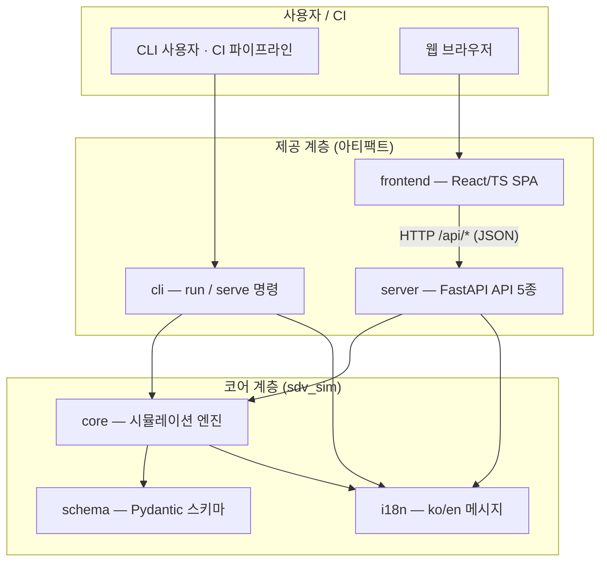

# 2. 시스템 개요

## 2.1 시스템 목표와 주요 기능

시스템의 최종 목표는 **하드웨어 없이 차량 소프트웨어 플랫폼을 정의 → 실행 → 검증**하는 것이다.
이를 위한 주요 기능은 다음과 같다.

| 영역 | 내용 |
|------|------|
| **E/E 아키텍처 모델링** | ECU/HPC 노드 정의, 토폴로지(노드 간 연결) 정의 — `architecture.yaml` |
| **차량 내 통신** | CAN/Ethernet 링크, 메시지 라우팅·지연·대역폭 시뮬레이션, 게이트웨이 라우팅 |
| **앱 런타임** | 가상 ECU/HPC 위에서 SW 컴포넌트 실행 (비선점 스케줄링, 오버런 감지) |
| **자동 검증** | YAML 선언형 assertion — JSON 이벤트 로그 + 종료 코드로 CI 연동 |
| **시각화 (v2)** | 구조 뷰 다이어그램, 편집·검증 피드백, 실행 결과 리플레이·리포트 |

## 2.2 전체 구조

시스템은 **사용자 접점 → 제공 계층 → 코어 계층 → 실행 환경**의 4개 층으로 구성되며,
모든 제공 형태가 코어 계층을 공유한다.

- **CLI**(`sdv-sim run`)와 **대시보드 서버**(`sdv-sim serve`)는 같은 코어 엔진을 호출한다.
  CLI는 파일 경로 기반 `load()`, 대시보드 서버는 YAML 문자열 기반 `loads()`를 사용한다
  (두 API의 관계는 4장·9장에서 설명).
- **프런트엔드**는 서버의 API 5종을 통해서만 코어에 접근한다. 파일을 직접 읽고 쓰는 것은
  브라우저이며, 서버는 파일 내용을 문자열로만 수신한다(2.4절 ④).
- 정적 UI 산출물(`sdv_sim/server/static/`)은 프런트엔드 빌드 결과이며, 패키지에 포함되어
  서버가 단일 프로세스로 서비스한다(10장).

## 2.3 구성 요소와 기술 스택

| 계층 | 구성 요소 | 기술 |
|------|-----------|------|
| 코어 | 시뮬레이션 엔진(`core/`), 정의 스키마(`schema/`), 메시지(`i18n.py`) | Python 3.11+, Pydantic 2.5+, PyYAML |
| CLI | `run`/`serve` 명령(`cli/`) | argparse, uvicorn |
| 대시보드 서버 | FastAPI 앱·세션·로그 로더(`server/`) | FastAPI, uvicorn, Pydantic |
| 프런트엔드 | SPA(`frontend/src/`) | React 19, TypeScript, Vite 6, js-yaml |
| 배포 | systemd 서비스(`deploy/`) | systemd user unit |
| 패키징 | PyPI 배포(`sdv-sim`) | hatchling, uv |

## 2.4 주요 설계 특성

시스템의 구조를 관통하는 4가지 설계 특성이다. 각 특성의 **선택 근거(대안·트레이드오프)는
부록 C/D**에 기록되어 있으며, 본문은 최종 설계가 어떤 모습인지를 설명한다.

1. **결정성(Determinism)** — 시뮬레이션은 난수를 사용하지 않으며, 모든 이벤트가
   `(t_ms, seq)` 완전 순서로 기록된다. 같은 입력은 항상 같은 결과를 낳으므로
   자동 검증(assertion)의 진실 소스로 쓸 수 있다. (4장)
2. **단일 코어 공유** — CLI·대시보드·(예정)데스크톱 모두 `sdv_sim.core`를 재사용한다.
   통신·스케줄링·검증 로직이 형태별로 분기되지 않아 일관성이 보장된다. (9장)
3. **헤드리스/CI 지원** — `run` 명령은 JSON 이벤트 로그와 종료 코드(0/1/2/3)만으로
   결과를 판정할 수 있어 무인 파이프라인에 통합된다. (5장)
4. **브라우저 파일 경계** — 대시보드의 파일 읽기/쓰기는 브라우저 권한 경계 안에서
   이루어지고(File System Access API 또는 업로드/다운로드), 서버는 사용자 파일을
   파일시스템에 저장하지 않는다. 서버 측 경로 검증·샌드박스가 필요 없어 보안 표면이
   줄어든다. (7.5절, 9.3절)
