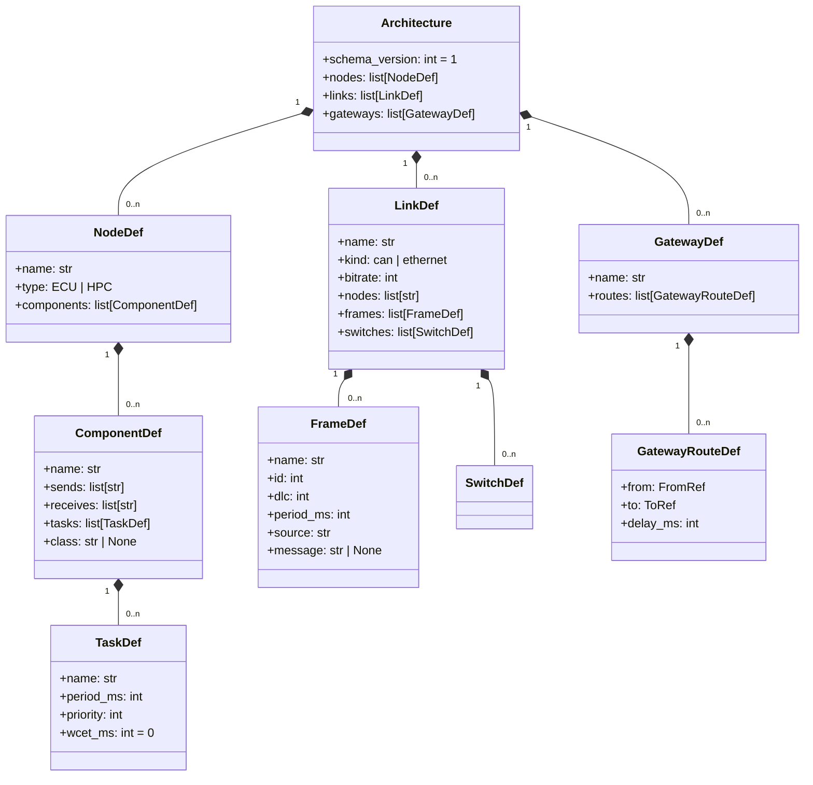

# 3. 정의 형식 개요

시스템의 입력은 **아키텍처 정의**와 **시나리오 정의** 두 개의 YAML 문서로 구성된다.
이 장에서는 두 문서의 도메인 모델(개념 구조)을 개관한다. 필드 단위의 완전한 사양은
**부록 A**에 있다.

## 3.1 아키텍처 정의 (architecture.yaml)

아키텍처 정의는 "차량의 구조가 어떻게 생겼는가"를 기술한다: 노드(ECU/HPC)와 그 위의
SW 컴포넌트, 노드 사이를 잇는 통신 링크(CAN/Ethernet)와 프레임, 링크 사이를 중계하는
게이트웨이.

**도메인 개념**:

- **노드(NodeDef)** — 하나의 ECU 또는 HPC. 여러 **컴포넌트(ComponentDef)**를 호스팅한다.
  컴포넌트는 메시지 `sends`/`receives` 목록과 주기 **태스크(TaskDef)** 목록을 가진다.
  태스크는 `period_ms`(주기), `priority`(우선순위), `wcet_ms`(최악 실행 시간)로 정의된다.
  `class` 필드가 있으면 그 이름의 사용자 정의 컴포넌트 클래스로 인스턴스화된다(4.6절).
- **링크(LinkDef)** — 노드들 사이의 통신 매체. `kind`가 `can` 또는 `ethernet`이다.
  링크는 **프레임(FrameDef)**을 소유한다: L2 수준의 전송 단위로 `id`(중재 ID), `dlc`(데이터 길이),
  `period_ms`(주기), `source`(송신 노드)를 가진다. Ethernet 링크는 스위치 큐 파라미터
  `switches[].queue_depth`를 가질 수 있다(기본 1000).
- **게이트웨이(GatewayDef)** — 한 링크에서 다른 링크로 프레임을 중계하는 **라우트(GatewayRouteDef)**를
  가진다. `from`(출발 링크 + 특정 프레임 또는 ID 범위) → `to`(도착 링크 + 선택적 ID 재매핑)의
  규칙에 `delay_ms`(처리 지연)가 붙는다.
- **메시지-프레임 매핑** — 컴포넌트가 주고받는 `sends`/`receives`의 **메시지 이름**은
  링크 프레임의 `message` 필드에 매핑되고, `message`가 없으면 프레임 이름 자체가 메시지 이름이다.

## 3.2 시나리오 정의 (scenario.yaml)

시나리오 정의는 "그 구조에서 무엇이 일어나는가"를 기술한다: 시뮬레이션 시간, 외부에서
주입할 메시지, 그리고 검증할 assertion.

| 요소 | 역할 |
|------|------|
| `duration_ms` | 시뮬레이션 종료 시간(정수 ms, 종료 시각 포함) |
| `messages` | **메시지 주입** — 특정 시각(`t_ms`)에 특정 링크(`link`)의 프레임(`frame`)을 데이터(`data`)와 함께 버스에 주입 |
| `assertions` | **자동 검증** — `expect` 블록으로 이벤트 종류·속성·시각·최소 개수를 선언 |

assertion의 `expect`는 `event`(`tx`/`rx`/`task`/`drop`/`overrun`/`log`)와 선택 속성
(`frame`, `link`, `node`, `task`, `message`), 그리고 시간 조건(`at_ms` + `within_ms`)과
`count`(최소 개수)로 구성된다. 평가 규칙의 동작은 4.7절에서 설명한다.

## 3.3 스키마 검증 규칙

두 YAML 문서는 **Pydantic 모델**(`sdv_sim/schema/`)로 검증된다. 검증은 두 층위에서 이루어진다.

1. **필드·구조 검증** — 타입과 값 제약: `period_ms > 0`, `wcet_ms >= 0`, `id >= 0`,
   `bitrate > 0`, `queue_depth > 0`, `extra` 필드 금지 등.
2. **유일성·참조 무결성 검증** —
   - 유일성: 노드·링크·게이트웨이 이름, 링크 내 프레임 이름·노드 참조, 노드 내 컴포넌트 이름이 유일해야 한다.
   - 참조 무결성: 링크가 참조하는 노드가 존재해야 하며, 프레임의 `source`는 해당 링크에 연결된 노드여야 한다.
     게이트웨이 라우트의 `from`/`to` 링크가 존재하고, `from.frame`은 해당 링크에 정의된 프레임이어야 한다.
     컴포넌트의 `sends`/`receives` 메시지는 연결된 링크의 프레임에 매핑되어야 한다.

검증은 입력이 시스템에 들어오는 모든 지점에서 수행된다 — CLI 로드 시(`load()`),
대시보드 실행 시(`loads()`), 편집 중 검증 피드백 시(`/api/validate`). 각 지점의 동작은
5장·6장·7장에서 설명한다.
