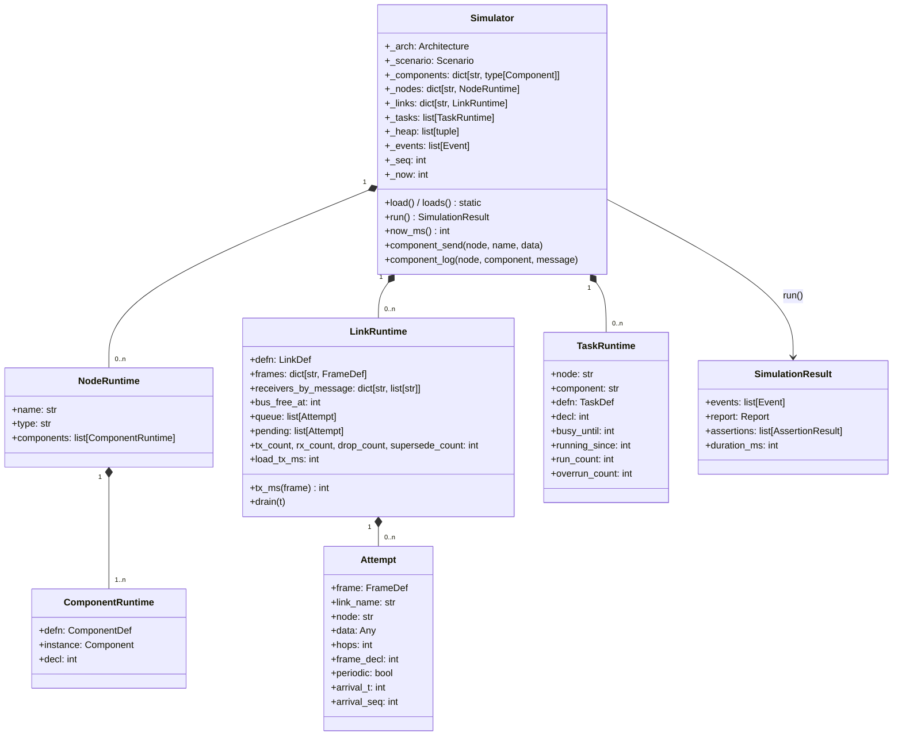

# 4.2 런타임 구조

시뮬레이션이 실행되는 동안 정의 문서(Architecture/Scenario)는 실행 가능한 **런타임 객체**로
변환된다. 엔진이 시뮬레이션 중 들고 있는 구조는 다음과 같다.

- **Simulator** — 엔진의 루트. 입력(정의)과 실행 상태(런타임, 이벤트 큐, 이벤트 로그)를 소유한다.
  사용자 정의 컴포넌트 클래스의 레지스트리(`_components`)를 가진다.
- **NodeRuntime / ComponentRuntime** — 정의의 노드·컴포넌트를 실행 상태로 변환한 것.
  컴포넌트는 `class` 이름에 매핑된 **Component 인스턴스**(4.6절)를 들고, `sends`/`receives`는
  링크의 프레임과 매핑되어 있다.
- **LinkRuntime** — 링크의 실행 상태. **버스가 바쁜 시각(`bus_free_at`)**, **전송 대기 큐(`queue`)**,
  **이번 tick에 도착한 시도(`pending`)**, 그리고 통계(전송/수신/드롭/supersede 횟수, 버스 점유 ms)를
  유지한다. `tx_ms(frame)`가 프레임 전송 시간을 계산한다(4.4절).
- **TaskRuntime** — 주기 태스크의 실행 상태. `busy_until`(실행 중 완료 시각)과 `running_since`(실행 시작
  시각)로 오버런을 판정한다.
- **Attempt** — 한 번의 "전송 시도"를 나타내는 불변 객체. 어떤 프레임을, 어떤 노드가, 몇 홉째에,
  몇 바이트 데이터로 보내려 하는지를 담는다. 링크의 큐/버스 점유 시뮬레이션의 단위가 된다.
- **SimulationResult** — `run()`의 반환 값: 정렬된 이벤트 목록, 리포트, assertion 결과, 실제 진행 시간.

## 공개 팩토리

코어를 감싸는 CLI와 서버는 서로 다른 입력 형태를 쓰므로, 두 가지 진입점을 제공한다.

| 팩토리 | 입력 | 사용처 |
|--------|------|--------|
| `Simulator.load(arch_path, scenario_path, components=None)` | 파일 경로 | CLI `run` |
| `Simulator.loads(arch_yaml, scenario_yaml, components=None)` | YAML 문자열 | 대시보드 서버 (파일 접촉 없음) |

두 팩토리는 스키마 검증(3.3절)을 거쳐 동일한 런타임을 구성한다. 이는 v1 코어를 변경하지 않고
v2 대시보드를 얹기 위해 추가된 문자열 입력 계약이며, 9.3절의 변경 사례 ①에서 자세히 설명한다.
