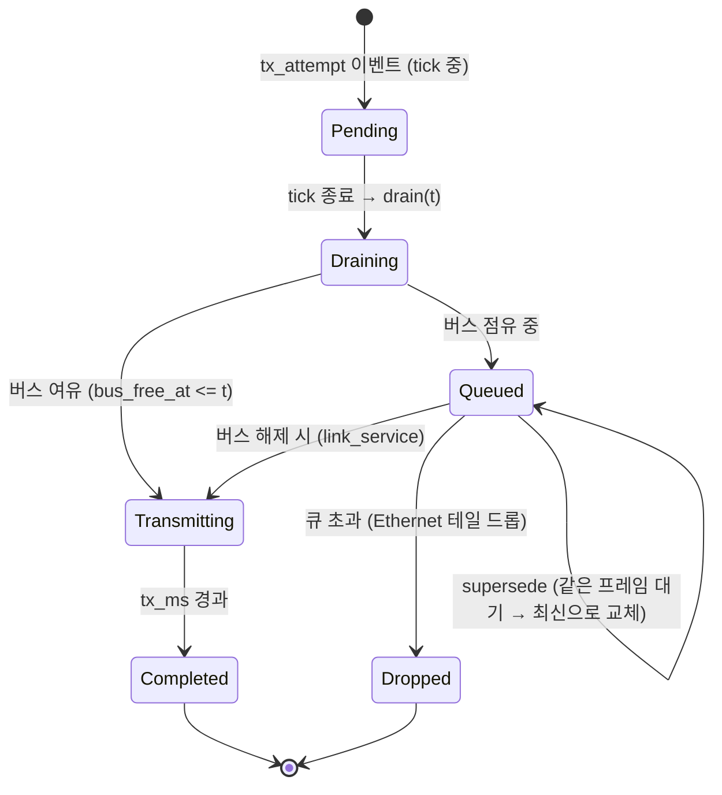

# 4.4 통신 동작 (CAN / Ethernet)

이 절은 프레임이 "전송 시도(tx_attempt) → 버스/스위치 → 수신(rx)"에 이르는 통신 동작을 설명한다.
게이트웨이 라우팅은 4.5절에서, 최종 설계의 순서 규칙은 위 4.1절의 이벤트 키를 따른다.

## 전송 시도의 수명주기

- 전송 시도는 tick이 끝날 때(4.3절의 `drain`)까지 대기했다가, **버스 여유 여부**에 따라
  즉시 전송되거나 큐에 들어간다.
- 전송이 시작되면 `tx` 이벤트가 `start` 시각에 기록되고, 링크의 `bus_free_at`이
  `start + tx_ms(frame)`로 갱신된다.
- **완료 시각**에 `rx` 이벤트가 스케줄되고, 링크가 비는 시각에 `link_service` 웨이크가 스케줄되어
  큐의 후속 프레임이 전송 기회를 얻는다.
- 게이트웨이 중계가 필요한 프레임은 완료 시각에 4.5절의 라우팅을 거친다.

## CAN 링크

**전송 시간**: `tx_ms = ceil((44 + 8·dlc) / (bitrate_kbps))` ms — CAN 프레임의 44비트
오버헤드 + 데이터 비트를 비트레이트로 나눈 값의 올림이다.

**중재(arbitration)**: 같은 시각에 여러 프레임이 전송을 시도하면, 버스 접근은 다음 순서로 결정된다.

1. **ID가 작을수록 우선** (CAN 중재 규칙의 재현)
2. ID가 같으면 **정의 선언 순서(frame_decl)**
3. 그다음 **도착 순서(arrival_seq)**

**버스 점유**: 버스가 바쁘면(`bus_free_at > t`) 시도는 큐에 대기한다. 대기 중인 프레임은
버스가 비는 시각부터 위 중재 순서대로 전송된다. CAN에는 큐 길이 제한이 없다
(모든 프레임은 결국 전송된다).

## Ethernet 링크

**전송 시간**: `tx_ms = ceil((dlc + 42) · 8 / (bitrate_mbps · 1000))` ms — 42바이트의
Ethernet 프레임 오버헤드(프리앰블·주소·타입·FCS)를 포함한 전송량을 비트레이트로 나눈다.

**스위치 큐**: 링크는 단일 스위치 FIFO를 가정한다.

- 큐의 순서는 **도착 순서(arrival_seq) 우선**, 같은 시각이면 정의 선언 순서로 결정된다.
- `switches[].queue_depth`(기본 1000)를 초과하는 시도는 **테일 드롭**되어 즉시 `drop` 이벤트가
  기록된다 (D-16).
- 큐에 **같은 프레임의 이전 인스턴스가 대기 중이면**, 대기 중인 것을 제거하고 최신 인스턴스로
  교체한다 — **supersede**(D-18). 중복 데이터의 전송을 생략해 대역폭을 절약하는 동작이며,
  `supersede_count`로 리포트에 집계된다.

## 전송·수신 이벤트

- `tx`: 전송 시작 시각에 기록 — `node`(송신자), `link`, `frame`, `data`.
- `rx`: 완료 시각에 기록 — 링크의 프레임 `message`를 `receives`하는 노드의 컴포넌트에게
  `on_message()`가 전달된다. 수신 매핑이 없는 노드는 이벤트에서 제외된다.
