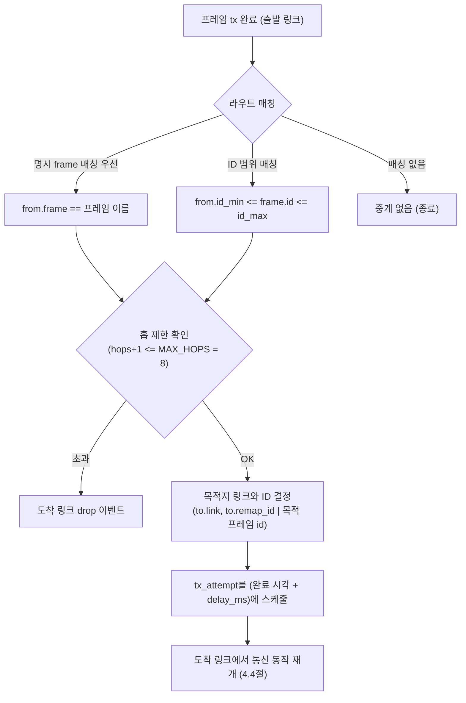

# 4.5 게이트웨이 라우팅

게이트웨이는 한 링크에서 수신·완료된 프레임을 다른 링크로 중계한다. 중계 규칙(라우트)은
아키텍처 정의의 `gateways[].routes`로 선언되며, 프레임이 출발 링크에서 **완료된 시각**에 평가된다.

## 라우트 매칭

- 한 프레임에 여러 라우트가 걸릴 수 있다. **`from.frame`으로 특정 프레임을 지목하는 명시 라우트가
  ID 범위 라우트보다 우선**하며, 같은 종류끼리는 선언 순서대로 적용된다.
- 매칭된 각 라우트마다 목적지 링크로의 중계가 하나씩 생성된다.

## 중계 동작

- **목적지 프레임 결정**: 라우트의 `to.remap_id`가 지정되면 그 ID로, 아니면 목적지 링크에서
  같은 이름의 프레임(또는 동일 ID)이 있으면 그 프레임의 `id`/`dlc`를 사용한다.
- **지연**: 중계된 시도는 `완료 시각 + delay_ms`에 도착 링크의 `tx_attempt`로 스케줄된다
  (라우트의 `delay_ms`, 기본 0).
- **홉 제한**: 시도가 이미 `MAX_HOPS(8)`개의 링크를 거쳤다면 중계하지 않고, 목적지 링크에서
  즉시 `drop` 이벤트로 기록된다 — 라우팅 루프로 인한 무한 전파를 방지한다.

## 중계된 시도의 흐름

중계된 시도는 `hops`가 1 증가한 채 도착 링크의 일반 통신 경로(4.4절)를 그대로 따른다 —
대기·중재·큐잉·supersede·테일 드롭 모두 동일하게 적용되며, `tx` 이벤트의 `node`는 원본
송신 노드가 아니라 **중계를 수행한 게이트웨이가 속한 노드**가 된다.
