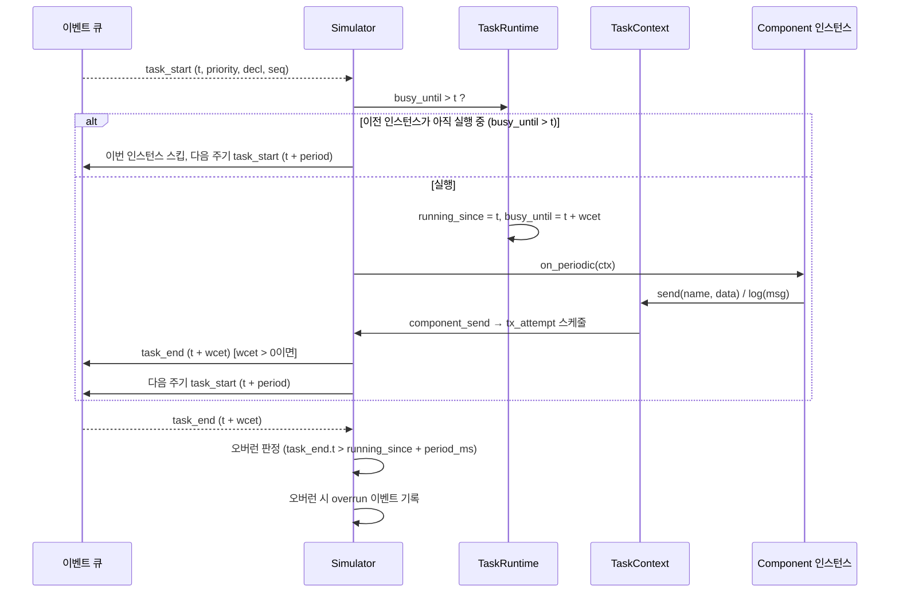

# 4.6 앱 런타임 (SW 컴포넌트·태스크)

가상 ECU/HPC 위에는 정의의 컴포넌트들이 앱으로서 실행된다. 엔진은 **비선점 스케줄링**으로
주기 태스크를 구동하고, 사용자 정의 컴포넌트에 실행 훅과 통신 API를 제공한다.

## 주기 태스크 스케줄링

각 태스크는 **절대 주기**로 동작한다 — 첫 실행은 `t=0`, 이후 `period_ms`마다 반복된다.
실행은 비선점이며, `wcet_ms` 동안 노드(가상 CPU)를 독점한다.



- **동일 노드의 동시 실행**은 없다: 다음 인스턴스가 시작될 시각에 이전 인스턴스가 아직
  `busy_until`이면, 그 인스턴스는 **스킵**되고 다음 주기로 넘어간다 (D-17).
- `wcet_ms == 0`이면 즉시 완료로 처리된다 (task_end가 같은 시각, 우선순위 열로 기록).
- 우선순위는 **순서의 키**로만 사용된다 — 같은 시각의 task_start들은 `priority`(그다음 decl,
  seq) 순으로 처리된다 (4.1절의 이벤트 키).

## 오버런 (D-17)

`task_end`가 `running_since + period_ms`를 초과하면 **오버런**으로 판정하고 `overrun` 이벤트를
기록한다. 태스크의 `run_count`/`overrun_count`는 리포트(TaskReport)에 집계된다.

## Component API

사용자 정의 컴포넌트는 `sdv_sim.core.component.Component`를 상속해 다음 훅을 구현할 수 있다.

```python
class Component:
    def on_start(self, ctx: TaskContext) -> None: ...      # 시뮬레이션 시작 시 1회
    def on_stop(self, ctx: TaskContext) -> None: ...       # 종료 시 1회
    def on_periodic(self, ctx: TaskContext) -> None: ...   # 주기 태스크마다
    def on_message(self, ctx: TaskContext, message: Message) -> None: ...  # 메시지 수신 시
```

- **TaskContext**는 실행 환경이다: `now_ms()`(현재 시각), `send(name, data)`(메시지 송신),
  `log(message)`(로그 이벤트 기록)를 제공한다.
- 컴포넌트 클래스는 `Simulator.load(..., components={...})`의 **클래스 레지스트리**에서
  `ComponentDef.class` 이름으로 매칭된다. 매칭되지 않으면 수신 전용 스텁(D-14)으로 취급되어
  `on_message`만 기본 동작(무시)으로 처리된다.
- **메시지 송신**: `ctx.send()`는 메시지 이름을 링크 프레임에 매핑해(3.1절) 해당 노드의
  `tx_attempt`를 **현재 시각**에 스케줄한다. 이후 동작은 4.4절의 통신 경로를 따른다.
- 컴포넌트 코드에서 예외가 발생하면 내부 오류(종료 코드 3)로 처리된다 — 사용자 컴포넌트의
  버그가 시뮬레이션을 불확정하게 만들지 않도록 한다.
