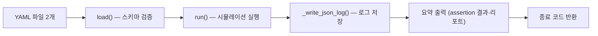

# 5. CLI (Command-Line Interface)

CLI는 코어의 1차 제공 형태이다. 패키지 설치 시 `sdv-sim` 실행 파일이 제공되며
(`pyproject.toml`의 entry point), 서버 없이 정의 → 실행 → 검증을 무인으로 수행한다.

## 5.1 명령 구조와 옵션

```
sdv-sim run <arch.yaml> <scenario.yaml> [--log PATH] [--quiet] [--lang ko|en]
sdv-sim serve [--port PORT] [--host HOST] [--dev] [--lang ko|en]
```

| 하위 명령 | 역할 |
|-----------|------|
| `run` | 아키텍처+시나리오를 로드·실행·검증하고 로그를 저장한다 |
| `serve` | 대시보드 서버를 시작한다 (6장) |

`run`의 주요 옵션:

| 옵션 | 기본값 | 의미 |
|------|--------|------|
| `--log PATH` | `events.json` | 이벤트 로그 저장 경로. `-`를 주면 stdout으로 출력 |
| `--quiet` | 꺼짐 | 요약 출력(assertion 결과·리포트)을 생략 |
| `--lang ko\|en` | 자동(5.4절) | 메시지 언어 강제 |

## 5.2 실행 흐름과 입출력 계약



1. `load()`: 두 YAML 파일을 읽고 스키마 검증(3.3절)을 수행한다. 실패 시 입력 오류로 처리(종료 코드 2).
2. `run()`: 4장의 엔진을 실행하고 `SimulationResult`를 얻는다.
3. 로그를 `--log` 경로에 JSON으로 저장한다. 로그는 `schema_version`, `duration_ms`, `events`,
   `assertions`, `warnings`를 포함하는 단일 JSON 객체이다 — 대시보드의 `/api/load-log`(6.2절)와
   리플레이(7.4절)의 입력 형식이다.
4. 요약(assertion별 결과, 리포트 요약)을 터미널에 출력한다. `--quiet`면 생략한다.
5. 종료 코드로 결과를 전달한다 (5.3절).

CI 파이프라인은 파일 경로와 종료 코드만으로 성공 여부를 판정할 수 있다.

## 5.3 종료 코드와 오류 처리

| 코드 | 의미 | 예 |
|------|------|----|
| `0` | **pass** — 모든 assertion 통과 | 정상 검증 성공 |
| `1` | **assertion fail** — 하나 이상 실패 | 예상 drop이 발생하지 않음 |
| `2` | **입력 오류** — 파일 없음, YAML 파싱 오류, 스키마 검증 실패, 잘못된 사용법 | 잘못된 필드, 존재하지 않는 경로 |
| `3` | **내부 오류** — 엔진/컴포넌트 예외 | 사용자 컴포넌트의 `RuntimeError` |

오류 메시지는 메시지 코드(`SdvSimInputError.code`)와 번역(5.4절)으로 구성되어, 언어 설정에
따라 한국어 또는 영어로 출력된다. 오류 원인(파일·라인·규칙)이 메시지에 포함된다.

## 5.4 i18n 체계

사용자 메시지의 언어는 다음 우선순위로 결정된다.

```
--lang 옵션 > SDV_SIM_LANG 환경 변수 > 시스템 로케일(유효하면) > ko
```

- CLI 오류·요약·리포트 문자열은 메시지 코드와 번역 테이블(`sdv_sim/i18n.py`)로 관리된다.
- 예: `--lang en`으로 실행하면 시스템 로케일과 무관하게 영어 메시지가 출력된다.
- 대시보드의 프런트엔드 언어 결정은 별도 경로를 따른다 (7.7절).
