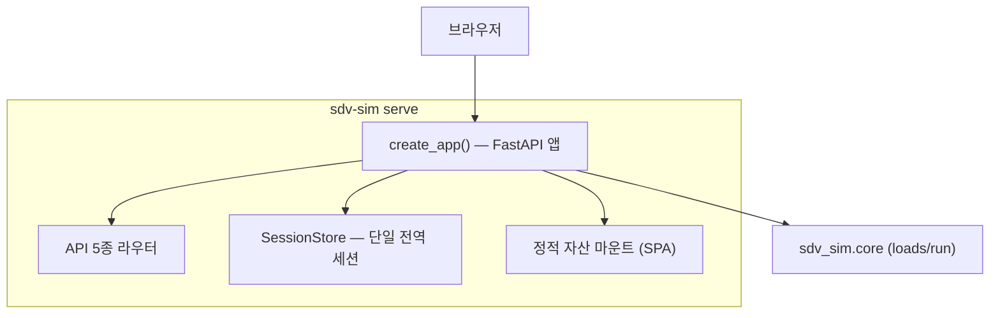
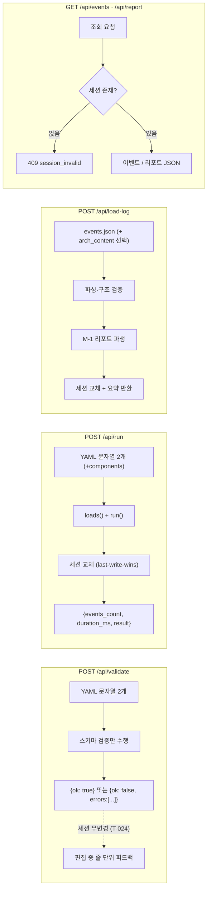

# 6. 대시보드 서버

v2의 백엔드는 `sdv-sim serve`로 실행되는 **FastAPI 서버**(`sdv_sim/server/`)이다.
브라우저와 코어 사이의 얇은 API 계층으로, 파일시스템에 닿지 않고(YAML/JSON 문자열만 수신)
단일 세션을 유지하며 모든 오류를 일관된 계약으로 반환한다.

## 6.1 서버 구조



- **`create_app()` 팩토리**: 서버 앱을 구성하는 유일한 진입점이다. 테스트에서 앱을 직접 구성해
  httpx/uvicorn으로 검증한다 (11장).
- **SessionStore**: 전역 **단일 세션** 객체를 보유한다. 새 실행이 세션을 **교체**하는
  last-write-wins 정책이다 (6.4절).
- **정적 자산**: 운영 모드에서는 프런트엔드 빌드 결과(`sdv_sim/server/static/`)를 같은 서버가
  마운트해 단일 프로세스로 서비스한다. 개발 모드(`--dev`)에서는 Vite 개발 서버가 `/api`를
  이 서버로 프록시하므로 정적 마운트를 사용하지 않는다.
- 서버는 `--port`를 **바인딩 전에 점유 여부를 확인**하고, 이미 사용 중이면 종료 코드 2로
  즉시 실패한다. `--host`(기본 `127.0.0.1`)로 바인딩 주소를 제어한다 (9.3절).

## 6.2 API 5종



| 메서드 | 경로 | 요청 본문 | 응답 | 동작 |
|--------|------|-----------|------|------|
| POST | `/api/validate` | `{arch_content, scenario_content}` | `{ok}` 또는 `{ok, errors[]}` | 스키마 검증만. 세션을 건드리지 않는다 (T-024) |
| POST | `/api/run` | `{arch_content, scenario_content, components?}` | `{events_count, duration_ms, result}` | YAML 문자열로 `loads()`→`run()` 후 세션 교체 |
| POST | `/api/load-log` | `{events_content, arch_content?}` | `{events_count, duration_ms, result}` | 로그 파싱·검증 → 리포트 파생(M-1) → 세션 교체 |
| GET | `/api/events` | — | 이벤트 JSON | 세션의 이벤트를 `(t_ms, seq)` 정렬로 반환 |
| GET | `/api/report` | — | 리포트 JSON | 세션의 리포트를 반환 |

- 모든 요청·응답은 JSON이며, 파일 경로가 아니라 **파일 내용 문자열**만 오간다.
- `validate`는 **실행하지 않는 순수 검증**이다. 편집 중 디바운스(7.6절)로 호출되어
  오류를 줄 단위로 피드백하지만, 기존 세션(리플레이/리포트)을 무효화하지 않는다.

## 6.3 오류 계약 (F-8)

모든 오류 응답은 다음 형태의 단일 envelope를 따른다.

```json
{ "error": { "code": "validation_error", "message": "...", "detail": "..." } }
```

| HTTP | code | 의미 |
|------|------|------|
| 400 | `validation_error` | 입력 YAML 검증 실패 (validate/run) |
| 400 | `log_invalid` | 로그 JSON 구조·이벤트 형식 오류 (load-log) |
| 404 | `not_found` | 존재하지 않는 리소스 |
| 409 | `session_invalid` | 세션이 없거나 무효 (GET 계열) — 프런트가 재실행을 유도 |
| 500 | `internal` | 서버 내부 오류 |

프런트엔드는 `code`를 기준으로 사용자 메시지를 결정한다 (7.6절).

## 6.4 세션 수명주기

- 세션은 `{arch?, scenario?, events, report, created_at}` 묶음으로, **서버 전역에 단 하나**만 존재한다.
- `run`/`load-log`가 성공하면 **세션이 통째로 교체**된다 (last-write-wins). 동시 실행 요청은
  마지막 요청이 이긴다 — 단일 사용자 대시보드에 적합한 단순성 정책이다.
- `validate`는 세션을 변경하지 않는다 (T-024). 편집 중 "세션 무효화"는 서버 API가 아니라
  **프런트의 로컬 상태**(`invalidated`)로 처리되어, 실행된 결과가 오래된 입력과 연결되는
  문제를 프런트가 직접 막는다 (7.6절).
- GET 계열은 세션이 없으면 `409 session_invalid`를 반환한다. 프런트는 리플레이/리포트 진입
  시 이를 감지하고 사용자에게 실행을 안내한다.

## 6.5 로그 로드·리포트 파생 (M-1)

`/api/load-log`는 실행 없이 기존 이벤트 로그(CLI가 저장한 `events.json` 등)를 세션으로
올린다. 리포트는 로그에서 **파생**되며, 파생 가능 여부는 항목별로 다르다 (M-1 규칙).

| 파생 가능 | 파생 불가 (아키텍처 필요) | 로그만으로 불가 |
|-----------|----------------------------|-----------------|
| 링크 tx/rx/drop 횟수 | 버스 점유율(`bus_load_percent`) | supersede 횟수 |
| 태스크 run/overrun 횟수 | 링크 `kind`, 태스크 `period_ms` | warnings (엔진 경고) |
| assertion 결과 | — | — |

- `arch_content`를 함께 주면 버스 점유율 등 아키텍처 의존 항목이 보강된 리포트를 만든다.
- 이 규칙 덕분에 CLI가 남긴 로그 파일만으로도 웹에서 동일한 리플레이·리포트를 재현할 수 있다.
