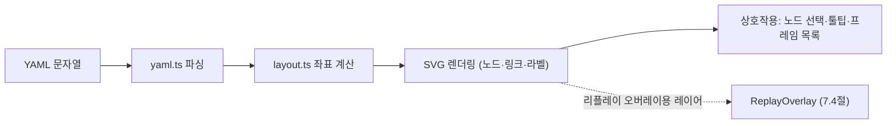

# 7.3 구조 뷰 (Structure View)

구조 뷰는 아키텍처 정의(YAML)를 **SVG 다이어그램**으로 렌더링하는 컴포넌트이다.
렌더링은 `StructureView.tsx`(표시)와 `layout.ts`(좌표 계산)로 분리된다.

## 결정적 레이아웃 (layout.ts)

`layout.ts`는 순수 함수로 노드·링크·프레임의 좌표를 계산한다. **같은 아키텍처 입력은 항상
같은 좌표**를 만든다 — 재현성과 테스트 용이성(11.2절)을 위한 설계이다.

- **타입 밴드 배치**: 노드를 타입별 세로 밴드로 배치한다. HPC 밴드 → 게이트웨이 밴드 → ECU
  밴드 순서로, 데이터 흐름(게이트웨이 중계)을 왼쪽→오른쪽으로 자연스럽게 읽을 수 있다.
- **밴드 내 정렬**: 같은 밴드 안의 노드는 **연결된 링크 수 내림차순, 이름 오름차순**으로
  정렬되어, 허브 역할을 하는 노드가 위쪽에 온다. 순서 불안정성을 없애기 위해 정렬 키가
  (링크 수, 이름)으로 결정적이다.
- **CAN/Ethernet 시각 구분**: 링크 종류에 따라 색·선 스타일을 달리한다.

## 렌더링 (StructureView.tsx)

- SVG는 좌표가 결정적이므로 리플레이 오버레이(7.4절)가 같은 좌표 체계를 재사용한다.
- 구조 뷰는 **검증이 유효할 때만** 갱신된다 — 파싱/검증 오류가 있는 동안에는 마지막 유효
  다이어그램을 유지한다 (7.6절).
