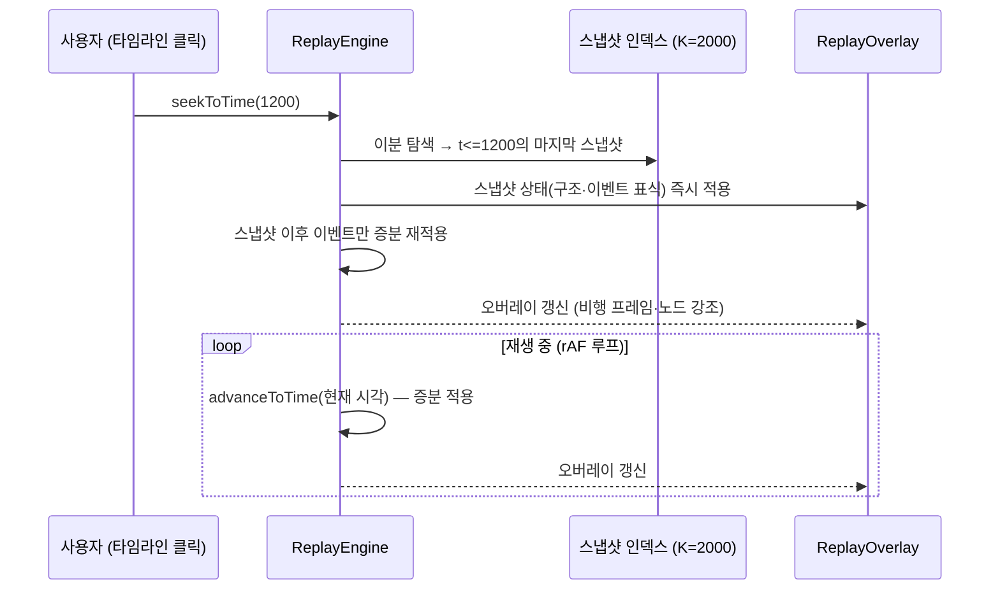

# 7.4 리플레이 (Replay)

리플레이 뷰는 실행 결과(이벤트 로그)를 구조 뷰 위에서 **시간에 따라 재생**한다.
핵심 요구사항은 "10만~100만 개의 이벤트를 부드럽게 시크(seek)할 수 있어야 한다"이다.

## 동작 설계: 스냅샷 인덱스 + 증분 재적용

전체 이벤트를 매 프레임마다 처음부터 재스캔하면 대형 로그에서 버벅인다. 리플레이는
**스냅샷 인덱스**와 **증분 적용**의 조합으로 시크를 O(log n + k)에 근접하게 만든다.

1. **이벤트 로드**: 이벤트는 이미 `(t_ms, seq)`로 정렬되어 있다 (4.7절).
2. **스냅샷 인덱스**: 로드 시 이벤트를 고정 간격(K=2000개)으로 스캔해, 각 스냅샷에
   "그 시점까지의 상태 요약"(전송 중 프레임, 노드 상태, 집계 카운터)을 저장한다.
3. **seekToTime(t)**: 이분 탐색으로 `t` 이전의 마지막 스냅샷을 찾아 상태를 복원한 뒤,
   그 스냅샷 이후의 이벤트만 순서대로 재적용한다. 시크는 100ms 이내를 목표로 한다.
4. **advanceToTime(t)**: 재생 중에는 현재 상태에서 이벤트를 증분 적용만 한다.

## 오버레이 렌더링 (ReplayOverlay)

구조 뷰(7.3절)의 결정적 좌표 위에 다음을 그린다.

- **비행 프레임**: 전송 중인 메시지가 링크 위를 이동 (시각 `t`에서 전송 시작/완료 사이)
- **노드 강조**: 현재 실행 중인 태스크의 노드 하이라이트
- **신호 표식**: `drop`/`overrun` 이벤트 발생 지점의 경고 표시

## 재생 모드

| 모드 | 시간 진행 | 용도 |
|------|-----------|------|
| **물리 모드** | 이벤트의 실제 `tx_ms`(통신 지연)를 그대로 재현 | 정확한 통신 순서 관찰 |
| **펄스 모드** | 이벤트 간격을 일정 펄스(약 300ms)로 압축 | 빠른 개관·긴 로그 브라우징 |

- **useReplayClock**: `requestAnimationFrame` 기반 시계로 배속(1x/2x/4x…)·일시정지·시크를
  제공한다. 물리 모드에서는 시뮬레이션 ms를 실제 시간으로 매핑하고, 펄스 모드에서는
  이벤트 수 기준으로 진행한다.

## 검증·정합성

- `scripts/check-replay.ts`가 **시크 결과 == 전체 재스캔 결과**를 검증한다 — 인덱스 근사화가
  상태를 왜곡하지 않는지를 CI에서 보장한다 (11.2절).
- 리플레이는 세션(`/api/events`) 또는 로그 파일(`/api/load-log`, 6.5절)에서 이벤트를 얻는다.
  두 경로 모두 동일한 `(t_ms, seq)` 정렬 입력을 쓰므로 렌더링 로직이 하나로 재사용된다.
