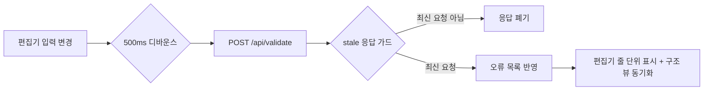

# 7.6 검증 피드백 (useValidation)

편집 중 YAML 오류를 **즉시** 사용자에게 보여주는 훅이다. 서버의 `/api/validate`(6.2절)를
사용하며, 실행(`/api/run`)과 분리된 순수 검증 경로로 동작한다.

## 동작

1. **디바운스**: 입력이 멈춘 뒤 500ms 후에만 검증을 호출한다 — 타이핑마다 요청이 가지
   않도록 한다.
2. **stale 응답 가드**: 연속 편집 중 이전 요청의 응답이 뒤늦게 도착하면, 최신 편집에 대한
   응답이 아닐 수 있으므로 **폐기**한다. 요청 시퀀스 번호로 최신 여부를 판별한다.
3. **반영**: 오류가 있으면 편집기에 줄 번호·메시지를 표시하고, **구조 뷰는 갱신하지 않는다**
   (마지막 유효 다이어그램 유지). 유효하면 구조 뷰를 동기화한다.
4. **forceValidate**: "실행" 버튼 클릭 시 디바운스와 무관하게 즉시 검증을 수행한다 —
   실행 요청 전에 입력이 유효한지 보장한다.

## 세션 무효화와의 관계 (T-024)

- `validate`는 세션을 변경하지 않는다(6.4절). 대신 **편집이 수정되면 `invalidated` 로컬
  플래그**가 켜지고, 리플레이/리포트 뷰가 "현재 입력과 다른 결과"임을 표시한다.
- 실행(`/api/run`) 성공 시 `invalidated`가 꺼지고 세션이 교체된다.

## 오류 표시

- 서버는 `{ok: false, errors: [{line, col, message}]}`를 반환하고(6.3절), 편집기는
  라인 숫자 옆에 오류 마커를 그린다.
- 오류 메시지는 서버가 `code`와 함께 반환하므로, 프런트는 코드별로 추가 해설을 붙일 수 있다.
