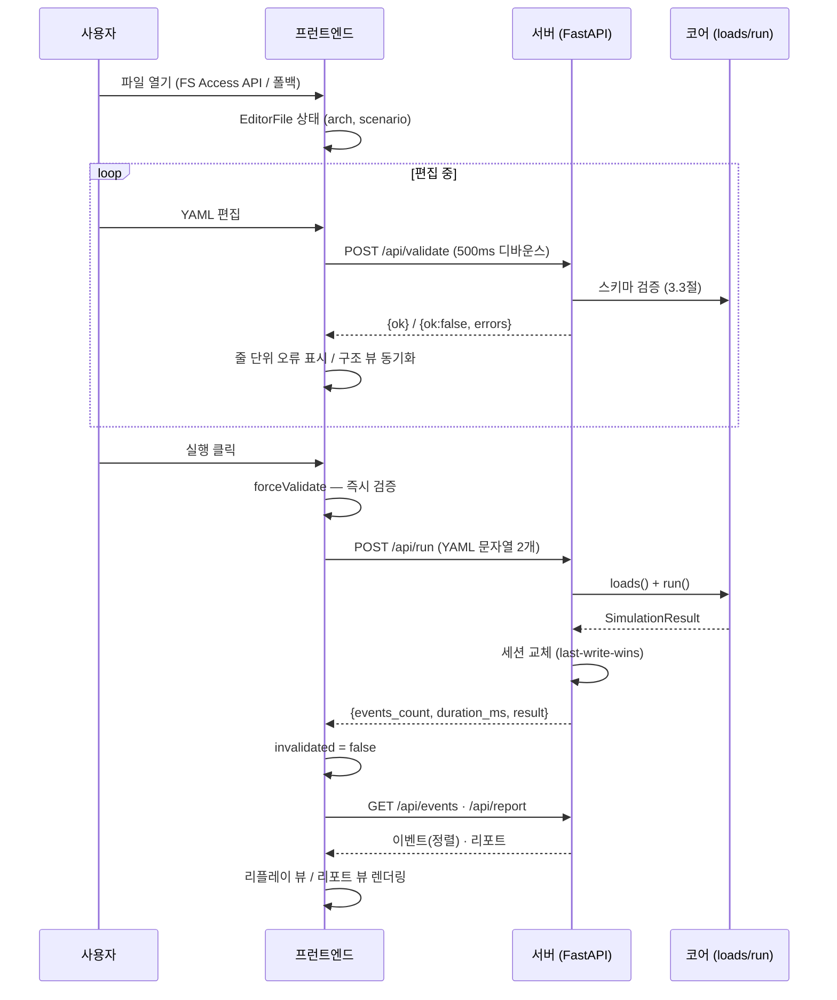
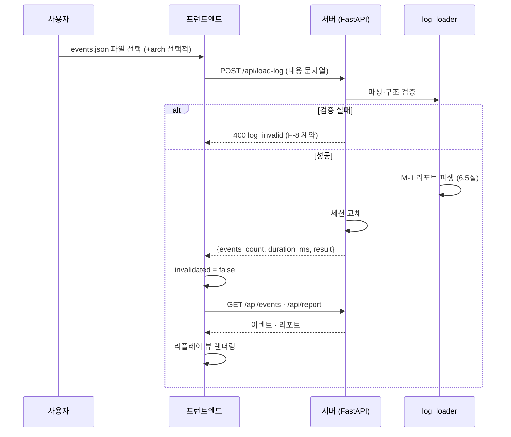

# 8. 핵심 데이터 흐름

4·5·6·7장에서 설명한 구성 요소가 하나로 묶여 움직이는 **통합 흐름**을 보여준다.
시스템에는 두 개의 진입 흐름이 있다: ① 대시보드에서 정의를 편집·실행하는 **run 경로**,
② 기존 로그 파일을 불러와 재현하는 **load-log 경로**. CLI의 `run`은 ①의 서버 없이 코어를
직접 호출하는 변형이다. 모든 데이터는 문자열/YAML/JSON으로 서버를 통과한다.

## 8.1 run 경로 (대시보드 실행)



- 편집은 서버와 독립적으로 진행되며, 검증만 서버를 거친다.
- 실행은 **YAML 문자열**로 서버에 전달되고, 결과 이벤트·리포트는 **JSON**으로 돌아온다 —
  어느 단계에서도 파일 경로가 오가지 않는다 (2.4절 ④).
- 세션이 교체되면 프런트의 `invalidated`가 꺼져, 현재 편집 내용과 실행 결과가 일치함을
  보장한다 (7.6절).

## 8.2 load-log 경로 (로그 파일 재현)



- CLI가 남긴 `events.json`(5.2절)이 이 경로의 대표 입력이다. 실행 없이 같은 리플레이·
  리포트를 웹에서 재현한다.
- 아키텍처를 함께 주면 버스 점유율 등 M-1 보강 항목이 리포트에 포함된다 (6.5절).

## 8.3 재생·시크 흐름

리플레이 뷰 내부의 시간 축 이동은 7.4절의 설계를 따른다:

```
이벤트 로드 (이미 (t_ms, seq) 정렬) → 스냅샷 인덱스 생성 (K=2000)
→ seekToTime(시크) = 이분 탐색 + 잔여 증분 재적용
→ advanceToTime(재생) = 증분 적용 (rAF 루프)
→ ReplayOverlay가 구조 뷰 위에 상태 렌더링
```

run 경로와 load-log 경로 중 어느 쪽으로 세션이 만들어졌든, 이벤트는 같은 정렬 계약을
따르므로 리플레이 로직은 하나로 재사용된다.
