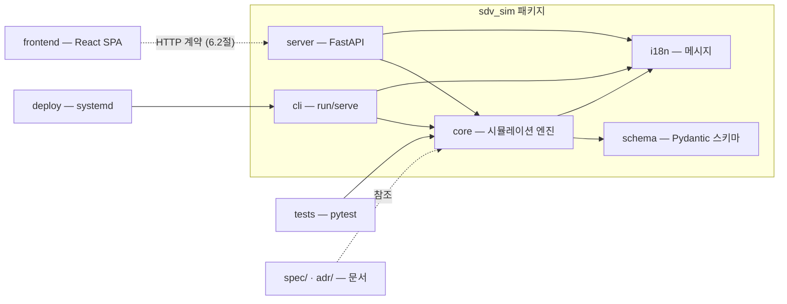

# 9. 모듈 의존성과 확장·변경 반영

이 장은 개발 측면의 관점에서 시스템을 본다: 모듈이 **어느 방향으로** 의존하는지,
확장이 어디에서 일어나는지, 그리고 실제 변경 요구가 구조에 **어떻게 반영**되었는지.

## 9.1 모듈 의존성

**의존성 규칙**: 화살표는 항상 "사용하는 쪽 → 사용되는 쪽"이다.

1. `core`는 `schema`(정의 타입)와 `i18n`(메시지)에만 의존하고, `cli`/`server`에 **역의존하지 않는다**.
   코어는 어떤 제공 형태로도 재사용될 수 있는 독립 실행 계층이다.
2. `cli`와 `server`는 같은 코어 API(`load`/`loads`/`run`)를 사용한다 — 통신·스케줄링·검증
   로직이 형태별로 분기되지 않는다 (2.4절 ②).
3. `frontend`는 서버의 **HTTP 계약**(6.2절)에만 의존한다. 서버 구현이나 코어 내부에
   의존하지 않으며, 브라우저에서 서버 코드를 알지 못한다.
4. `tests`는 코어(및 서버 팩토리)를 직접 사용한다 — 제공 형태를 거치지 않고 엔진 동작을 검증한다.

## 9.2 확장 지점

새 요구는 대부분 코어를 고치지 않고 **추가**로 흡수된다.

| 확장 지점 | 방식 | 예 |
|-----------|------|----|
| **사용자 정의 컴포넌트** | `components={...}` 클래스 레지스트리, `class` 키 매칭 | 샘플의 신호등 컴포넌트 (11.3절) |
| **새 링크 종류 / 라우트 / assertion** | 스키마(부록 A) + 엔진 처리기 확장 | CAN/Ethernet에 새 링크 종류 추가 |
| **새 제공 형태 (v2 사례)** | 코어는 무변경, 계층만 추가 | `loads()` 문자열 API 추가 → 대시보드 재사용 |
| **새 제공 형태 (v3 예정)** | 같은 코어 + API 계약 재사용 | 데스크톱 셸 (12장) |

- **레이어 추가 원칙**: "코어를 바꾸지 않고 어떻게 얹을까"를 먼저 묻는다. v2는 이 원칙의
  검증 사례이다 — v1 코어에 문자열 입력 API 하나를 추가하고, CLI와 별개로 서버·프런트를
  얹었다 (9.3절 ①).

## 9.3 변경 요구 반영 사례

실제 프로젝트에서 발생한 요구가 구조에 반영된 세 사례이다. 공통점은 **기존 계약을
깨지 않으면서** 새 요구를 흡수한 것이다.

### ① F-11 방향 전환: 서버 파일 접근 → 브라우저 파일 접근

- **요구**: v2 설계 초기에는 서버가 `--root` 샌드박스 안에서 파일을 읽는 방식이었다.
  사용자 피드백으로 "브라우저에서 원하는 파일을 열고, 서버가 파일을 몰라도 되는" 방향으로
  전환되었다 (F-11).
- **반영**: 서버에서 경로 처리·샌드박스 로직을 **제거**하고, 코어에 문자열 입력 팩토리
  `loads()`를 추가했다. 기존 `load()`(파일 경로, CLI용) 계약은 그대로 유지되어 CLI는
  변경 없이 재사용된다. 브라우저가 파일 소유자가 되면서(7.5절) 서버 보안 표면이 줄었다 (2.4절 ④).

### ② 네트워크 바인딩 제어: `--host` 추가

- **요구**: systemd 서비스 배포(10장)에서 `127.0.0.1` 기본값만으로는 외부 접근이 불가능하다.
- **반영**: `serve`에 `--host` 옵션을 추가하고 기본값을 `127.0.0.1`로 유지했다. `0.0.0.0`
  지정 시 경고를 출력하고, 포트가 이미 사용 중이면 종료 코드 2로 즉시 실패한다 (5.3절).

### ③ T-024 재설계: 세션 무효화를 프런트로 이동

- **요구**: "입력이 수정되면 실행 결과(리플레이/리포트)를 무효화"하는 요구가 초기에는
  서버 API(`/api/validate`가 세션을 무효화)로 설계되었다. 그러나 검증이 편집 중 수시로
  호출되어 **유효한 실행 결과까지 계속 무효화**되는 문제가 드러났다.
- **반영**: 서버의 `validate`를 **순수 검증**(세션 무변경)으로 고정하고, 무효화 판단을
  프런트 로컬 상태(`invalidated`, 7.2절)로 옮겼다. "표시 중인 결과 = 현재 입력" 보장은
  서버 대신 브라우저가 담당한다 (7.6절).

이 세 사례는 모두 9.2절의 "추가로 흡수" 원칙을 따른다: 계약을 유지하면서 기능을
얹거나, 책임을 더 적합한 계층으로 이동했다.
