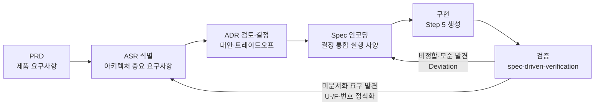

# 부록 C. 설계 및 개발 과정 (PRD → ASR → ADR → Spec → 구현 → 검증)

- **범위**: 이 프로젝트가 어떤 과정으로 설계·개발되었는지와 산출물 개념 — 본문의 "최종 설계"가 도출된 배경
- **자료**: `prompts.md`(대화 기록), `TODO-v1.md`/`TODO-v2.md`(작업 추적), `spec/`·`adr/`·`verification/` (요약·개념화 — 진행 로그 재생산 아님)

## C.1 단계 파이프라인 개요

이 프로젝트는 **spec-driven 개발** 워크플로우를 따른다. 각 단계는 사용자 승인 게이트를 거치며, 후속 단계에서 식별된 미해결 항목이 이전 단계로 되돌아가는 **피드백 루프**를 가진다.

- **PRD**: "무엇을 만들 것인가" — 목표·범위·성공 기준
- **ASR**: "어떤 요구가 아키텍처를 결정하는가" — ASR 등록부에 식별·검토·승인 상태로 관리
- **ADR**: "그 요구를 어떻게 충족할 것인가" — 1 concern = 1 ADR, 대안 ≥ 2 + 트레이드오프 + 결정·근거
- **Spec**: "구현이 따라야 할 실행 사양" — 승인된 ADR 결정을 검증 가능한 요구사항으로 인코딩 (SSOT)
- **검증**: Spec 항목별로 구현을 대조 — pass/fail 인벤토리 + Deviation + **미문서화 ASR(U-/F-번호)** 식별

## C.2 산출물 개념

| 산출물 | 위치 | 역할 | 주요 내용 |
|--------|------|------|-----------|
| PRD | `spec/PRD.md` | 제품 수준 요구사항 | 배경·문제 정의, 목표(정의→실행→검증), 대상 청중, v1/v2/v3 범위, 비목표, 제약, 성공 기준 |
| ASR | `spec/ASR.md` | 아키텍처 중요 요구사항 등록부 | ASR-001~021 (ID·카테고리·상태·Resolution·관련 ADR·의존성 순서) |
| ADR | `adr/*.md` (49건) | 결정 레코드 | Concern·Context·Options≥2·Tradeoffs·Recommendation·Downstream Concerns |
| Spec | `spec/sdv-sim-v1.md`, `spec/sdv-sim-v2.md` | 결정 통합 실행 사양 | Decisions·Requirements(검증 가능 항목)·Constraints·Out of Scope·Open Questions |
| 검증 | `verification/` | 사양 대비 구현 검증 | 항목별 pass/fail 인벤토리, Deviation, Undocumented ASR, 권장 조치 |
| 작업 추적 | `TODO-v1.md`, `TODO-v2.md` | 단계·게이트 추적 | T-번호 단위 작업 + Snapshot + Notes |

**상태 의미**: ASR — `identified`(식별) → `reviewing`(검토 중) → `designed`(결정 채택) → `approved`(스펙 인코딩·승인 완료). ADR — `proposed` → `approved` (일부는 후속 결정으로 `superseded`, 예: dashboard-run-path).

## C.3 단계별 활동

### C.3.1 v1 진행 (라이브러리 코어 + CLI)

| 단계 | 활동 | 산출·결정 |
|------|------|-----------|
| PRD | 시뮬레이션 대상(A: 차량 SW 플랫폼)·청중(a: 차량 SW 개발자)·아티팩트 형태(모두 선택 → 스테이징) 확정 | v1 = E/E 아키텍처 + 통신(CAN/Ethernet) + 앱 런타임, OTA는 v2로 연기. PRD 승인 |
| ASR 식별 | 의존성 순서로 7건 등록 | ASR-001~007 (언어/엔진/형식/통신/런타임/API 경계/검증) |
| ADR 검토 (1차) | ASR별 설계 검토 | ADR 2건 승인(언어·엔진) + Direct Input 5건(형식/통신 충실도 L2/런타임 RTE/패키지/검증) |
| Spec 작성 | Gate 5(구현 충분성) 검토 | **1차 판정: 아키텍처 충분 / 구현 상세 미흡** — 미진 설계 14건 식별 → 사용자 "① 전부 상세화" 선택 |
| ADR 검토 (2차) | 갭 14건 → concern 11건 분해 | ADR 11건 작성·일괄 Option A 승인 (simulation-time-model 등) |
| Spec 재작성 | 2차 배치 인코딩 후 Gate 5 재검토 | **구현 SSOT 여전히 불충분** — 그룹 A 5건(필드 스키마·이벤트 의미론·스텁·API 시그니처·CLI 채널) 차단성 판정 |
| ADR 검토 (3차) | 그룹 A+B → 1 ADR = 1 concern | **D-12~D-21 10건** 작성·전부 Option A 승인 (definition-field-schema, communication-event-semantics 등) |
| Spec 인코딩 | 상세 설계 21건(1차 11 + 2차 10) 반영 | Requirements +14, Out of Scope +7 — **Spec 승인**(T-007) |
| 구현 (Step 5) | uv + Python 3.12, Pydantic 스키마, DES 엔진, CLI | 생성 시 해석 결정 5건 명시(조용한 발명 방지). pytest 실패 5건 수정(엔진 버그 1건 포함) → 63 passed, mypy strict |
| 검증 | spec-driven-verification | 인벤토리 81건(78 pass / 1 fail / 2 partial) — **Deviation 2건**(공식 예시 자기 비정합·i18n 불완전) + **U-1~U-6** 미문서화 요구 식별 |
| 수정 루프 | 스펙 수정 + i18n 구현 + ADR 사후 정식화 | Deviation 해소, U-1~U-6 스펙 인코딩 + **ADR 6건(ASR-008~013) 사후 설계 검토 승인** → 재검증 **86 pass / 0 fail** |

### C.3.2 v2 진행 (웹 대시보드)

| 단계 | 활동 | 산출·결정 |
|------|------|-----------|
| PRD v2 | 사용자 지시로 v2 TODO 재생성, OTA 제외 확정 | v2 = 웹 대시보드 (구조 뷰·편집·리플레이·리포트) |
| ASR 식별 | v2 범위로 등록 | ASR-014~020 (기술 스택/데이터 흐름/구조 뷰/파일 접근/편집 검증/서버 명령/UI 언어) |
| ADR 검토 | ASR별 검토 + spec-review | ADR 14건 승인 + direct-input 1건(ASR-020) |
| **F-11 방향 전환** | 사용자 지시 — "서버에 저장한다는 개념은 부적절" | (1) v1 코어에 `loads()` 문자열 입력 API 추가 (2) 브라우저 로컬 파일 직접 사용 — `dashboard-run-path` ADR **superseded**, ASR-006/015/017 재검토, PRD "v1 코어 무변경" 제약 개정 |
| Spec v2 | F-1~F-11 전부 인코딩·해소 + v1 Spec D-15 갱신 | **v2 Spec 승인** → ASR-014~020 approved |
| 구현 (Step 5) | 단위 작업 T-013~T-021 | v1 문자열 API → 서버(FastAPI·API 5종) → CLI serve → 프런트(Vite/React/TS) → 패키징(static 포함) → 통합 테스트 (pytest 113, mypy 18 files, check-* 스크립트) |
| 검증 | spec-driven-verification | 43 pass / 1 partial(E15) / 3 not-verifiable, fail 0 — E15 수용 → U-1(무효화 신호) 인코딩 |
| 피드백 수정 | 사용자 버그 리포트 | **T-024 재설계** — `/api/validate` 순수 검증 전환, 세션 무효화를 프런트 로컬 상태로 이동 (기존 "validate=무효화 신호" 설계 폐기) |
| 추가 요구 | 사용자 요청 3건 | T-022 `--host` 외부 접근(serve-network-binding ADR 승인 + OS 방화벽 허용) / T-023 기본 샘플 시드 / T-025~T-028 deploy 산출물(설계·작성·검증 — **실제 설치 보류**) |
| 완료 게이트 | v2 완료 승인 | 2026-08-13 사용자 승인 — v2 확정, v3(데스크톱)는 별도 논의 |

### C.3.3 검증 반복 요약

| 검증 대상 | 결과 | 피드백 → 정식화 |
|-----------|------|-----------------|
| v1 (1차) | 78 pass / 1 fail / 2 partial | Deviation 2건(스펙 수정) + U-1~U-6(스펙 인코딩 + ADR 6건) |
| v1 (재검증) | **86 pass / 0 fail / 0 partial** | — |
| v2 | 43 pass / 1 partial(E15 수용) / 3 not-verifiable | E15 → U-1 인코딩 → 이후 T-024에서 재설계(폐기·대체) |

## C.4 사용자 개입 지점

설계·개발 과정에서 사용자가 내린 주요 결정·게이트 통과 지점 (자료: prompts.md, TODO-*.md):

| 시점 | 개입 | 영향 |
|------|------|------|
| 프로젝트 시작 | 시뮬레이션 대상 A(차량 SW 플랫폼)·청중 a(개발자)·형태 모두(스테이징 제안) 선택 | v1/v2/v3 스테이징 구도 성립 |
| PRD 승인 | Gate 1 통과 | v1 범위 확정 (통신 CAN/Ethernet + 앱 런타임, OTA v2 연기) |
| ASR별 승인 | ADR 승인 / Direct Input 확정 7건 | ASR-001~007 designed |
| Gate 5 | "① 전부 상세화" 선택 | 상세 설계 ADR 2차 배치(11건)로 전환 |
| 2차 배치 | "전부 A 옵션으로 승인" | ADR 11건 → Spec 인코딩 |
| Gate 5 재검토 | 미진 항목 ADR 생성 지시 | D-12~D-21 10건 → Spec 인코딩 → Spec 승인 |
| 구현 | "uv로 venv를 생성하고 개발" | Spec 승인 신호로 간주 → Step 5 시작 |
| 검증 수정 | 공식 예시 수정·i18n 로컬라이즈 지시 | Deviation 2건 해소 |
| U 정식화 | "Undocumented ASR에 대해 ADR 작성" | ADR 6건 + ASR-008~013 등록·승인 |
| v2 시작 | v2 TODO 생성 지시, OTA 제외 | v2 = 웹 대시보드 |
| **F-11 방향 전환** | "서버에 저장한다는 개념은 부적절" | 브라우저 로컬 파일 직접 관리 + v1 `loads()` 추가 — 기존 PRD 제약 개정 |
| v2 Spec 승인 | "v2 spec을 승인함. 구현을 시작해줘" | ASR-014~020 approved → Step 5 시작 |
| 외부 접근 | "외부 브라우저에서 접근" | serve-network-binding ADR Option B 승인 + 방화벽 8888 허용 |
| 기본 샘플 | "모르는 사람도 그냥 실행" | T-023 기본 시드 |
| 버그 리포트 | "실행→재생 후 리포트에서 로그 파일 요구" | **T-024 재설계** — validate 순수 검증 + 프런트 로컬 무효화 |
| deploy | "deploy 스크립트 작성 (실제 설치는 하지 말아줘)" | deploy/ 3종 작성·검증, ASR-021, 설치 보류 |
| 완료 | v2 완료 승인 / 구조 설계서 게이트 승인 | 스테이징 종료, v3 별도 논의 |
